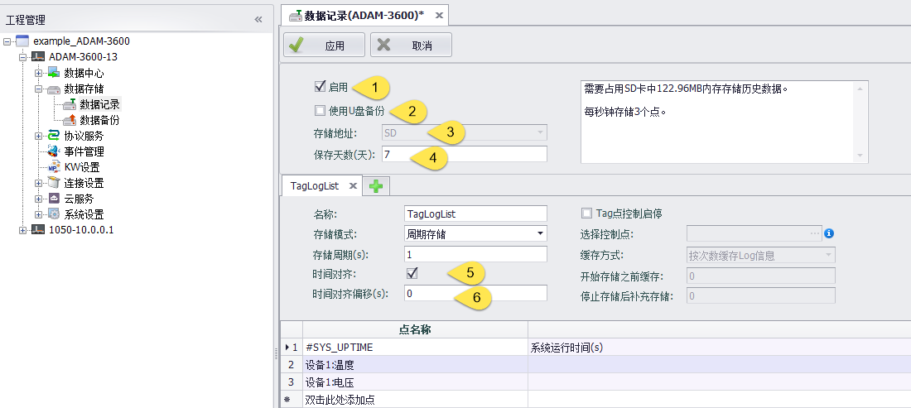
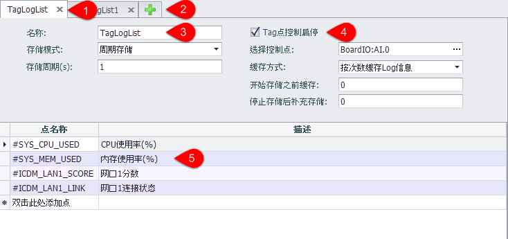
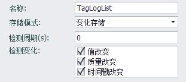
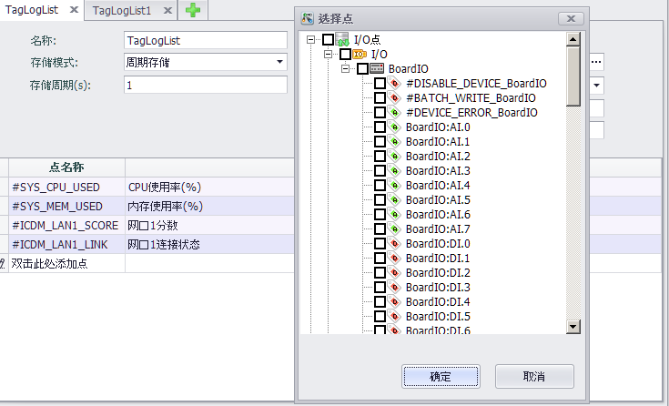

## 数据记录配置

数据记录(DataLogger)为EdgeLink上实现历史数据存储的软件模块，数据存储界面配置此功能。
数据记录(DataLogger)程序依据配置，从Data Center中读取tag数值，并将数据保存在"Tag历史数据表"中，同时会将数据整理保存到分钟、小时、天，三个历史数据统计数据表中。

### 参数配置：

1. 启用:  选中此项，才会使能数据存储。DataLogger在SD卡上存储的是adb文件，不能直接查看；U盘备份时会存储为db3文件；
2. 使用U盘备份: 选择此项时，仅当系统检测到插入U盘时，才将SD卡中的现有历史数据复制到U盘中。新添加的历史数据仍存储在SD卡中。
3. 存储地址启用:  数据存储的位置，默认存储在SD卡上，**使用周期存储功能时必须先安装SD卡**；
4. 保存天数（天）: 历史数据保存最多的天数，默认7天，超过保存的天数，会自动删除最早存储的数据；

DataLogger默认按照时间对齐进行存储，举例说明：
- 周期存储存储周期为10S，存储程序在13：15：17开始运行，那么时间则第一笔存储的数据时间戳为13：15：20，下一笔数据时间戳为13：15：30

### 存储组参数配置：

Tag数值可以依存储组的配置以多种方式存储到数据表中。

1. 存储组配置Tab页，用户可以点击"x"关闭当前配置页。
2. 用户可以点击"+"添加存储组，最多可添加16个存储组
3. 存储组的基本参数：
	- 名称：存储组的名称，只用于区分存储组。
	- 存储模式：可以选择周期存储和变化存储。
	- 选择周期存储时需要配置存储周期。
4. 用户可以选择一个Tag点控制当前存储组启停，当Tag点的值为0时不启用存储组，其余值时启用存储组。
	- 选择控制点：选择一个Data Center中的点作为控制点。
	- 缓存方式：控制点启停时会缓存一定的数据，在缓存方式中可以选择按次数缓存log信息或按时间缓存log信息。
	- 开始存储之前缓存：存储组开始存储之前，会缓存一些Tag点数据。
	- 停止存储后补充存储：存储组停止存储后，会补充存储一些Tag点数据。
5. 在列表中编辑要存储的Tag点，所有存储组一共存储的点限制为200个。

存储模式选择变化存储时，需要配置“检测变化”和“检测周期”。启用存储组后每隔“检测周期”时间，检测存储组内的tag点其“检测变化”内勾选的属性与上一个检测周期结束后保存的值是否有变化，如果有变化则存储到数据表中。

当“检测周期”的值为0时，检测到tag点属性变化时会立刻存储到数据表中。

### 编辑存储Tag点

在点名称一列双击最后一行可以添加存储Tag点，双击添加后的Tag点可以修改。需要删除Tag点时在要删除的Tag点行上点击右键，在弹出的工具栏上点击删除按钮即可删除当前Tag点。

>**注!** Tag点被添加到一个存储线程，不能在被添加到其他存储线程中。

### 系统点#DATALOG_ERROR的错误码信息

当#DATALOG_ERROR的值为0，表示没有错误发生。

几个关键错误定义如下：

	1 DataLogger 没有使能。
	2: DataLogger 存储路径无效。
	3: SDK 初始化存储路径失败。
	4: SDK 初始化失败。
	5: DataLogger 启动时分配内存失败。
	6: DataLogger 启动时创建存储线程失败。
	7: DataLogger 打开控制点失败。
	8: DataLogger 读取控制点值失败。
	9: DataLogger 添加Tag点失败。
	
	257: 存储空间不足（安全空间为50M）。
	512 ~ 767: 向DataLogger SDK的值缓冲区插入数据失败。
	768 ~ 1023: DataLogger SDK向文件写数据失败。
	1024 ~1279: DataLogger SDK写值到文件的过程中，定位文件位置失败。