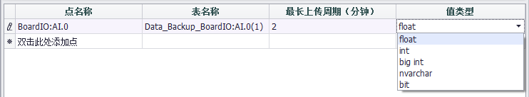
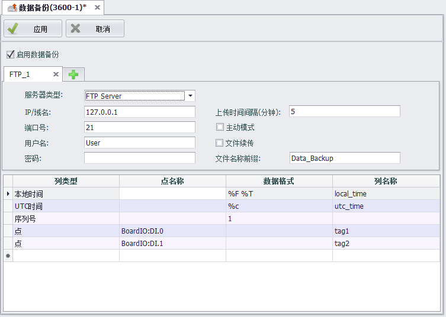

## 数据备份 ##

在EdgeLink Studio中用户可以设置对指定的点的历史数据进行存储，根据设置的存储方式，历史数据将占用SD卡或U盘中的部分空间，随着运行时间的增加，历史数据也会越来越多。为提高历史数据备份性能和安全性，用户可以将庞大的数据备份到其他服务器上。

1.打开“数据备份”页面。

2.选择启用数据备份。

3.填写数据备份设置。

4.选择要备份的点及其他必要信息。

5.点击“+”按钮增加一条备份设置，最多添加4个数据备份配置页面。

6.点击“×”按钮删除一条备份设置。

7.点击应用，完成配置。

目前数据备份按使用服务器类型不同，分为SQL Server和FTP Server两种：

当连接下的备份列表中已经添加了要备份的内容（如Tag点）后，服务器类型不可修改；删除备份列表中的所有内容后，可以修改服务器类型。

###SQL Server方式###

在数据备份设置区域中，选择“服务器类型”为“SQL Server”，即可按ODBC方式备份所选点数据。需要填写的信息包括：

IP/域名：备份服务器IP地址或域名

端口号：需要连接的数据库端口号

数据库名：连接的服务器端已存在的数据库的名称

表名：自定义表名字，将在SQL server中自动生成该表，表中会记录每个上传点的最后一笔时间，用于断点续传

用户名：远程登录服务器的用户名

密码：远程登录服务器的密码

表名称前缀：用于在所连接的数据库中按照表名称自动创建数据库表

单次最大上传个数限制：允许客户端每次上传数据量的限制，默认值为500，即查询缓存500条数据会批量上传至服务器

在点列表中双击“点名称”列的空白行，可以添加本次备份包含的点。

在备份时一个Tag点保存为一个数据库表。默认情况下，将把“表名称前缀_tag点名称”作为Tag点存储的表名称，为区分同名Tag点的存储表，可在不同连接中为“表名称前缀”指定不同内容以便区分，或自行修改表名称列。若表名称前缀和Tag点均相同，系统将自动重命名表名称。

Tag点默认最长上传周期为2分钟，与“单次最大上传个数限制”相配合，未达到单次最大上传个数限制条件但是查询不到新数据的时间超出最长上传周期，此时会将缓存的数据上传至服务器。

Tag点存储值类型即存储数据的格式，默认值类型为float，可选择存为float、int、big int、navarchar、bit类型。

用户可以根据需要在点列表中修改“表名称”、“最长上传周期”时长和“值类型”。

若“周期存储”功能未启用或“周期存储”中未指定存储的Tag点，则在数据备份中添加Tag点时，将弹出对话框提示，用户应先设置“周期存储”功能后再设置备份Tag点。

###MySQL Server方式###

在数据备份设置区域中，选择“服务器类型”为“MySQL Server”，即可按MySQL Server方式备份所选点数据。需要填写的信息与“SQL Server”一致。

###ORACLE方式###

在数据备份设置区域中，选择“服务器类型”为“ORACLE”，即可按ORACLE方式备份所选点数据。需要填写的信息包括：

1. IP/Domain：数据库的ip地址，其中domain方式未进行测试。
1.	Port：数据库监听的端口，数据库安装时，默认1521。若配置数据库时并未修改，则以默认1521即可。
1.	DataBaseName：Oracle数据库实例名字，在oracle 11g和12c的数据库安装过程中，创建数据库实例阶段，默认实例名字orcl，若此阶段进行了名字自定义，则使用自定义名字。
1.	TableName：oracle中存储数据的table。此版数据上传机制为，设备端所有需要备份的数据均存储在数据库端此table中。数据库端无需手动创建，设备上传数据时若此table不存在会自动创建，必须字母开头；下表为table结构

    

    - RECDATETIME字段：tag的时间戳，以Date格式存储。
    - METERCODE字段：对应上表中的MeterCode内容，同Tagname中的
    - ATTRCODE字段：对应上表中Alias内容。
    - VALUE字段：tag值。

    定义传输字段的规则如下：

    - Tag name 格式为：devicename:tagname ，Tagname自动对应字段Alias，devicename对应字段metercode
    - Tag name 格式为tagname时，Tagname自动对应字段Alias，字段metercode可为空，字段Alias不可为空

1.	UserName及Password为远程登陆oracle的凭证。
1.	Timestamp：存储至数据库table中RECDATETIME字段中时间的类型，可选本地时间及UTC时间。
此版界面并没有可自定义配置用于存储每个tag最后成功上传的时间戳的table。设备连接数据库时会默认创建FORRECORDTIME 表用于存储tag最后上传的时间戳，用于设备断点续传功能。

###FTP Server方式###

在数据备份设置区域中，选择“服务器类型”为“FTP Server”，即可按FTP方式备份所选点数据。需要填写的信息包括：

IP/域名：备份服务器IP地址或域名

端口号：需要连接的数据库端口号

用户名：远程登录服务器的用户名

密码：远程登录服务器的密码

上传时间间隔：设备上传文件到服务器端的时间间隔，默认为5分钟

是否开启主动连接：连接服务器的模式是否为主动。FTP支持两种模式，一种为Standard(PORT，即主动模式)，一种为 Passive (PASV，即被动模式)。主动模式下FTP的客户端发送PORT命令到FTP服务器，被动模式下FTP的客户端发送PASV命令到FTP服务器。默认不启用主动模式，即使用被动连接

是否开启文件续传：对于传输过程中因网络原因导致传输不完整的文件，链路恢复后续传未完成部分或删除不完整文件，重新传输。考虑部分服务器不支持此功能，默认不开启

文件名称前缀：对于多用户或多设备同时传输到同一服务器会导致文件名称一致冲突，为文件名称添加前缀以便区分

列类型：在列表中点击“列类型”列的空白行，可以选择向备份的FTP文件中增加一列数据。可选类型包括“点”及点存储时对应的“序列号”、“本地时间”、“UTC时间”。

数据格式：只针对“序列号”、“本地时间”、“UTC时间”的格式。

列名称：可重命名需要存储的数据列名称。

点：选择列类型为“点”时，用户可在弹出的对话框中批量选择要备份的点，并在列表中修改“列名称”，在FTP文件中将按照用户设置的“列名称”显示数据内容。

序列号：选择列类型为“序列号”时，用户可在列表中修改“数据格式”和“列名称”，“数据格式”中应填写大于0的整数，表示备份的首行数据的索引值。

本地时间或UTC时间：选择列类型为“本地时间”或“UTC时间”时，默认保存的数据格式为“%F %T”，用户可在弹出的对话框中设置备份需要的时间格式，窗口下方的日期列表中给出不同时间格式的代码，并在“保存为”中展示时间格式的示例。用户可以对日期列表中的各个格式组合使用。指定时间格式并点击确定按钮，“时间格式”代码将会显示在列表中，用户可以修改时间列保存的“列名称”。

FTP Server方式上传文件格式为csv文件，系统会将选择备份的所有点的同一时间戳的数值作为一条数据记录在表格中。