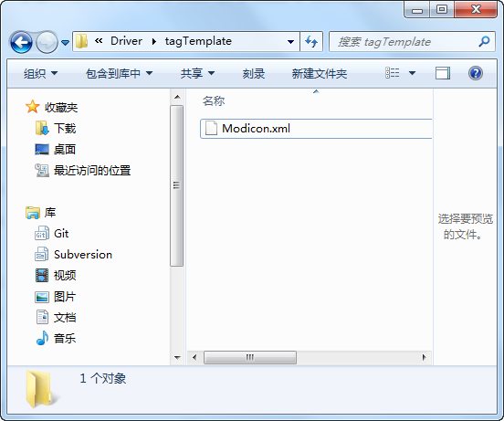
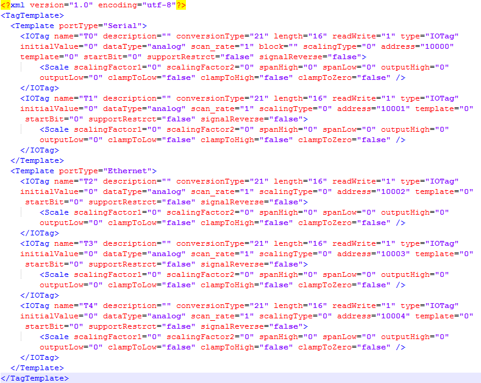
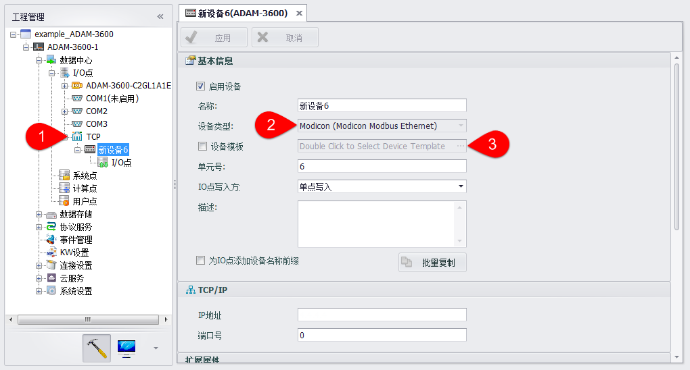
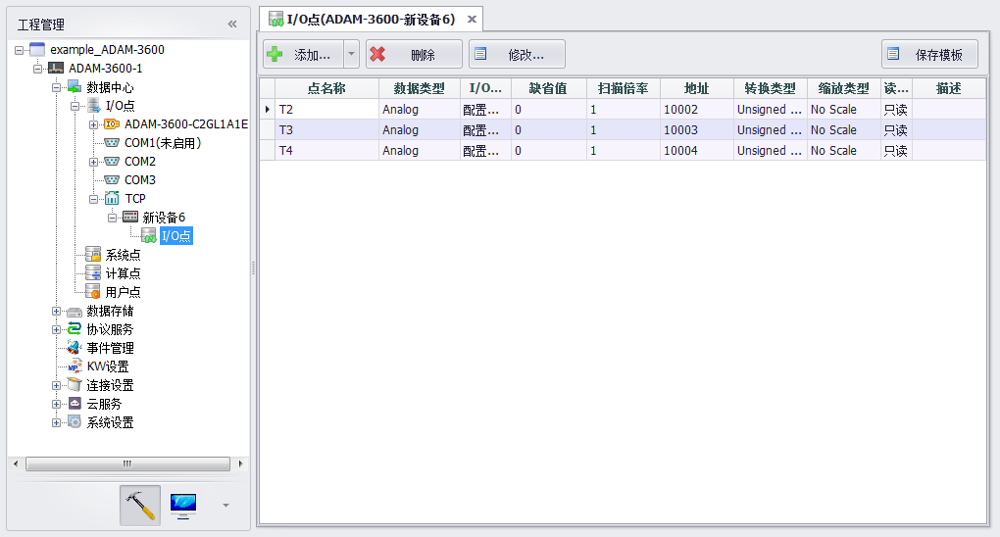

## 通过配置文件添加预设Tag点　
若在EdgeLink中预存了该串口类型和设备类型所对应的预设Tag点配置文件，则在添加串口设备时，可以将配置文件中的Tag点添加到设备下。　

EdgeLink安装路径的Driver\tagTemplate文件夹用于存放不同设备类型所需的配置文件，配置文件的名称即设备类型名，配置文件中标明了该设备类型在不同串口类型下预设的Tag点信息。

以配置文件Modicon.xml为例，假设Modicon.xml中预设了两种串口类型Serial和Ethernet，分别包含了T0、T1和T2、T3、T4点。在TCP端口（Ethernet）下添加设备时，若选择设备类型为Modicon且不选择使用设备模板，则将从Modicon.xml文件中获取符合条件的Tag点添加到新建设备中。

