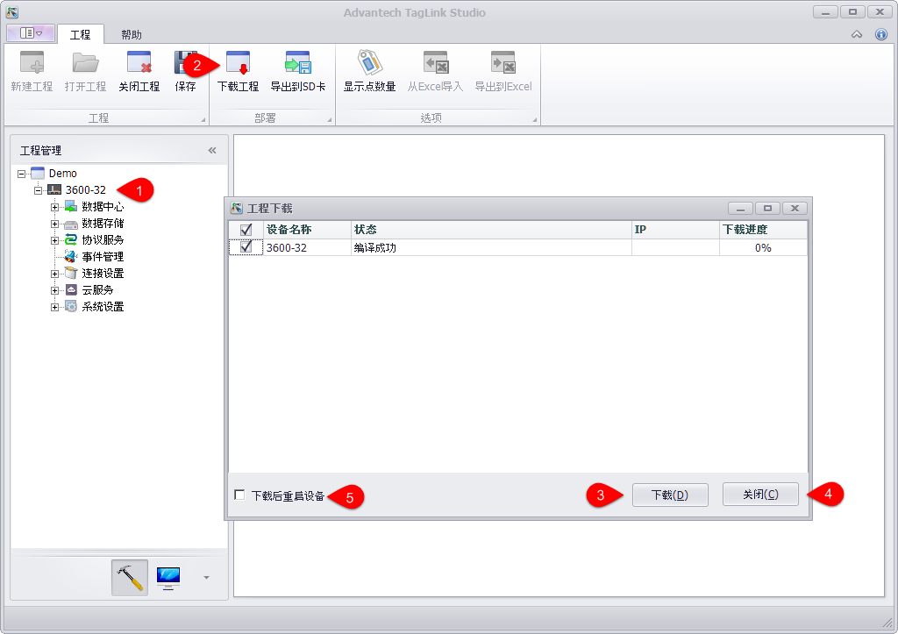

# 下载工程　

完成设备识别后，将配置信息下载到相应设备上，EdgeLink Studio支持批量下载。点击下载工程时，如在左边工程管理树形图中点击工程名，对话窗会将工程所有的RTU带出并进行批量下载。如点击单一RTU 单元再点击下载工程，对话窗仅会带出该RTU 单元，并仅对单一单元进行工程下载。

1. 鼠标选中设备

2. 点击下载工程按钮

3. 点击下载，开始下载过程

4. 下载完毕后，会在下载进度处现在当前下载进度，完成后，点击关闭，结束本次下载

5. 下载前可以设置下载完毕后，是否重启设备

