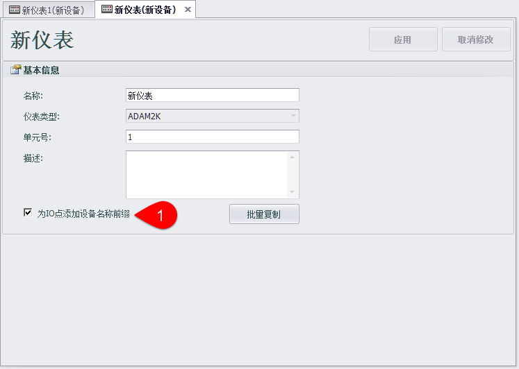
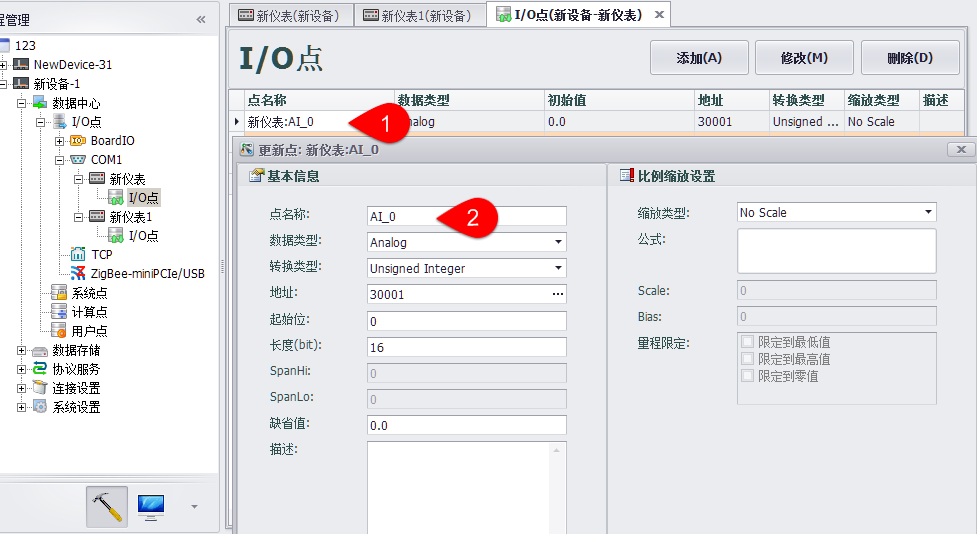
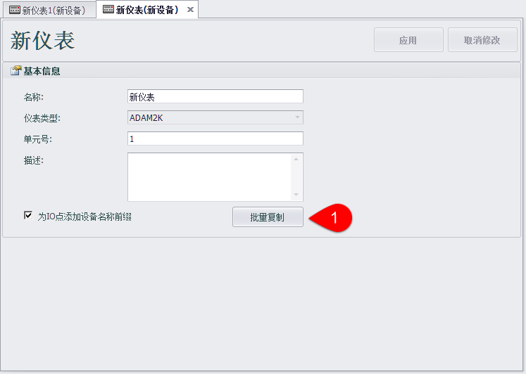
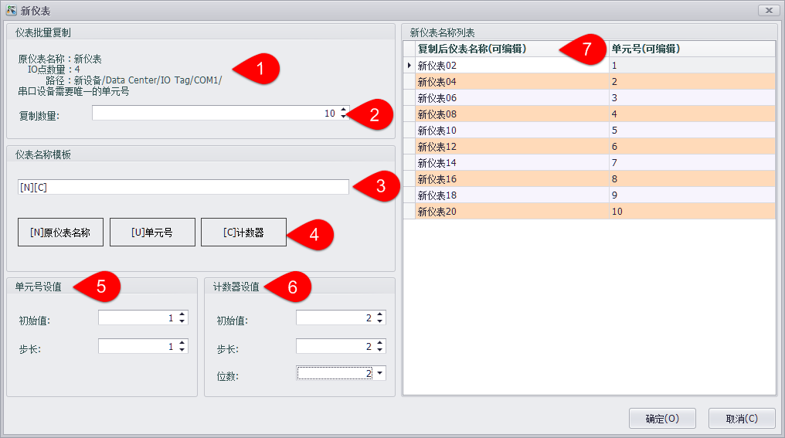
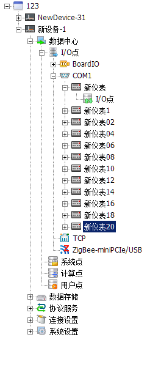

## 为IO点添加设备名前缀

点选“为IO点添加设备名称前缀”选项后，会为IO点添加前缀，格式如‘ 设备名称:IO点名称 ’。

取消点选后会去掉设备名称前缀。如果取消前缀后IO点名称有重复，会提示用户是否允许系统自动重命名重复的IO点。

在I/O点编辑页面中会显示设备名称前缀，但不能编辑

## 批量复制

选择添加设备名称前缀后，可以试用批量复制功能复制当前设备

点击批量复制按钮会弹出编辑设备名称页面，在此页面中用户可以编辑要复制的设备数量、设备名称及单元号。

1. 显示原设备的基本信息
2. 选择要复制的设备数量最多可一次复制100个
3. 将会依照名称模板生成复制后的设备名称
4. 可以在设备名称模板中使用原设备名称和随序号变化的单元号、计数器
5. 可设置单元号的初始值和步长
6. 计数器可设值初始值、步长和显示的位数
7. 生成好的设备名称显示在右边的列表中，设备中的值可以修改，但会在修改左侧属性修改后被重置。

点击确定后可以看到在端口下生成了批量复制的设备