# 设备模板

在EdgeLink Studio中，根据不同的设备驱动和型号，对每个型号的设备建立一套模板，模板中包括了这种设备的基础信息及设备下的Tag点信息，即为“设备模板”。在EdgeLink Studio中添加设备时，选择使用设备模板，就可以把设备模板下包含的Tag点按一定规则添加到设备下，而不需再逐个添加Tag点。
设备模板是sqlite数据库文件，分为默认模板和用户模板，默认模板保存于EdgeLinkStudio安装目录下，用于存放出厂时包含的厂家设备模板；用户模板保存于工程文件所处的模板路径中。
设备模板可以设置打开密码，用户可以使用EdgeLinkStudio设备模板工具凭密码打开模板进行维护。普通用户只能打开用户模板进行维护，开发者可以打开默认模板进行维护。

## 设备模板工具

在EdgeLinkStudio页面工具栏中点击“设备模板”按钮打开设备模板工具。

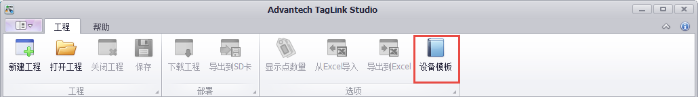

设备模板工具界面：

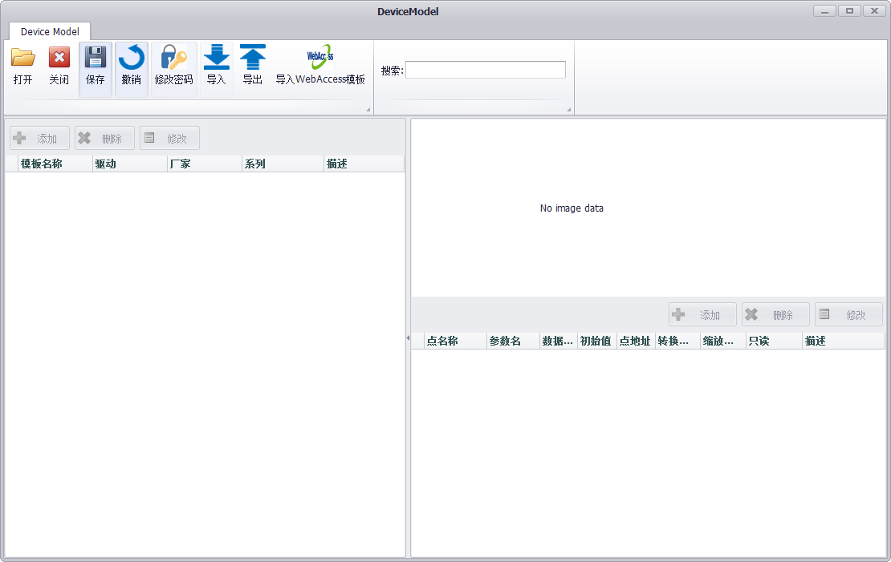

在设备模板工具中支持模板的打开、关闭、保存、撤销、修改密码、导入导出和导入webaccess模板等功能。

### 1.打开设备模板

在EdgeLinkStudio页面中打开设备模板工具时，将默认打开“用户模板”，在界面中可以查看模板信息、模板图片、tag点信息等。

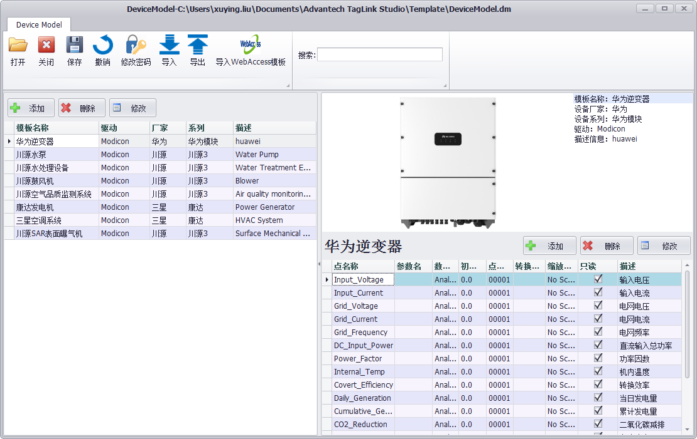

若本地不存在用户模板，将弹出提示框，用户可以根据提示创建空的用户模板。

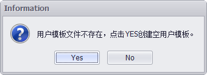

用户可以点击“打开”按钮打开任意的设备模板文件。

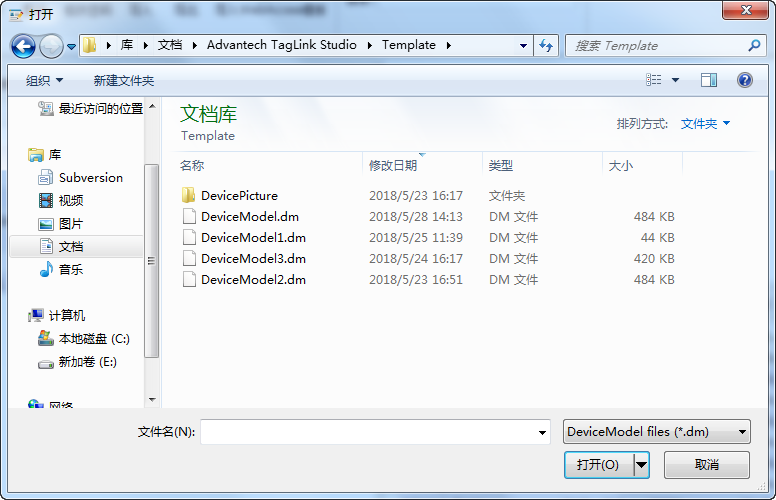

若打开的设备模板需要凭密码打开，则需要输入模板密码。密码错误时，将会给出提示。

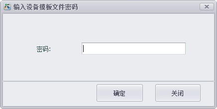

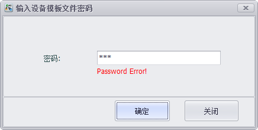

### 2.关闭设备模板

用户可以点击“关闭”按钮关闭当前设备模板文件。若模板存在未保存的修改，则弹出提示框。

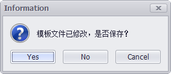

### 3.修改设备模板

在设备模板工具中用户可以进行模板的查看、排序、搜索、筛选、添加、修改、删除和模板下包含的tag点的添加、修改、排序、删除等操作。

点击设备模板列表表头可以对模板排序，点击tag点列表表头可以对Tag点排序。

在工具栏搜索框内填写关键字，点击回车按钮即可按关键字搜索当前模板文件中符合条件的模板信息。

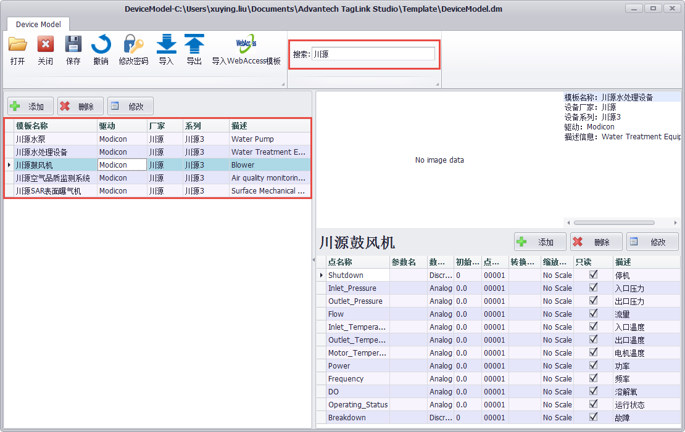

在模板列表的表头部分可以按列筛选模板。

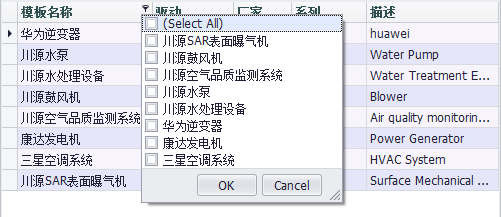

点击模板列表上方的“添加”按钮可以添加新的设备模板，填写信息包括模板名称、驱动类型、生产厂家、设备类别、设备图片及描述信息。其中模板名称不能与模板文件内的其他模板重名，生产厂家和设备类别可以点击输入框右侧的“添加”按钮添加新的生产厂家和设备类别，也可以通过下拉方式选择已存在的生产厂家和设备类别。设备图片可以上传.PNG、.JPG、.JPGE、.BMP和.GIF"格式的不超过200K的图片文件。

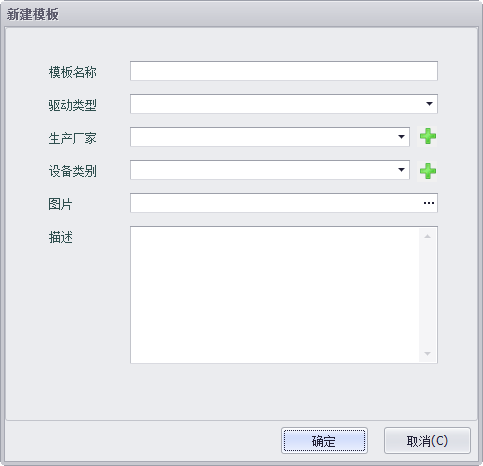

双击列表中已有的模板，或选中列表中一个模板点击列表上方的“修改”按钮可以修改模板。

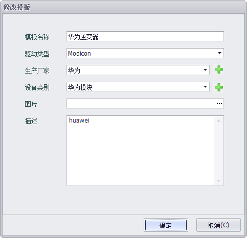

选中列表中一个模板点击列表上方的“删除”按钮可以删除模板。

点击Tag点列表上方的“添加”按钮可以为当前选中的模板添加新的Tag点。Tag点信息与EdgeLinkStudio中IOTag点信息类似。添加的Tag点名称不能与同一模板下的其他Tag点重名。

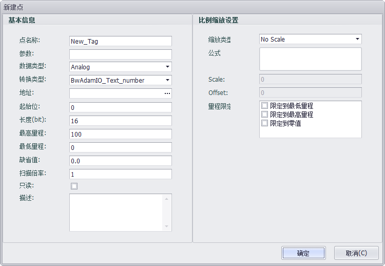

双击列表中已有的Tag点，或选中列表中一个Tag点，点击列表上方的“修改”按钮可以修改Tag点。

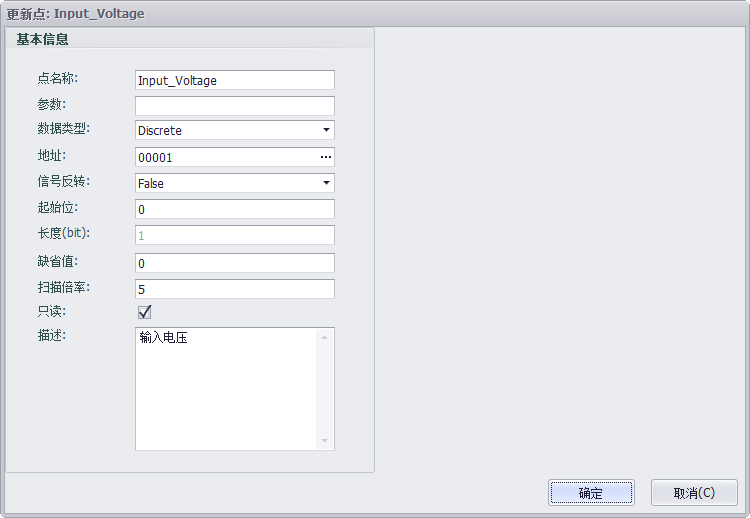

选中列表中一个Tag点，点击列表上方的“删除”按钮可以删除Tag点。

### 4.保存设备模板修改

对模板文件所做的添加、修改、删除、导入等操作都需要点击页面工具栏中的“保存”按钮才能保存到模板文件中。保存成功后弹出提示框。

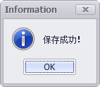

### 5.撤销设备模板修改

点击“撤销”按钮可以将未保存的修改撤销，模板将退回到上一次保存时的内容。

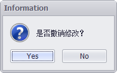

### 6.修改设备模板密码

点击“修改密码”按钮，在弹出的对话框中可以修改模板密码。

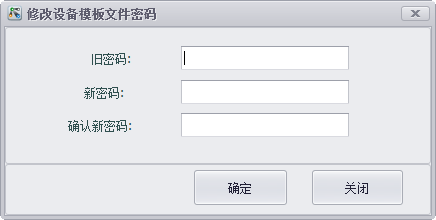

### 7.导入设备模板

点击“导入”按钮可以将其他设备模板文件中的模板导入当前打开的模板中。若要导入的模板需要密码打开，则将弹出输入密码对话框提示用户输入密码。

选择打开要导入的模板文件，将在预览面板中查看模板信息，勾选要导入的模板信息，点击“追加”按钮将选中模板导入到当前模板文件中，点击“覆盖”按钮将清除当前模板后再将选中模板导入到当前模板。

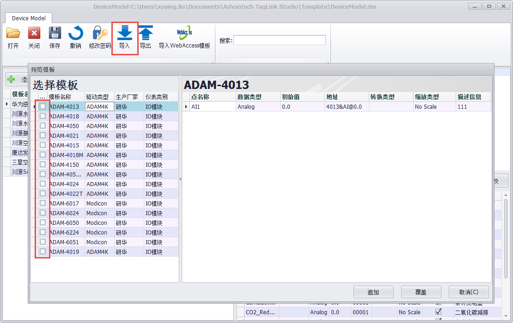

无论是追加还是覆盖，都将判断是否存在模板重名和Tag点重名的情况，若有重名，在预览面板中将高亮显示，并可以选择对重名模板或Tag点进行重命名。

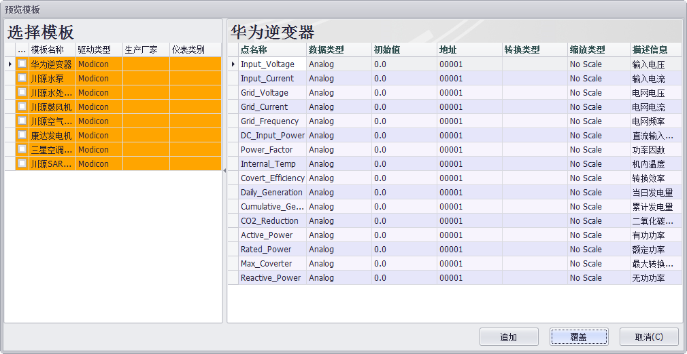

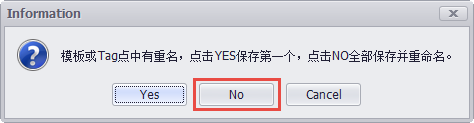

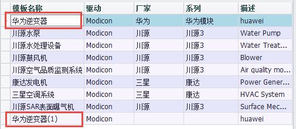

### 8.导出设备模板

点击“导出”按钮可以将当前打开的模板导出为新的模板文件。导出时仍需在预览面板勾选要导出的模板，点击确定按钮保存模板文件。

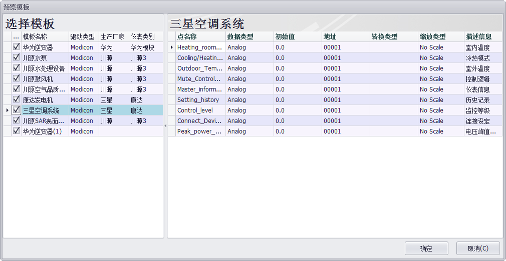

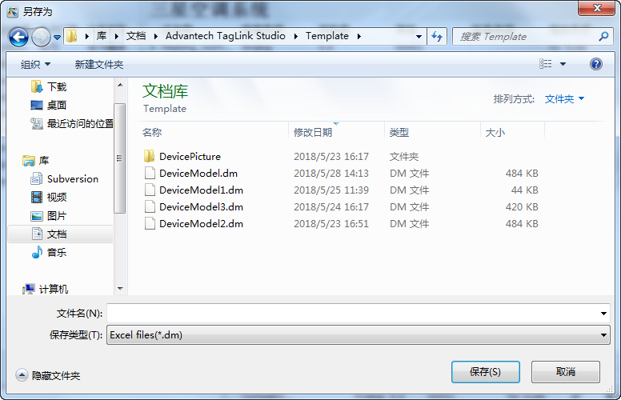

保存成功后，预览面板自动关闭。

### 9.导入webaccess模板

webaccess模板为.mdb格式的access数据库文件，点击“导入webaccess模板”按钮，选择要导入的文件，在预览面板中勾选要导入的模板信息，点击“追加”按钮将选中模板导入到当前模板文件中，点击“覆盖”按钮将清除当前模板后再将选中模板导入到当前模板。

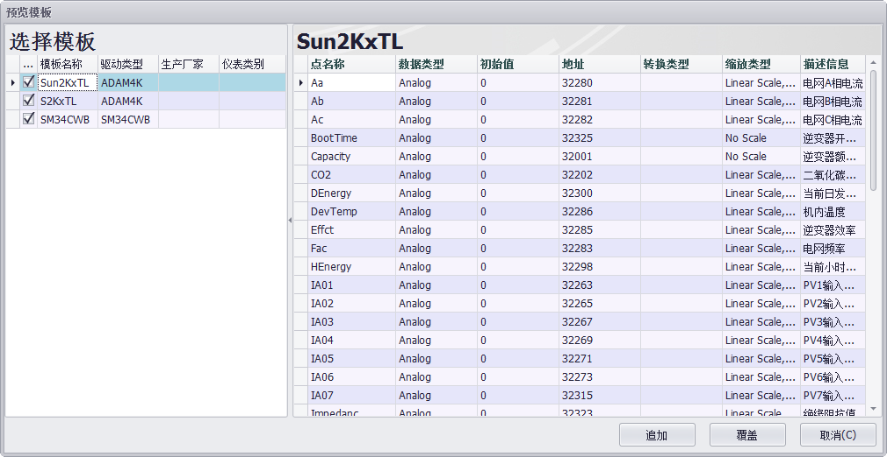

与导入设备模板文件相同，在导入webaccess模板时也将判断是否存在模板重名和Tag点重名的情况，若有重名，在预览面板中将高亮显示，并可以选择对重名模板或Tag点进行重命名。

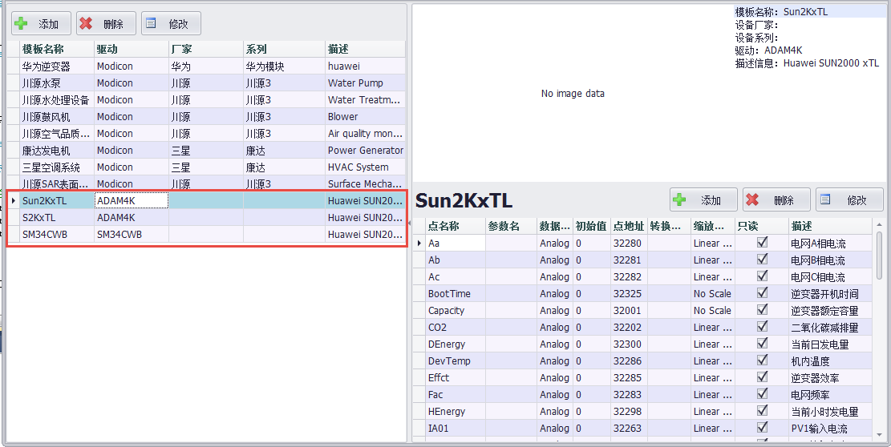

## 设备模板使用

在添加和修改设备时勾选使用设备模板。

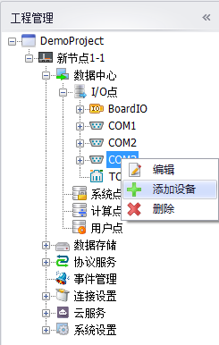

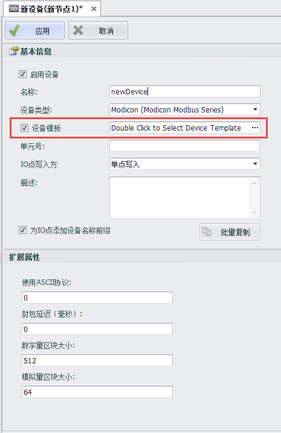

双击设备模板选择框，将弹出面板可查看和选择设备驱动支持的所有“默认模板”和“用户模板”中的设备模板。其中模板下的Tag点可以全选，也可以选择其中一部分。

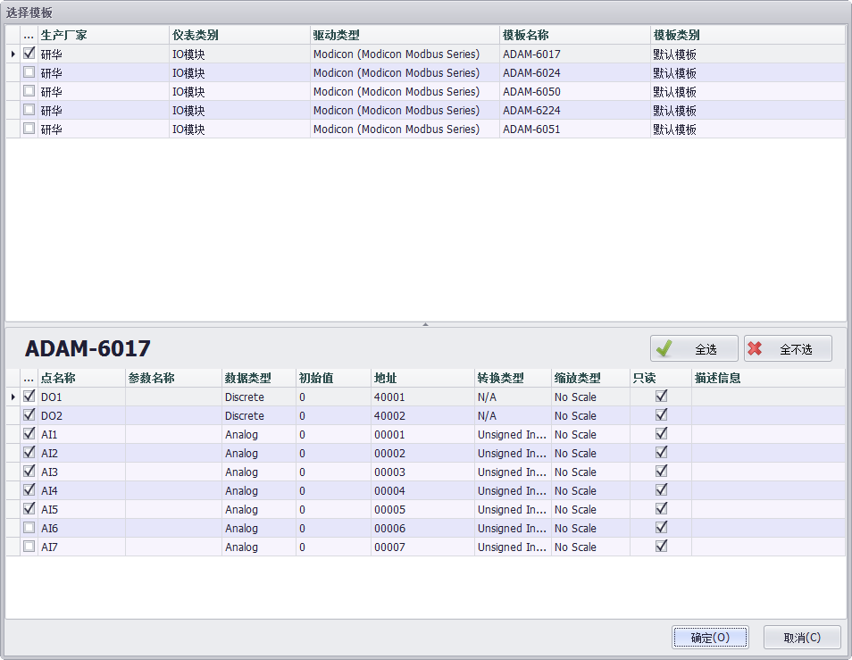

点击“确定”按钮后，即为设备设置使用模板。在设备信息页面点击“应用”按钮，即可添加或更新设备信息，同时，所选设备模板下的选中Tag点将自动添加到设备下的IOTag点列表中。

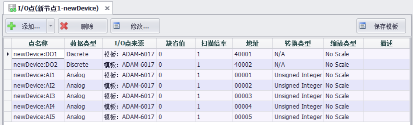

在IOTag点列表中点击“添加”按钮可以自定义添加Tag点，点击“添加”按钮下拉菜单中的“从模板添加”按钮，可以选择从模板中批量添加tag点。

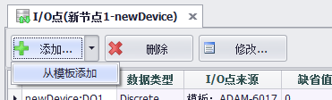

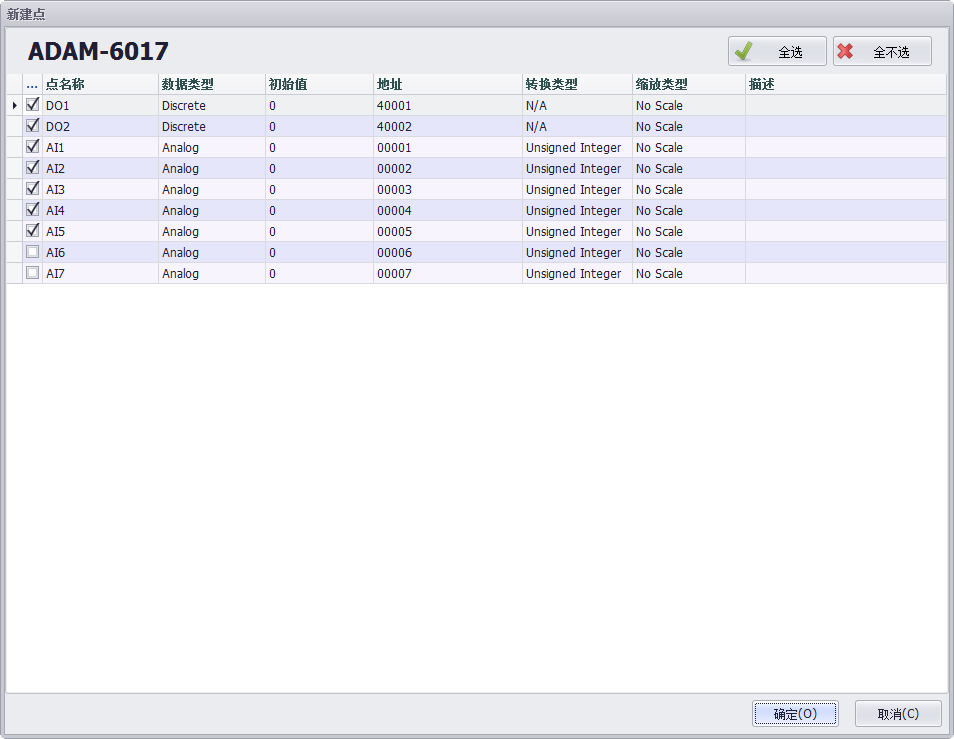

在IOTag点列表页面可将该设备下的Tag点信息保存为模板。点击“保存模板”按钮，将弹出输入模板信息面板。若用户模板设置了打开密码，则需要输入打开密码才能保存模板。

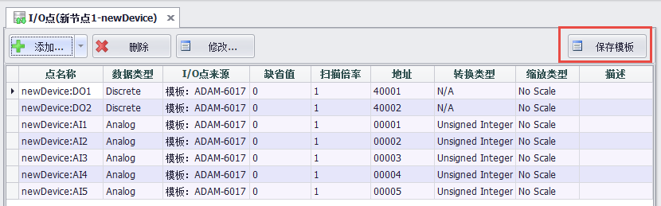

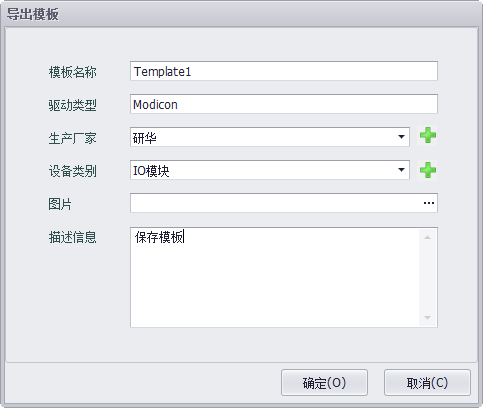

保存成功后，在用户模板中即可查看到新保存的设备模板信息。

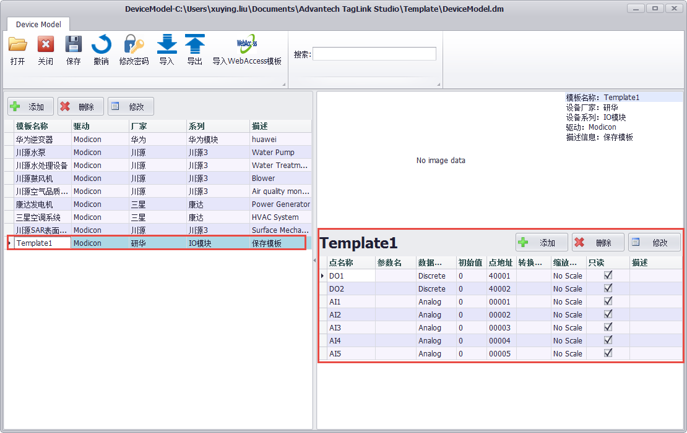

