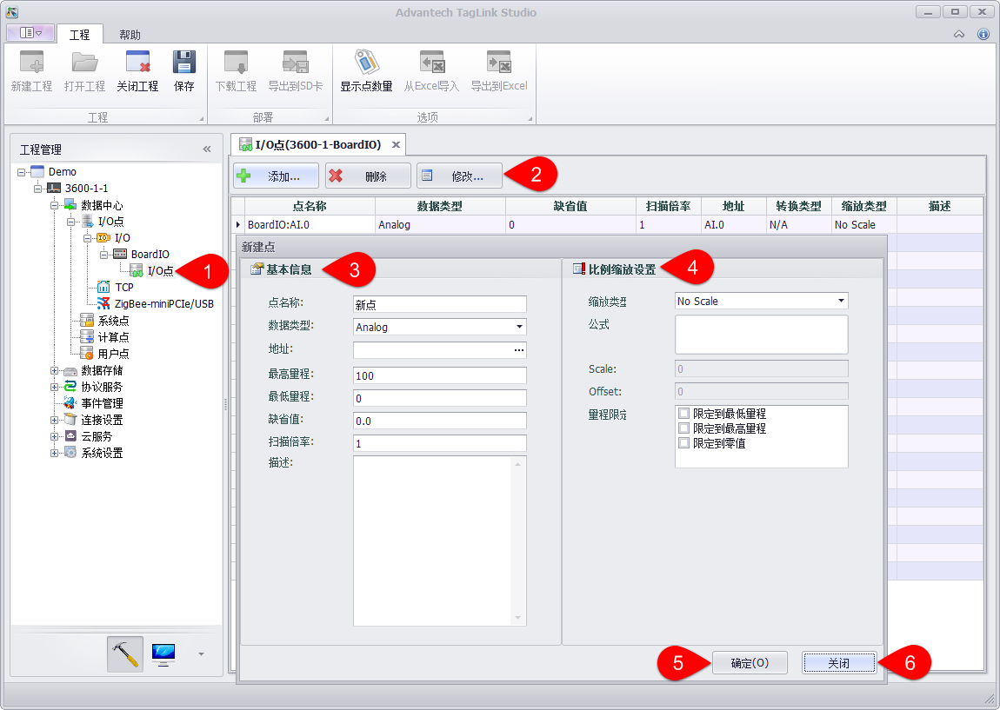

## 板载IO点配置

ADAM-3600板载8-ch AI，8-ch DI和4-ch DO，在工程配置中，用户需要根据实际的输入信，添加板载IO Tag并作相应配置，具体添加操作如下图：　

1.双击I/O点或者右键编辑。

2.点击“添加”按钮添加一个新点。选中一个或多个点，点击“删除”、“修改”按钮可以进行删除、修改操作。

3.填入点名称、选择数据类型、选择点地址、设置最高和最低量程、缺省值、扫描倍率填写描述信息。

4.设置缩放类型，缩放类型的说明。

5.点击确定，成功添加点，此时在列表中可以看到添加的点。

6.点击“关闭”按钮取消添加或修改。

板载IO点支持以设备模板方式配置tag点，具体说明见2.2.16设备模板部分
