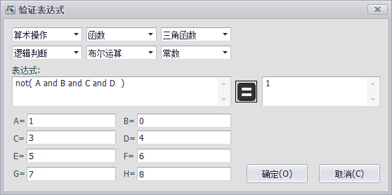
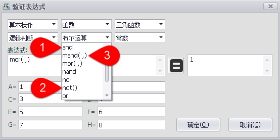

## 计算点配置　

计算点是一种特殊的Tag点，它的值是某个表达式的计算结果，该表达式的参数可以是Tag点或常数，在表达式中可以使用一些常用的计算方法，包括四则运算，逻辑运算，三角函数等。

通过使用计算点，可以做一些相对复杂的计算，例如将采集到的传感器数值通过换算得到实际的物理量（如液位、风速等），这样可以减少上位机的运算量，也使得设备更加智能化。

每个计算点对应一个表达式，表达式可以有最多8个Tag点作为输入变量，为了方便起见，8个Tag点在表达式中分别使用A，B，C，D，E，F，G，H（不区分大小写）来表示。

### 添加计算点操作步骤

添加计算点的步骤如下所示

1. 双击工程树上的“计算点”节点

2. 点击“添加”按钮新增一个计算点

3. 输入基本信息，其中的“周期”参数表示该计算点每隔多久被计算一次，以秒为单位。

4. 输入计算表达式，表达式中可使用的预设函数或运算符可以从表达式输入框上方的几个下拉框中选择，也可以手动输入预设的函数或运算符。
图中显示的是“开关跳脱”计算点的计算表达式，表达式逻辑是当4个开关中任何一个Tag点值为0，则表示开关跳脱。

5. 双击表达式变量的输入框，选择该变量对应的Tag点。

6. 点击“确定”完成添加点。

### 表达式检查

表达式设置界面中的表达式输入框的右边有一个计算器样式的按钮，点击它可以打开表达式检查器，如下图所示。表达式检查器的界面与表达式设置界面大致相同，但右边多了一个计算按钮及计算结果的显示框。另外，与表达式设置界面不同的是，表达式检查器的变量输入框中需要的是变量数值而不是Tag点名称。

要验证表达式是否正确，可以通过点击计算按钮来得到计算结果，然后通过检查计算结果可以直观地验证表达式的正确性。当表达式验证完毕后，点击确认按钮即可将表达式更新到表达式设置界面中，如果不想将表达式更新到表达式设置界面，则按取消即可。

### 函数及运算符说明

计算点支持的函数及运算符全部在表达式上方的选择框内设置，一共分为五类：算术操作、函数、三角函数、逻辑判断、布尔运算。除此之外，还有一个常数选择框，目前定义了三个常数：pi（圆周率），epsilon（大于零的最小正double值），inf（无穷大）。

如下图所示，选择框中显示的函数或运算符，如果没有括弧的表示是二元操作符（如标识1），带有括弧的表示是函数，括弧中无逗号的表示只有一个参数（如标识2），有逗号的表示该函数支持输入1个以上的参数（如标识3）。

计算点所有功能和运算符描述如下：

(0) 算术和赋值运算符

| 运算符| 定义                                           |
| ------ | --------------------------------------------- |
|  +       | x和y之间的加法。  (eg: x + y)                  |
|  -       | x和y之间的减法。  (eg: x - y)               |
|  *       | x和y之间的乘法。  (eg: x * y)            |
|  /       | x和y之间的除法。  (eg: x / y)                  |
|  %       |  x相对于y的模数。 (eg: x % y)            |
|  ^       |  x的y次方。 (eg: x ^ y)                       |
|  :=      | 将x的值赋给y。 y是变量或向量类型。   (eg: y := x)                           |
|  +=      | 用右边表达式的值增量x。 其中x是变量或向量类型。  (eg: x += abs(y - z))                                   |
|  -=      | 用右边表达式的值减小x。 其中x是变量或向量类型。  (eg: x[i] -= abs(y + z))                                |
|  *=      | 将x乘以右边表达式的值赋给x。 其中x是变量或向量类型。  (eg: x *= abs(y / z))                                   |
|  /=      | 将x除以右侧表达式的值赋给x。 其中x是变量或向量类型。 (eg: x[i + j] /= abs(y * z))  |
|  %=      |  将右侧表达式的值赋给x模。 其中x是变量或向量类型。   (eg: x[2] %= y ^ 2)                              |

(1) 等式与不等式

| 运算符 | 定义                                              |
| ------ | --------------------------------------------- |
| == or =  | 只有当x严格等于y时才成立。 (eg: x == y)     |
| <> or != | 只有当x不等于y时才成立。 (eg: x <> y or x != y) |
|  <       | 只有当x小于y时才成立。 (eg: x < y)              |
|  <=      | 只有当x小于或等于y时才成立。 (eg: x <= y) |
|  >       | 只有当x大于y时才成立。 (eg: x > y)           |
|  >=      | 只有当x大于或等于y时才成立。 (eg: x >= y) |

(2) 布尔运算

| 运算符 | 定义                                              |
| ------ | --------------------------------------------- |
| true     |  正确情况或除零以外的任何值（通常为1）。 |
| false    |   错误情况，值为0。                  |
| and      |  逻辑和，只有当x和y均为true时为真。  (eg: x and y)                                           |
| mand     |   多输入逻辑和，只有当所有输入都为真时才为真。 从左到右短路的表达式。  (eg: mand(x > y, z < w, u or v, w and x))               |
| mor      | 多输入逻辑OR，如果其中至少一个输入为真，则为真。 从左到右短路的表达式。 (eg: mor(x > y, z < w, u or v, w and x))  |
| nand     | 逻辑NAND，只有当x或y为false时才为真。  (eg: x nand y)                                          |
| nor      | 逻辑NOR，只有当x或y的结果为false时才为真  (eg: x nor y)                                           |
| not      |   逻辑NOT，否定输入的逻辑意义。  (eg: not(x and y) == x nand y)                          |
| or       | 逻辑OR，当x或y为真时，则为真。 (eg: x or y) |
| xor      | 逻辑XOR，仅当x和y的逻辑状态不同时为真。   (eg: x xor y)                                  |
| xnor     | 逻辑XNOR，如果满足x和y的双条件，则为真。    (eg: x xnor y)                              |
| &        | 与AND相似，但从左至右表示短路优化。   (eg: (x & y) == (y and x))    |
| |        | 与OR相似，但从左到右的表达是短路优化。   (eg: (x | y) == (y or x))     |

(3) 通用功能

| 函数 | 定义                                              |
| ------ | --------------------------------------------- |
| abs      | x的绝对值  (eg: abs(x))                      |
| avg      | 所有输入的平均值  (eg: avg(x,y,z,w,u,v) == (x + y + z + w + u + v) / 6)   |
| ceil     | 大于或等于x的最小整数。  |
| clamp    |  将x钳位在r0和r1之间，其中r0 <r1。  (eg: clamp(r0,x,r1))                                    |
| equal    |  使用正规的epsilon进行x和y之间的相等性测试 |
| erf      | x的误差函数。  (eg: erf(x))                      |
| erfc     |  x的互补误差函数。 (eg: erfc(x))       |
| exp      | e的x次方 (eg: exp(x))                      |
| expm1    |  e的x次方减1，其中x很小。  (eg: expm1(x))                                          |
| floor    | 小于或等于x的最大整数。  (eg: floor(x))                                          |
| frac     |  x的分数部分。 (eg: frac(x))                 |
| hypot    | x和y的斜边值(eg: hypot(x,y) = sqrt(x*x + y*y))|
| iclamp   | 将x反向钳位在r0和r1范围之外。 其中r0 <r1。 如果x在此范围内，它将捕捉到最接近的边界。   (eg: iclamp(r0,x,r1)                     |
| inrange  | 当x在r0和r1范围内时，内程返回“true”。 其中r0<r1..   (eg: inrange(r0,x,r1)           |
| log      | x的自然对数。 (eg: log(x))                   |
| log10    |  x的以10为底的对数。 (eg: log10(x))                 |
| log1p    | 1 + x的自然对数，其中x非常小。  (eg: log1p(x))                                          |
| log2     | x的以2为底的对数。  (eg: log2(x))                   |
| logn     |  x的以N为底的对数，其中n是正整数。  (eg: logn(x,8))                                         |
| max      | 所有输入中的最大值。 (eg: max(x,y,z,w,u,v)) |
| min      | 所有输入中的最小值。 (eg: min(x,y,z,w,u))  |
| mul      |   所有输入的乘积。  (eg: mul(x,y,z,w,u,v,t) == (x * y * z * w * u * v * t)) |
| ncdf     |  正态累积分布函数. (eg: ncdf(x)) |
| nequal   | 使用标准化的epsilon在x和y之间进行不相等测试 |
| pow      | x的y次方.  (eg: pow(x,y) == x ^ y)           |
| root     |  x的N次根。 其中n是一个正整数。  (eg: root(x,3) == x^(1/3))                              |
| round    |  将x舍入到最接近的整数。 (eg: round(x))         |
| roundn   | 将x舍入到小数点后n位，其中n> 0，是整数。  (eg: roundn(1.2345678,4) == 1.2346)                     |
| sgn      | x的符号，x < 0时返回-1，x > 0时返回+1。其余情况返回0  (eg: sgn(x))                                            |
| sqrt     | x的平方根，其中x> = 0。  (eg: sqrt(x))          |
| sum      |  所有输入的总和。  (eg: sum(x,y,z,w,u,v,t) == (x + y + z + w + u + v + t)) |
| swap     | 交换变量x和y的值，并返回y的当前值。 |
| <=>      |   (eg: swap(x,y) or x <=> y)         |
| trunc    |  x的整数部分。 (eg: trunc(x))                   |

(4) 三角函数

| 函数 | 定义                                              |
| ------ | --------------------------------------------- |
| acos     |  以弧度表示的x的反余弦值。间隔[-1，1]  (eg: acos(x))                                           |
| acosh    |  以弧度表示x的反双曲余弦值。  (eg: acosh(x))                                          |
| asin     |  以弧度表示x的反正弦值。 间隔[-1，+ 1]  (eg: asin(x))                                           |
| asinh    | 以弧度表示x的反双曲正弦值。  (eg: asinh(x))                                          |
| atan     | 以弧度表示x的反正切值。 间隔[-1，+ 1]  (eg: atan(x))                                           |
| atan2    |  以弧度表示（x / y）的反正切值。 [-pi，+ pi]  eg: atan2(x,y)                                          |
| atanh    |   以弧度表示x的反双曲正切值。  (eg: atanh(x))                                          |
| cos      | x的余弦值。 (eg: cos(x))                              |
| cosh     | x的双曲余弦值。 (eg: cosh(x))                  |
| cot      |  x的余切值。 (eg: cot(x))                           |
| csc      |  x的余割值。 (eg: csc(x))                            |
| sec      | x的正割值。  (eg: sec(x))                              |
| sin      |  x的正弦值。 (eg: sin(x))                                |
| sinc     |  x的正弦基数。 (eg: sinc(x))                      |
| sinh     | x的双曲正弦值。  (eg: sinh(x))                    |
| tan      | x的正切值。  (eg: tan(x))                             |
| tanh     | x的双曲正切值。 (eg: tanh(x))                 |
| deg2rad  | 将x从度转换为弧度。 (eg: deg2rad(x))    |
| deg2grad |  将x从度转换为梯度。 (eg: deg2grad(x))  |
| rad2deg  | 将x从弧度转换为度。  (eg: rad2deg(x))    |
| grad2deg | 将x从梯度转换为度。 (eg: grad2deg(x))  |

(5) 字符串处理

| 函数 | 定义                                              |
| ------ | --------------------------------------------- |
|  = , ==  | 所有常见的相等/不相等运算符均适用于字符串, |
|  !=, <>  |  并且以区分大小写的方式应用。 |
|  <=, >=  | 在以下示例中，x，y和z为字符串类型。|
|  < , >   | (eg: not((x <= 'AbC') and ('1x2y3z' <> y)) or (z == x)  |
| in       |  仅当x是y的子字符串时才为真。  (eg: x in y or 'abc' in 'abcdefgh')                     |
| like     |   仅当字符串x与模式y匹配时为真。  可用的通配符为“ *”和“？” 分别表示零个或多个和零个或一个匹配项。  (eg: x like y or 'abcdefgh' like 'a?d*h')               |
| ilike    |  仅当字符串x以不区分大小写的方式与模式y匹配时才为真。   可用的通配符为“ *”和“？” 分别表示零个或多个和零个或一个匹配项。  (eg: x ilike y or 'a1B2c3D4e5F6g7H' ilike 'a?d*h')      |
| [r0:r1]  |  指定字符串的闭合间隔[r0，r1]。  eg:  给定一个值为‘abcdefgh’的字符串x：  1. x[1:4] == 'bcde'  2. x[ :5] == x[:10 / 2] == 'abcdef'  3. x[2 + 1: ] == x[3:] =='defgh'  4. x[ : ] == x[:] == 'abcdefgh'  5. x[4/2:3+2] == x[2:5] == 'cdef'   注：r0和r1均假定为整数，其中r0 <= r1。  它们也可能是表达式的结果，如果它们具有小数部分，将被截断。    (eg: 1.67 --> 1)                     |
|  :=      | 将x的值分配给y。 其中y是可变字符串或字符串范围，而x是字符串或字符串范围。   eg:  1. y := x  2. y := 'abc'  3. y := x[:i + j]  4. y := '0123456789'[2:7]  5. y := '0123456789'[2i + 1:7]  6. y := (x := '0123456789'[2:7])  7. y[i:j] := x  8. y[i:j] := (x + 'abcdefg'[8 / 4:5])[m:n]   注意：对于选项7和8，两个范围中的较短者将表示要复制的数字字符。|
|  +       |  x和y的串联。 其中x和y是字符串或字符串范围。   eg  1. x + y  2. x + 'abc'  3. x + y[:i + j]  4. x[i:j] + y[2:3] + '0123456789'[2:7]  5. 'abc' + x + y  6. 'abc' + '1234567'  7. (x + 'a1B2c3D4' + y)[i:2j]                           |
|  +=      | 将y的值附加到x。 其中x是可变字符串，y是字符串或字符串范围。   eg:  1. x += y  2. x += 'abc'  3. x += y[:i + j] + 'abc'  4. x += '0123456789'[2:7]                               |
| <=>      | 交换x和y的值。 其中x和y是可变字符串。    (eg: x <=> y)                                 |
| []       | 字符串大小运算符返回正在操作的字符串的大小。  eg:  1. 'abc'[] == 3  2. var max_str_length := max(s0[],s1[],s2[],s3[])  3. ('abc' + 'xyz')[] == 6  4. (('abc' + 'xyz')[1:4])[] == 4                        |

(6) 控制结构

|结构 | 定义                                             |
| ------ | --------------------------------------------- |
| if       | 如果x为真，则返回y，否则返回z。  eg:  1. if (x, y, z)  2. if ((x + 1) > 2y, z + 1, w / v)  3. if (x > y) z;  4. if (x <= 2*y) { z + w };                             |
| if-else  |  if-else / else-if语句。  根据条件分支，该语句将返回结果分支或替代分支的值。  eg:  1. if (x > y) z; else w;  2. if (x > y) z; else if (w != u) v;  3. if (x < y) { z; w + 1; } else u;  4. if ((x != y) and (z > w))     {       y := sin(x) / u;       z := w + 1;     }     else if (x > (z + 1))     {       w := abs (x - y) + z;       u := (x + 1) > 2y ? 2u : 3u;     }                                                    |
| switch   | 遇到的第一个真实情况条件将决定切换的结果。  如果所有情况都不成立，则假定默认操作为最终返回值。  这有时也被称为多路分支机制。  eg:  switch  {    &nbsp;&nbsp;case x > (y + z) : 2 * x / abs(y - z);    &nbsp;&nbsp;case x < 3       : sin(x + y);    &nbsp;&nbsp;default          : 1 + x;  }                                                       |
| while    | 该结构将反复评估内部语句直到‘while’条件为真。    最终迭代中的最终语句将作为循环的返回值。  eg:  while ((x -= 1) > 0)  {    &nbsp;&nbsp;y := x + z;    &nbsp;&nbsp;w := u + y;  }                                                       |
| repeat/  |   该结构将重复评估内部语句，直到'until'条件为真。  |
| until    | 最终迭代中的最终语句将用作循环的返回值。  eg:  repeat    y := x + z;    w := u + y;  until ((x += 1) > 100)                                  |
| for      |  当条件为真时，结构将重复评估内部语句。  在每次循环迭代中，都会评估“递增”表达式。  条件是必需的，而初始化器和递增表达式是可选的。  eg:  for (var x := 0; (x < n) and (x != y); x += 1)  {    &nbsp;&nbsp;y := y + x / 2 - z;    &nbsp;&nbsp;w := u + y;  }                                                       |
| break    |  Break终止最近的封闭循环的执行，允许在循环外部继续执行。 |
| break[]  | 默认的break语句会将循环的返回值设置为NaN，   其中基于返回值的形式会将值设置为break表达式的值。  eg:  while ((i += 1) < 10)  {    if (i < 5)      &nbsp;&nbsp;j -= i + 2;    else if (i % 2 == 0)      &nbsp;&nbsp;break;    else      &nbsp;&nbsp;break[2i + 3];  }                                                       |
| continue |  继续会导致跳过最近的封闭回路主体的剩余部分。  eg:  for (var i := 0; i < 10; i += 1)  {    &nbsp;&nbsp;if (i < 5)      &nbsp;&nbsp;&nbsp;&nbsp;continue;    &nbsp;&nbsp;j -= i + 2;  }                                                       |
| return   | 从当前表达式内立即返回。   可以选择传回可变数量的值（标量，向量或字符串）。  eg:  1. return [1];  2. return [x, 'abx'];  3. return [x, x + y,'abx'];  4. return [];  5. if (x < y)      &nbsp;&nbsp;return [x, x - y, 'result-set1', 123.456];     else      &nbsp;&nbsp;return [y, x + y, 'result-set2'];                   |
| ?:       | 三元条件语句，类似于上述表示的if语句。  eg:  1. x ? y : z  2. x + 1 > 2y ? z + 1 : (w / v)  3. min(x,y) > z ? (x < y + 1) ? x : y : (w * v)         |
| ~        | 评估每个子表达式，然后返回最后一个子表达式的值作为结果。  有时称为多序列点评估。  eg:  ~(i := x + 1, j := y / z, k := sin(w/u)) == (sin(w/u)))  ~{i := x + 1; j := y / z; k := sin(w/u)} == (sin(w/u))) |
| [*]      | 评估其case语句为真的任何结果。   返回值可以是零，也可以是最后一个结果的值。  eg:  [*]  {    &nbsp;&nbsp;case (x + 1) > (y - 2)    : x := z / 2 + sin(y / pi);    &nbsp;&nbsp;case (x + 2) < abs(y + 3) : w / 4 + min(5y,9);    &nbsp;&nbsp;case (x + 3) == (y * 4)   : y := abs(z / 6) + 7y;  }                                                       |
| []       |  向量大小运算符返回要作用的向量的大小。  eg:  1. v[]  2. max_size := max(v0[],v1[],v2[],v3[])                 |

