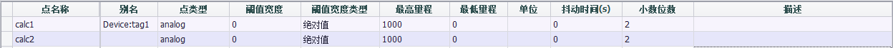

# 云连接Tag点表配置说明

| 参数 | 参数说明 |
|------|----------------------------------------------------------------------|
|`点名称`|双击此栏可以添加设备中的tag点。|
|`别名`|设置上传数据时的名称，别名为空时使用点名称作为数据名称。|
|`点类型`|显示tag点的数据类型，此项为只读项，在此点表中不可修改。如需修改，请到数据中心中修改原始tag点属性。|
|`阈值宽度`|用于配置点值的变化检测方式，共有两种方式：绝对值和百分比。当类型配置为绝对值时，会将tag当前点值与上一次上传的tag点值的差值取绝对值后与 阈值宽度 进行比较，如果超出则认为tag点发生了变化；当类型配置为百分比时，会将tag当前点值与上一次上传的tag点值的差值取绝对值后与上一次上传的tag点值进行比较，如果变化超过 阈值宽度 ，则认为tag点发生了变化。|
|`阈值宽度类型`|用于指定tag点检测的阈值宽度值，tag点的值变化在阈值内不会触发点值变化。|
|`最高量程`|点属性，云连接配置界面不可更改，需在数据中心中修改量程，量程不对EdgeLink限制|
|`最低量程`|点属性，云连接配置界面不可更改，需在数据中心中修改量程，量程不对EdgeLink限制|
|`单位`|只读项，当阈值宽度类型为百分比时会显示百分号，用于与绝对值区分。|
|`抖动时间`|单位为秒，当检测到点值超过 阈值宽度 后，就会开始进行 抖动时间 的验证。当tag点值在指定的 抖动时间 内都被检测为超出 阈值宽度 才会被最终判定为有点值变化，此时才会上传变化的值，否则会被判定为点值抖动，将不被上传。|
|`小数位数`|用于指定模拟量tag点值的小数点后的数据位数，默认为2，当实际的tag点值只有整数值时，可以将此栏位设置为0以节省数据流量。|
|`描述`|显示tag点的描述，此项为只读项，在此点表中不可修改。如需修改，请到数据中心中修改原始tag点属性。|
