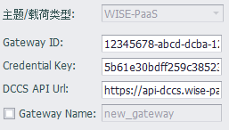

## DeviceOn/BI

DeviceOn/BI云服务插件用于将数据上传到DeviceOn/BI平台。

因为DeviceOn/BI的连接需要使用DCCS API来获取连接参数，所以基本配置中的连接参数将会被忽略。您只需将网站上生成的`Gateway ID`，`Credential Key`和`DCCS API Url`复制粘贴到相应栏位即可完成连接配置。

`Gateway Name`为选填项，不指定时，将会使用工程中配置的网关节点的名字。

DeviceOn/BI数据使用子设备模型上传数据。子设备的名称以Tag点名或者别名中的冒号（`:`）号来区分，冒号前的名称将作为子设备名，冒号后的名字作为实际上传的点名，如果点名或别名中没有冒号，则使用`Gateway Name`作为子设备名。

将`@`符号添加到别名后面可以用来标识Tag点的区块类型，例如Dev1:AI1@Pump，则Pump将会作为该Tag点的BlockType属性，上传的点名称只会包含@符号之前的字符。如果别名以@开头，则整个别名将会被用于BlockType。请注意最多只能输入一个@符号，否则将会造成云平台解析错误。

### 其他配置说明

[点表配置说明](zh-CN/EdgeLinkStudio/工程管理/工程配置/数据发布/Advance/TagList_Setting.md)   

[断点续传配置说明](zh-CN/EdgeLinkStudio/工程管理/工程配置/数据发布/Advance/resume.md)

[点表导入导出配置说明](zh-CN/EdgeLinkStudio/工程管理/工程配置/数据发布/Advance/excel.md)