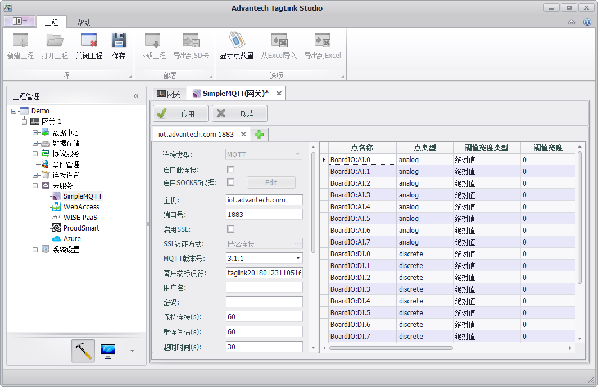
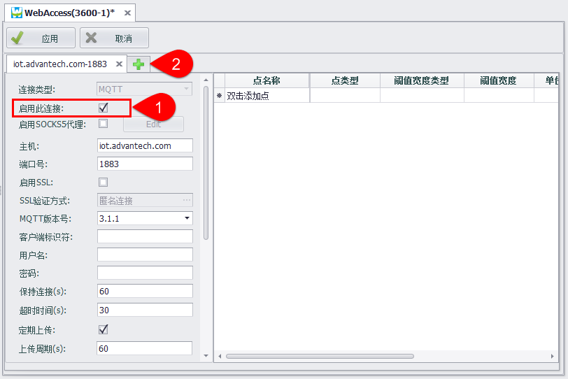
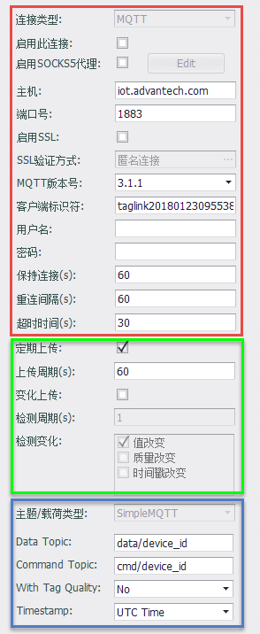
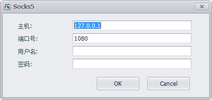
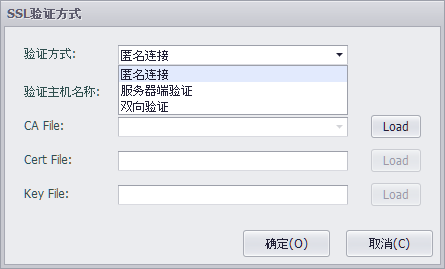
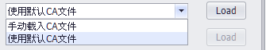

# 云服务

EdgeLink可以通过MQTT协议与云上的IoT中心设备终结点通信。目前EdgeLink支持与百度云、Azure等云服务商的IoT中心通信。

EdgeLink Studio中用户可以在云服务页面配置设备，将设备tag点信息上传到IoT中心，同时支持上传到多个不同类型的IoT中心。

用户需要配置IoT中心连接属性及上传条件、接收服务属性、需要上传的tag点等信息。

按照连接类型的不同，支持多种云服务，分别配置对应的连接信息。

---

## 基本配置

1. 为了使配置生效，必须选中“**启用此连接**”。在调试阶段可以合理地使用此开关来测试在同一个云服务类型中添加的多个连接。
2. 在主页面中点击右侧的“+”按钮，可为云服务添加多个连接，每一种云服务类型最多允许添加4个连接。

---

## 云端连接属性及上传属性

EdgeLink采用标准的MQTT协议规范连接云服务，所以大多数的云服务类型在MQTT连接设定部分的配置界面是相同的。Azure IoT Hub是一个例外，由于微软采用连接字符串的配置方式来提供用户登录凭证，所以针对Azure IoT Hub连接配置会有不同，具体详见Azure IoT Hub配置页面。

如下图的MQTT配置界面，红框部分是与Broker连接的配置信息，绿框部分是数据上传的配置信息，蓝框部分是各个云服务类型专属的配置信息，这部分将在各个云服务类型的说明页面中详细描述。

### 连接配置部分

- **启用SOCKS5代理** - 如果设备是在需要代理服务器才能连接到MQTT Broker的网络环境下使用，则需要启用SOCKS5代理。点击启用选择框后再点击“Edit”按钮即可在弹出框中设置SOCKS服务器信息，如下图，可以设置SOCKS5代理服务器的IP地址、端口号、用户名和密码。

	

- **主机** - 输入MQTT Broker的IP或者域名

- **端口号** - 输入MQTT Broker的监听端口号，默认情况下，不加密的TCP端口是1883，加密的TLS连接端口是8883。EdgeLink目前不支持WebSocket方式的连接。

- **启用SSL** - 如果Broker是要求SSL/TLS连接的，那么需要启用SSL，并依据Broker提供的配置来从三种验证方式中选择：

	1. 匿名连接：仅提供加密连接，通信双方不对身份进行验证。

	2. 服务器端验证：由设备端验证云端服务器的真实性，需要云端服务器提供CA文件。EdgeLink自带一些公共服务器的证书文件，如果连接的是公有云，可以尝试使用默认的CA文件。对于自己搭建的服务器，如果使用自签名的证书，将无法通过第三方证书机构认证，在这种情况下，除了需要将CA文件加载到设备上以外，还需要取消验证主机名称，否则连接无法成功建立。

	3. 双向验证：与服务器端验证的差别是，在这种情况下，云服务器需要验证设备端的身份，此时处理加载服务器的CA文件外，还需要加载设备的证书文件和秘钥文件，当设备与云服务器连接时，设备端将与云服务器端相互验证。

		

		

- **MQTT版本号** - 指定通信双方遵守的MQTT规范版本，一般情况下，使用默认的3.1.1版本即可，如果Broker有特殊要求，可按照其要求进行配置。

- **客户端标识符** - 客户端标识符用于Broker区别多个与之连接的客户端，请在此输入唯一的客户端标识，如果Broker支持的话，也可以留空以便由Broker自动分配一个客户标识。

- **用户名** - 与Broker连接所用的用户名，请按照Broker的要求填写。如果是配置与WISE-PaaS的连接，此处可以留空，WISE-PaaS协议插件将会通过DCCS API获取相应的用户名和密码。

- **密码** - 与Broker连接所用的密码

- **保持连接** - 单位为秒。依MQTT协议规定，当设备在一定时间内与Broker之间没有任何的通信，则必须向Broker发送MQTT PING报文以保持连接。这项参数的设定应遵从实际项目需要并结合Broker的配置来确定。

- **重连间隔**。单位为秒。定义客户端与云端重连的最小时间间隔，当设备与Broker无法建立连接或者连接中断后，会以此间隔不断进行重连尝试直至连接成功。

- **超时时间**。单位以秒。为单位定义客户端发送信息到云端响应的最大时间间隔，客户端超过时间没有得到相应后会主动中断连接。

### 数据上传配置部分

数据上传有两种模式，一种是定期上传，即以固定的时间间隔上报所有在右边tag列表中的tag点即时数据；另一种是变化上传，在这种模式下，程序会以配置好的检测周期及检测条件来检查tag点的变化，当检测到有tag点变化时才会上传那些有变化的tag点的即时数据。

定期上传和变化上传这两种模式可以同时启用，也可以只启用其中的一种模式。比较推荐的配置方式是同时启用定期上传和变化上传，其中变化上传的检测周期设定的时间短一些，定期上传的周期设定的长一些，这样就可以兼顾数据实时性及有效性，并可以减少带宽占用。

- **定期上传**: 定期上传的启用开关

- **上传周期**: 选择定期上传时数据的上传周期。

- **变化上传**: 变化上传的启用开关

- **检测周期**: 指定用于检测tag点变化的检测周期

- **检测变化**: 选择检测tag点的哪些参数变化，可选的参数包括点值、质量和时间戳。tag点值的变化检测会受到在tag点表中配置的阈值类型、阈值宽度和抖动时间这三个参数的影响，详见下面的tag点表配置说明。

---
### tag点表配置

tag点表用于将数据中心的tag点加入到MQTT连接中，每个连接可以有自己的点表配置，以满足不同云服务器的需求。

- **点名称**: 双击此栏可以添加或选择设备中的tag点。

- **别名**: 设置上传数据时的名称，别名为空时使用点名称作为数据名称。

- **点类型**: 显示tag点的数据类型，此项为只读项，在此点表中不可修改。如需修改，请到数据中心中修改原始tag点属性。

- **阈值宽度类型**: 用于配置点值的变化检测方式，共有两种方式：绝对值和百分比。当类型配置为绝对值时，会将tag当前点值与上一次上传的tag点值的差值取绝对值后与 *阈值宽度* 进行比较，如果超出则认为tag点发生了变化；当类型配置为百分比时，会将tag当前点值与上一次上传的tag点值的差值取绝对值后与上一次上传的tag点值进行比较，如果变化超过 *阈值宽度* ，则认为tag点发生了变化。

- **阈值宽度**: 用于指定tag点检测的阈值宽度值，tag点的值变化在阈值内不会触发点值变化。

- **单位**: 只读项，当阈值宽度类型为百分比时会显示百分号，用于与绝对值区分。

- **抖动时间**：单位为秒，当检测到点值超过 *阈值宽度* 后，就会开始进行 *抖动时间* 的验证。当tag点值在指定的 *抖动时间* 内都被检测为超出 *阈值宽度* 才会被最终判定为有点值变化，此时才会上传变化的值，否则会被判定为点值抖动，将不被上传。

- **小数位数**: 用于指定模拟量tag点值的小数点后的数据位数，默认为2，当实际的tag点值只有整数值时，可以将此栏位设置为0以节省数据流量。

- **描述**：显示tag点的描述，此项为只读项，在此点表中不可修改。如需修改，请到数据中心中修改原始tag点属性。
