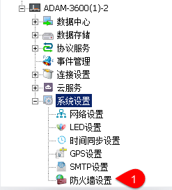
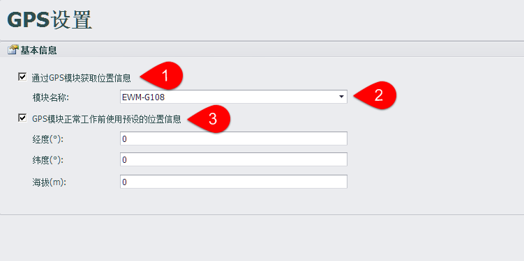
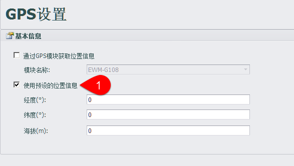
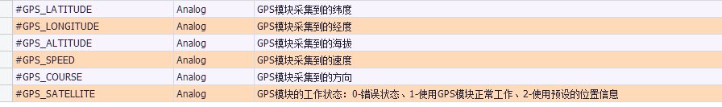
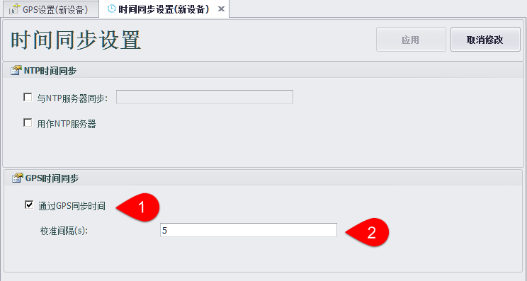

## GPS Setting

"GPS设置"中可以设置RTU上的GPS模块。

----

### GPS模块

1. 启用：启用GPS模块采集功能，RTU会通过GPS模块采集实时的位置信息、速度和角度。
2. 模块名称：可以选择的GPS模块类型。程序会从配置文件\\Resources\\GPSInfo.xml中读取模块信息。切换模块类型时，程序会将其他属性设为预设值。
3. 在GPS模块正常工作前会使用预设好的经纬度和海拔作为初始值。 
**注意!** GPS模块正常工作后，如果遇到突发情况如：GPS模块被拔出、GPS搜星数少于3颗导致无法获得位置信息时，经纬度和海拔值会保留为最后一次正常获得的数值。

----

### GPS预设值模式

1. 用户可选择不使用GPS模块，而是预设好RTU的位置信息。用户也可以选择不适用预设的位置信息，此时RTU中将不启动GPSManager模块。

----

### GPS系统点

GPS功能启用后会将位置信息存储到系统点中。

其中GPS\_SATELLITE中保存的是GPS模块当前的工作状态。

* 值为0时，表示RTU中的GPSManager模块未启动，或GPSManager处于出错状态。
* 值为1时，GPS模块正常工作。
* 值为2时，使用预设的位置信息设置GPS\_LATITUDE、GPS\_LONGITUDE、GPS\_ALTITUDE三个值，而GPS\_SPEED和GPS\_COURSE的值为0.

### GPS时间同步

GPS功能启用后，可以使用GPS同步RTU时间。

1. 至多只能选择一种时间同步模式。
2. 当GPS时间与RTU时间的差距大于“校准间隔”时，将设备时间与GPS时间同步。