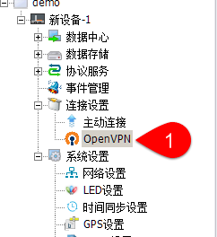
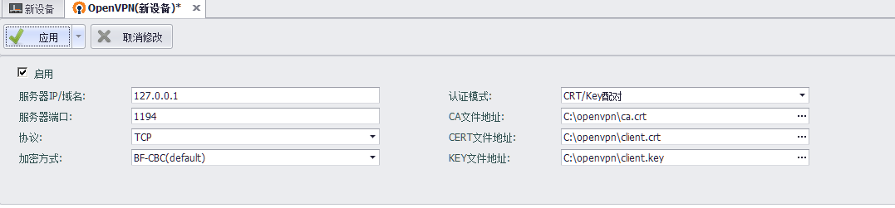
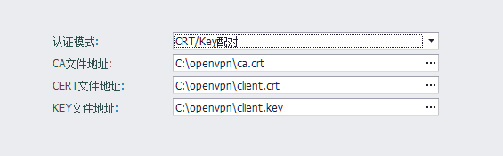

## OpenVPN设置

可以通过设置OpenVPN使EdgeLink作为客户端通过虚拟专用通道与VPN服务器相连。

双击打开“连接设置/OpenVPN”可以进行OpenVPN设置。

### 基本设置

由于需要与VPN服务器相连，需要配置如下属性：

1. 服务器IP或域名
2. VPN连接使用的端口号，默认为1194
3. 使用的传输协议，可以选择TCP或UDP
4. 传输的加密方式，可以选择FB-CBC、AES-128-CBC、DES-EDE3-CBC三种加密方式

### 认证模式-CRT/Key配对

EdgeLink支持两种认证模式，CRT/Key配对、用户名/密码。

CRT/Key配对需要用户将OpenVPN服务器上生成的CA文件、CERT文件、KEY文件放到EdgeLink Studio所在的电脑上。
在本页面载入后，这三个文件会在工程下载时被下载到EdgeLink中。

### 认证模式-用户名/密码

使用用户名、密码连接OpenVPN服务器时同样需要服务器上生成的CA文件。
同时还需要服务器上分配的用户名和密码。

### TLS身份认证

1. 当连接的OpenVPN服务器需要进行TLS身份认证时，可以在认证文件栏中输入认证文件的路径，以启用TLS身份认证。

2. 认证方向的值应该与OpenVPN服务器是互补的, 例如服务器为"0"时客户端应该选择"1",或者两端都设置忽略此值。