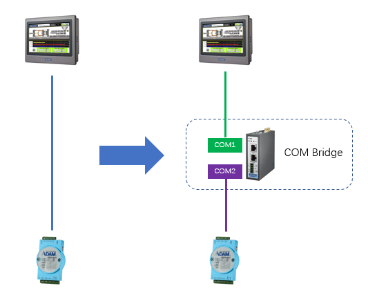
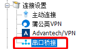
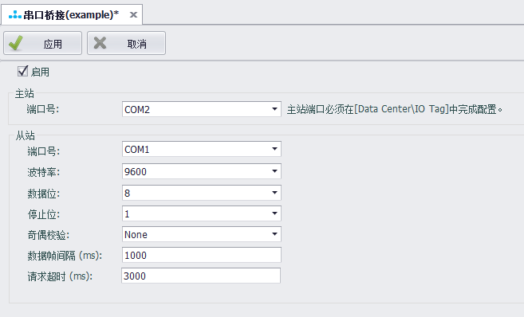

# 串口桥接

串口桥接主要用于在保留已有串口连接逻辑的场景下，加入网关进行数据采集，如下图所示，在HMI与被采集设备之间，加入一台网关，通过串口桥接功能将网关的两个串口进行桥接，使原有的HMI数据采集不受影响的同时，网关也能采集数据。

## 原理

串口桥接程序会打开两个串口，一个是与上位主站连接的从站端口，另一个是与下位被采集设备连接的主站端口。当串口桥接程序从从站端口接收到上位主站的请求时，会将数据报文转发到主站端口，并接受被采集设备的应答数据，将其从从站端口返回给上位主站。

因为串口是独占资源，为了实现网关的数据中心与上位主站能够同时对一台下位被采集设备进行数据采集，串口桥接程序需要与数据中心共享同一个主站端口，采用分时复用的策略来各自对被采集设备进行请求。因为是分时使用主站端口，所以在使用串口桥接程序时要协调好数据中心和上位主站的采集周期配置，否则会影响采集效果。

## 设置

串口桥接功能位于工程配置树的连接设置中，如下图所示：

双击工程配置树的串口桥接设置项，即可开启串口桥接配置页面，点击“启用”后即可配置串口桥接。

配置参数说明：

 - **主站-端口号**：选择一个已在数据中心配置好，用于采集的串口。
 - **从站-端口号**：选择一个未添加到数据中心且没有其他应用占用的串口，用来作为从站端口。
 - **数据位/停止位/奇偶校验**：按照与上位主站的实际连接情况选择。
 - **数据帧间隔（ms）**：指定上位机数据请求的最小间隔，单位是毫秒。串口桥接程序将依据此设定参数来拆分自从站端口接收到的完整数据报文。
 - **请求超时（ms）**：指定上位机数据请求的等待应答超时时间，单位是毫秒。串口桥接程序在转发报文后，如果等待应答的时间超过此设定参数，则认为设备无应答，此时串口桥接程序将释放对主站端口的占用，以便数据中心继续采集。

