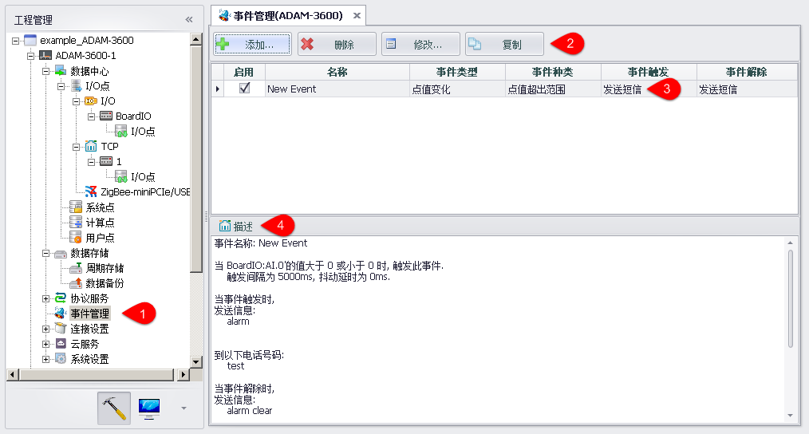
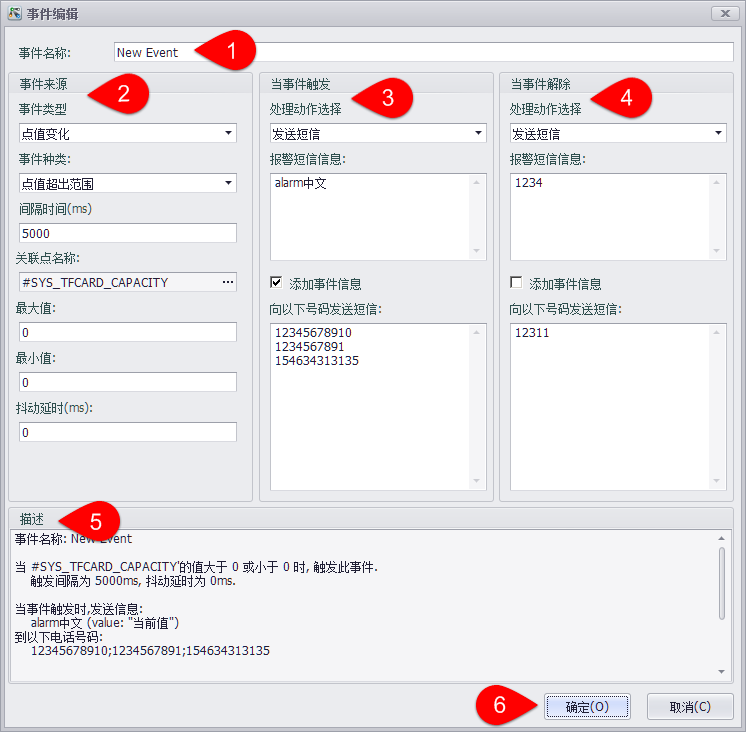
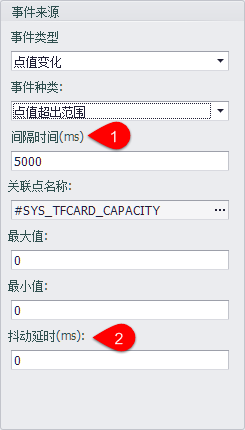
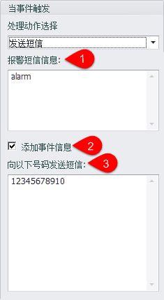
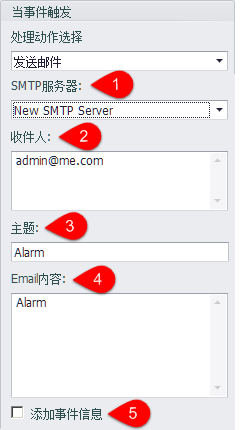

## 事件管理

事件管理页面允许用户设置事件的触发条件，当满足条件时触发事件，当状态从满足条件转变为不满足条件时执行事件解除。

### 事件管理页面

1. 双击“事件管理”节点打开编辑页面。
2. 可以添加、删除、修改、复制一个事件。
	- 添加：弹出事件编辑页面，新建一个事件
	- 删除：删除选中的事件
	- 修改：弹出事件编辑页面，修改选中的事件
	- 复制：复制选中的事件，并添加到事件列表中
3. 已添加的时间会在列表中显示，可以通过点击“启用”列的选择框，设置此事件是否在设备运行时启用。
4. 在列表中选择一个事件后，在描述框中会显示事件的说明。

### 事件编辑页面

1. 编辑事件名称
2. 可以通过选择事件类型以及具体的时间种类，确定事件参数。
3. 当事件触发时执行处理动作。
4. 同时可以编辑事件解除时执行的处理动作。
5. 与事件管理页面相同，在描述框中会实时刷新事件的说明。
6. 设置完成后点击确认即可保存设置。

### 支持的事件
#### 点值改变

目前支持点值改变事件，可以监控点值超出范围或点的质量不为good两种情况。

1. 间隔时间指一次事件触发后，在间隔时间内不再出发相同事件。
2. 抖动延时指当点值超过范围或质量不为good持续的时间小于抖动延时，此时不触发事件。

### 支持的处理动作

 -  发送短信：支持向指定手机号码发送报警短信

	

	1. 将要发送到手机上的短信文本。
	2. 选中后可以在短信最后添加事件的详细信息：
	
		Tag Name: #BATCH_WRITE_BoardIO  
    	Value: "current value"  
    	Quality: "current tag quality"  
    	Time Stamp: "timing of event"  
	3. 事件触发后会向此文本框中的号码发送短信，如有多个号码应换行或用';'分号分隔。

 - 发送邮件：支持通过SMTP服务器向指定邮箱发送报警邮件。

	

	1. 选择一个配置好的SMTP服务器，如没有配置请参考本文档的SMTP服务器配置部分。
	2. 收件人部分请输入标准邮件格式，如有多个收件人请换行输入或用';'分号分隔。
	3. 报警邮件的主题。
	4. 要发送的报警邮件内容。
	5. 选中后可以在邮件最后添加事件的详细信息：
	
		Tag Name: #BATCH_WRITE_BoardIO  
    	Value: "current value"  
    	Quality: "current tag quality"  
    	Time Stamp: "timing of event"  