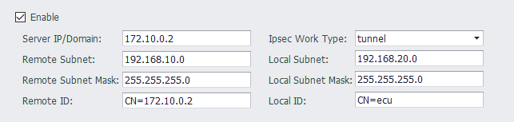

## IPSec Site to Site

IPSec site to site模式主要是通过IPSec协议将两个局域网进行连接。如下图所示

### IPSec 服务器配置

服务器IP地址及两边网段配置如下所示

### IPSec 验证模式

目前支持证书格式和PSK模式。

证书模式时，需要设置Remote ID为对端证书的Subjet，Local ID为本地证书的Subjet。

PSK模式时，Remote ID，Local ID都需要根据服务器配置设置。

### IPSec IKE配置

目前支持IKEv1 IKEv2模式，也可以设置为Auto模式，由协议自动进行配置。

### IPSec 状态查看

可以使用ipsec命令查看连接状态。

``
/home/sysuser/util/ipsec statusall
``

