## License 激活

## EdgeLink 购买方式

我们提供两种方式购买 EdgeLink 组件，可能涉及到的组件包括：EdgeLink 基础功能或在 EdgeLink 基础功能基础上加购 IEC-61850。

### 1. 方式一：通过 Marketplace 购买  
[Marketplace 链接](https://wise-iot.advantech.com/en-us/marketplace){target="_blank"}

#### 购买步骤：  
1. ​**登录 Marketplace**  

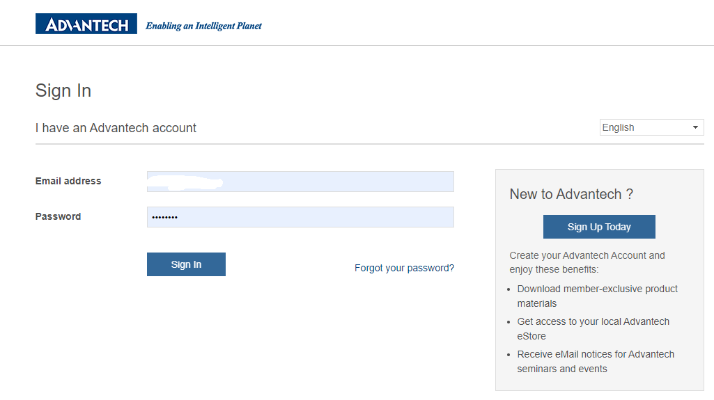

2. ​**搜索 EdgeLink**，找到价格方案，根据需求下单  

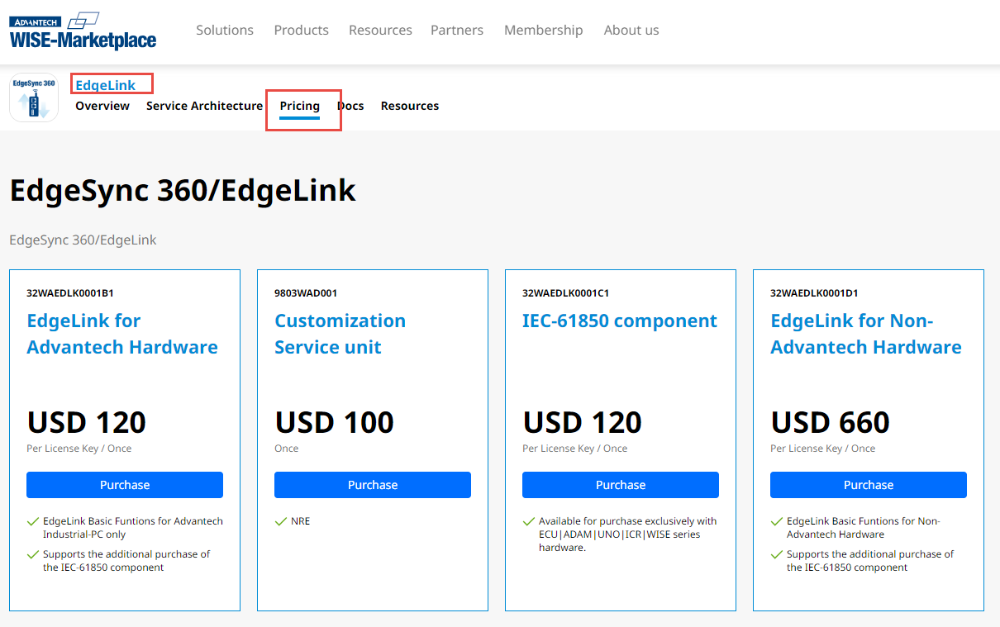

| 料号          | 描述                              | 说明                                                                 |  
|---------------|-----------------------------------|----------------------------------------------------------------------|  
| 32WAEDLK0001B1 | EdgeLink for Advantech Hardware   | 当客户已经购买研华硬件，需部署 EdgeLink 应用时购买此料号（可加购 IEC-61850，后续也可补充加购） |  
| 32WAEDLK0001C1 | IEC-61850 component               | 研华出厂设备已安装 EdgeLink（如 ECU、ADAM、WISE、UNO、ICR），默认只有基础功能，需单独购买 IEC-61850 服务 |  
| 32WAEDLK0001D1 | EdgeLink for Non-Advantch Hardware | 当客户需在非研华硬件上部署 EdgeLink 应用时购买此料号（可加购 IEC-61850，后续也可补充加购） |  
| 9803WAD001    | NRE 费用                          | 客制化需求，需评估 NRE 费用，根据产品部评估价格后再购买此料号        |  

3. ​**购买完成后**，到账户的“我的软体授权”页面查看待激活的订单（可一次购买多套 EdgeLink，但需逐个激活）  

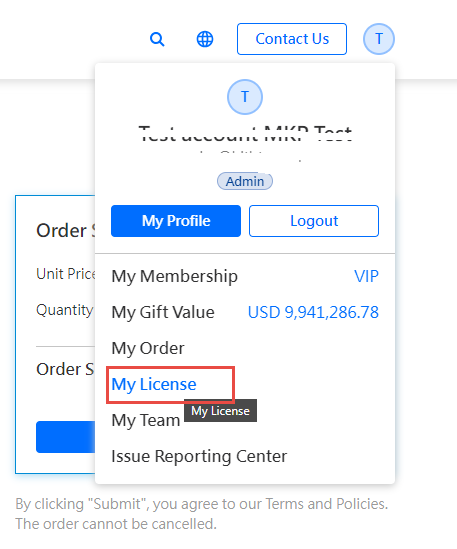

### 2. 方式二：通过研华业务购买  
联系研华销售人员进行购买。  

## 激活

### 什么情况下需要激活

1. ​**客户购买的硬件未安装 EdgeLink**，需自行安装 EdgeLink（默认只包含基础功能）。  
2. ​**客户购买的硬件已安装基础功能 EdgeLink，且已经为激活状态**，如果需要使用收费组件，如IEC-61850组件，则需要另外购买并激活，详情请参考[组件说明](#组件说明)

​**备注：​**

1. 客户购买的硬件已经包含EdgeLink基础功能（研华生产时会激活），不需要再次激活（购买硬件时可咨询业务人员），可以直接从在线查看基础功能的[激活状态](#激活状态码说明)

2. 这里将说明如何激活License，此处只包含License激活过程，Container版本EdgeLink部署过程需参考EdgeLink部署文档：[EdgeLink](https://www.advantech.com.cn/zh-cn/support/details/manual?id=1-2BBA3OC){target="_blank"}。

### 激活步骤

#### 安装 EdgeLink Studio

如果在 Marketplace 购买，则在“我的软体授权”页面下载“激活工具”（EdgeLink Studio），也可以通过 [EdgeLink Studio 官网下载链接](https://www.advantech.com.cn/zh-cn/support/details/utility?id=1-28QPAEB){target="_blank"}进行安装。如果已经通过其他渠道下载和安装，则可以忽略此安装步骤。

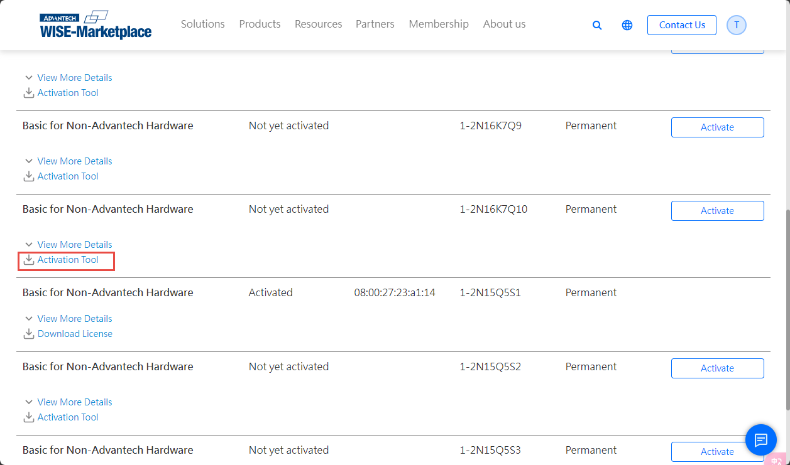

#### 获取待激活设备的 reg.elic 并保存到本地

在 PC 端打开 EdgeLink Studio，将 PC 与待激活 EdgeLink 的设备置于同一网络内。在 Studio 的在线设备中找到待激活设备，登录进入设备后进入 Activation 页面。

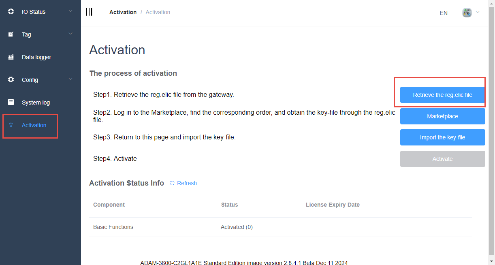

#### 获取授权文件(购买方式不同，获取授权文件的方式不同)

##### 通过 Marketplace 购买的 EdgeLink，获取授权文件
到 Marketplace 的“我的软体授权”页面。  

1. 点击Activate按钮
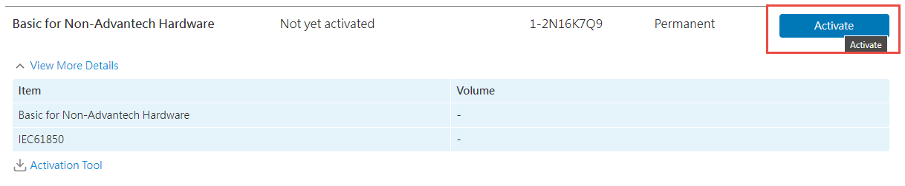

2. 点击Browse按钮导入刚刚拿到的reg.elic文件
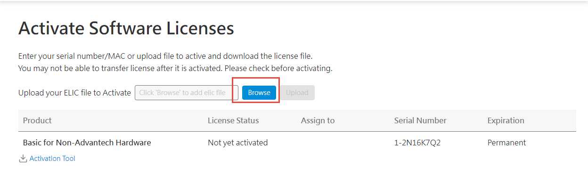

3. 点击Upload按钮完成授权操作
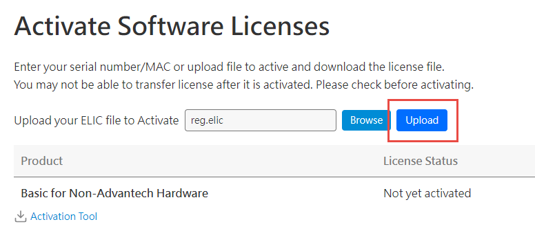

4. 授权操作完成后可以下载License key     
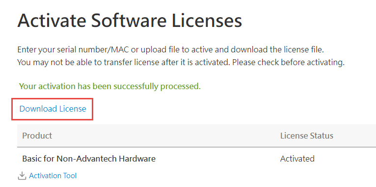

5. 下载完成后是一个zip包，需要解压拿到edgelink.lic
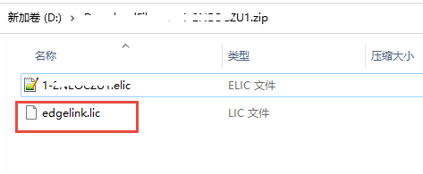 

##### 通过业务购买的 EdgeLink，获取授权文件

将获取的 [reg.elic](#获取待激活设备的-regelic-并保存到本地) 文件发送给业务人员，由业务人员联系产品部获取授权文件。

#### 到 EdgeLink Studio 在线的 Activation 页面，导入 edgelink.lic（或者 .elic 文件）。

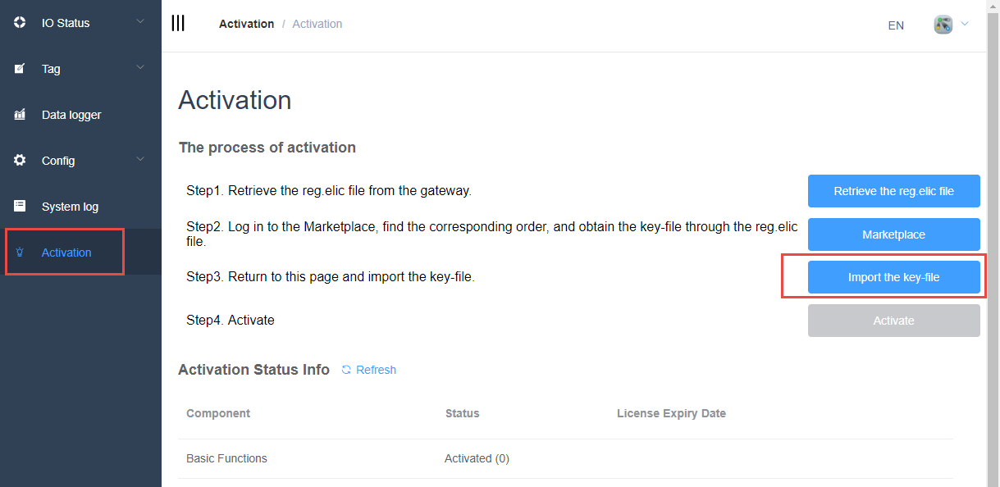

#### 激活

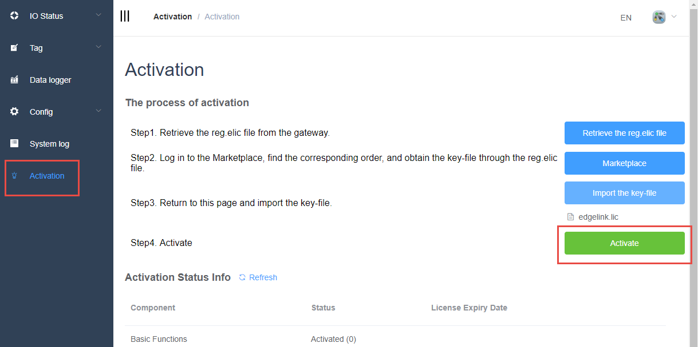

#### 点击 ​**Refresh** 按钮，查看激活状态。

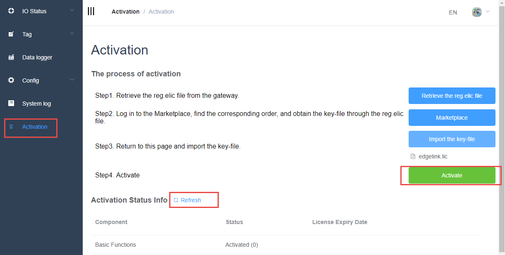

#### 激活状态码说明

| 状态码 | 说明               |  
|--------|--------------------|  
| 0      | 已激活             |  
| 1      | 试用               |  
| 2      | 试用过期           |  
| -1     | 未激活             |  
| -2     | ElicMgr 连接失败   |  
| -3     | 无此组件           |  

#### 组件说明

| 组件          | 说明                          |  
|---------------|-------------------------------|  
| Basic Functions | EdgeLink 基础系统             |  
| IEC61850      | IEC61850 组件，包含 driver 和 server |  
| Mitsubishi CNC | Mitsubishi CNC 组件           |  
| FANUC CNC     | FANUC CNC 组件                |  
| Haas CNC      | Haas CNC 组件                 |  
| Brother CNC   | Brother CNC 组件              |  
| KND CNC       | KND CNC 组件                  |  

#### 备注：

1.	基础功能是指上述表格中列出来的收费组件以外的所有功能，详情需参考EdgeLink功能列表说明：[EdgeLink Function Support List](https://www.advantech.com.cn/zh-cn/support/details/manual?id=1-2BLS919){target="_blank"}
2. CNC系列暂未上架，可以联系销售人员获取更多信息

