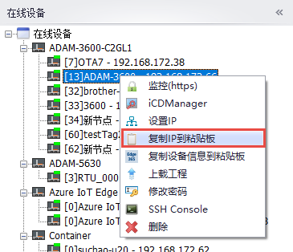
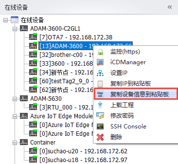

## 复制信息

用户可以将设备信息拷贝至粘贴板，用于后续使用。

### 复制IP地址到粘贴板, 例如：192.168.172.66

### 复制设备信息到粘贴板，此信息目前用于Edge365创建EdgeLink设备时使用  （2.8.2以上版本支持）。

信息格式如下：

{
  "name": "", \
  "description": "", \
  "mac": "", \
  "type": "EdgeLink" \
}

