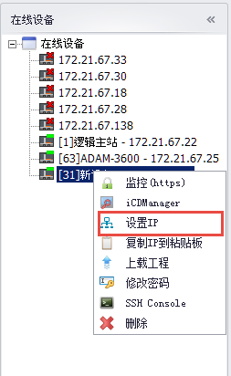
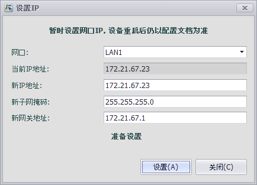

## 在线设置IP 

用户可以通过EdgeLinkStudio临时修改在线设备网口的IP地址和子网掩码。例如：RTU两个网口被设置为DHCP模式（动态分配IP），但网络中没有可以提供DHCP服务的服务器。此时RTU可以被搜索到，但无法通过IP访问。此时用户可以临时设置RTU的IP以便进行下载工程等操作。

>**注意**：此设置会在重启RTU后失效。重启后，RTU会依照配置文档设置网口状态

1. 在已经搜索到的在线设备上点击右键，点选设置IP，打开"设置IP"弹出框。

2. 在"设置IP"弹出框中，用户首先选择需要修改的网口，之后输入新的IP地址和子网掩码。

