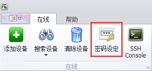
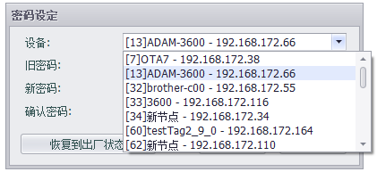
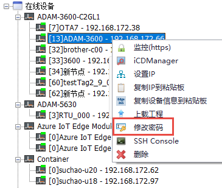
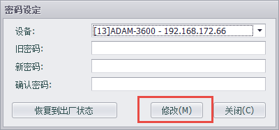
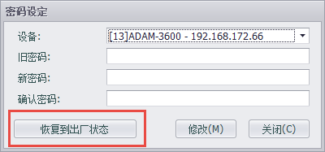

## 密码设定　

可以设置设备的密码，且注意此密码也为下载密码（默认密码00000000）。　

第一种情况：多个设备中选择任一设备进行密码修改

1. 点击密码设定　

2. 选择要设置的设备　

    

    

第二种情况：在具体某一在线设备上右键选择修改密码，修改当前设备的密码

1. 选定设备，右键　

2. 选择修改密码　
    
    

以上两种情况进入后

1. 填写旧密码，新密码，确认密码　

2. 点击修改，设置密码　

    

### 恢复到出厂状态

在此界面点击"恢复到出厂状态"，之后需要在10秒内重启设备。重启后设备的密码会恢复到出厂状态。

