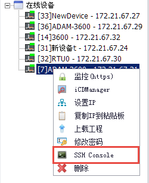
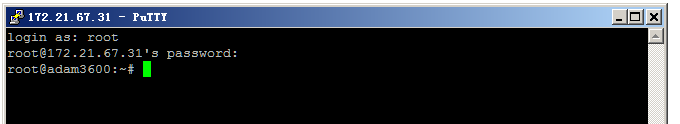
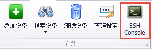
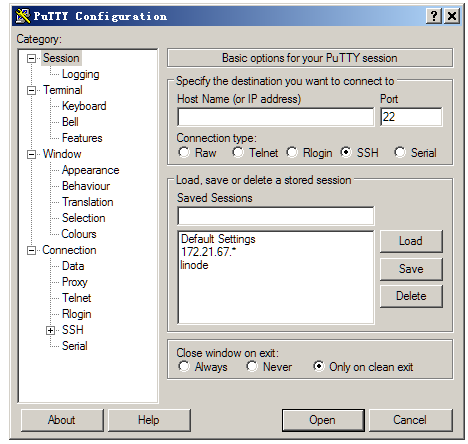

## SSH Console

用户可以在Online界面中通过SSH Console直接登陆到在线设备上。

### 登录在线设备

在线设备中中的设备上点击右键调出工具栏，点击工具栏中的SSH Console按钮。

用户输入用户名和密码后可远程登录到设备的系统中。

>**！注**：EdgeLink Studio使用Putty远程连接设备

### 手动登陆设备

如需要在登陆设备前设置连接参数，用户可以点击上方工具栏中的SSH Console按钮。

EdgeLink Studio会打开Putty的配置页面供用户编辑，编辑完成后点击Open即可登陆设备。