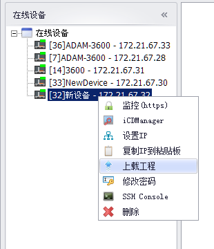
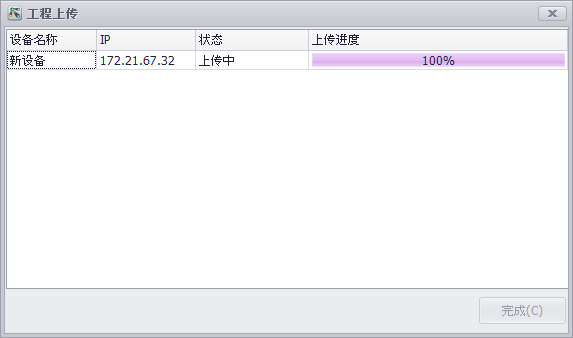

## 上传工程

用户可以将设备上的当前设备信息上载到EdgeLink Studio中。　

1. 在已经搜索到设备上点击右键，在工作框中选择“Upload Project”可以开始上载设备信息。
	
	

2. 上载设备信息前需要用户输入当前设备的密码，验证正确后才可以上载。
	
	

3. 上载时会以进度条的方式显示当前的上载进度。
	

4. 上载完成后，会在“工程管理”中显示上载的工程。

	- 此时如果“工程管理”中没有打开的工程，会新建一个包含上载设备信息的新工程。

	- 如果已有打开的工程，则上载完成后会尝试将设备信息保存在现有工程中。