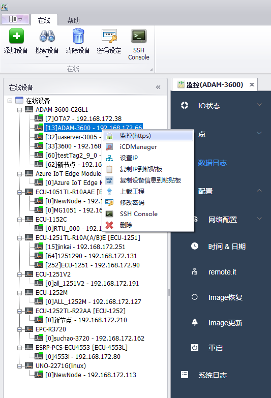

## 在线功能　

Advantech EdgeLink Studio支持在线设备操作，主要有以下几项功能：　

1. 在线添加设备，搜索设备，清除设备　

2. 在线密码设定，此密码用于工程下载，在线登录 (默认密码00000000)　

3. 在线监控设备:IO状态、点、数据日志、配置、系统日志

4. 在线设置设备IP地址（重启失效）

5. 复制当前设备IP地址到剪切板

6. 复制当前设备信息到剪切板 (在Edge365创建设备时使用)

7. 上载当前设备工程到本地

8. SSH访问设备

9. iCDManger　

　
