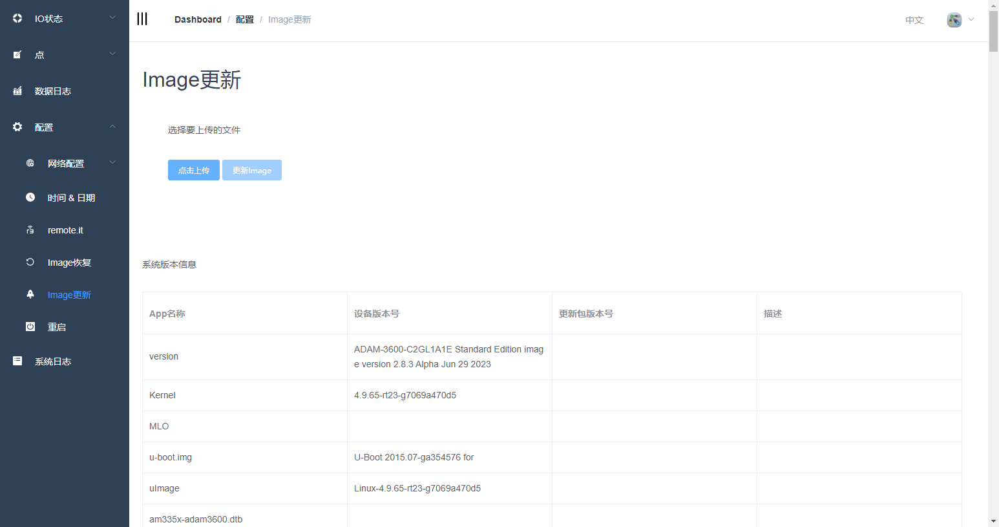
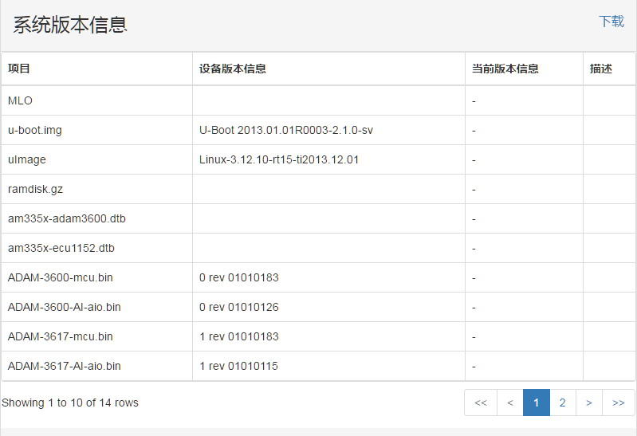
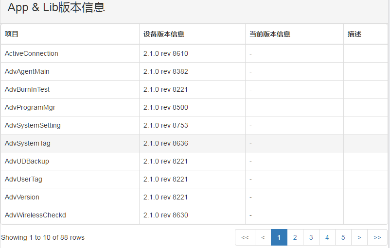
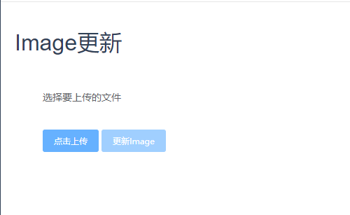
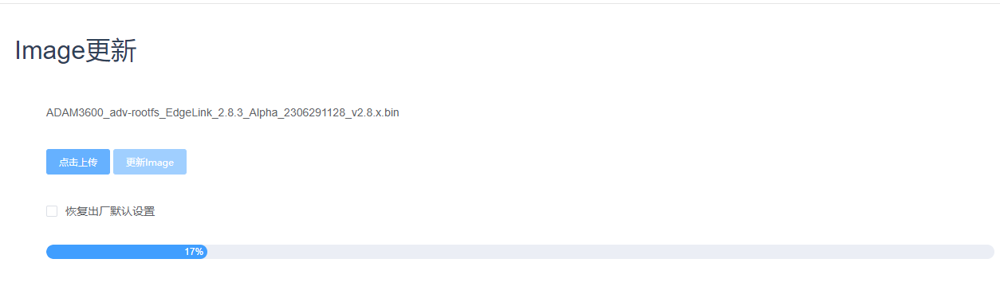
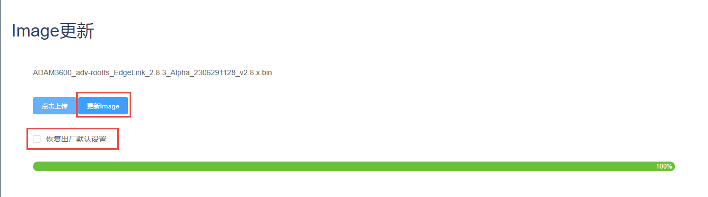
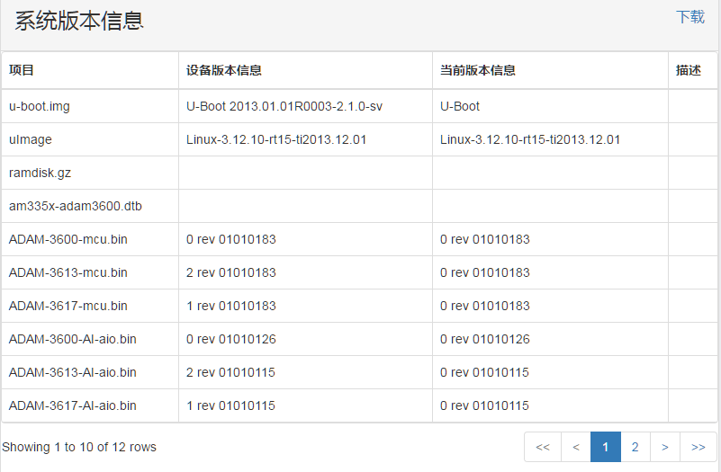
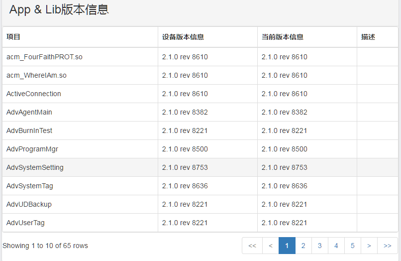
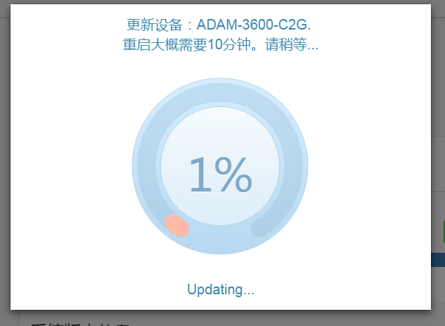
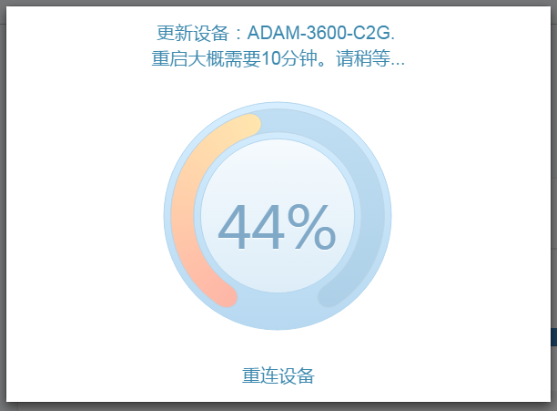

## Image更新　

Image更新页面显示了当前设备的所有系统版本和软件版本信息，并且可以实现固件以及软件的在线更新。页面显示如下：

### 信息显示

当前设备的系统版本信息显示如下：

当前设备的软件版本信息显示如下：

### Image更新

>**！注**：该操作必须登录后才能完成。

1. 点击上传选择需要更新的bin文件包。

	

3. 上传文件过程显示如下，整个过程耗时大约几mins。

	

	

	更新之前可以选择是否勾选‘恢复出厂默认设置’，如勾选则升级后原配置清除

4. 上传文件成功会显示出'更新image'按钮，如上图红色框出现时。同时，列出上传的文件包中的各个文件的版本号，如下图。

	

	

5. 点击Update开始Image更新，更新过程如下图所示。

	

	

6. 更新完成后，EdgeLink设备会重新启动，重启后会跳转到登录界面，用户登录后才可以进行后续操作。
