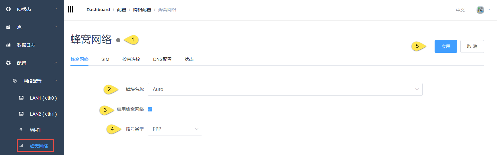
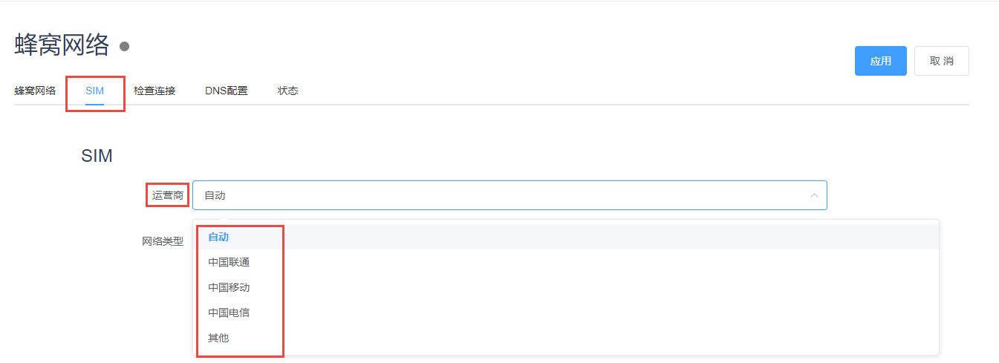
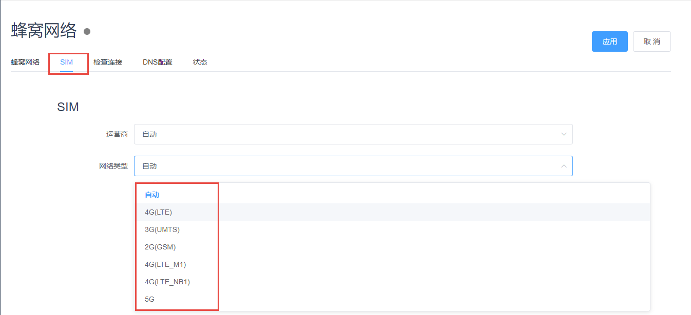
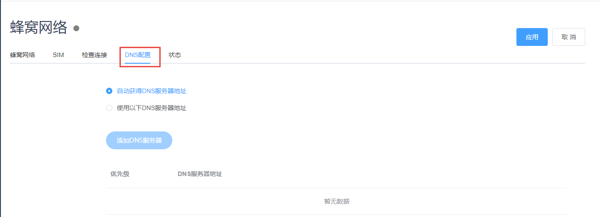
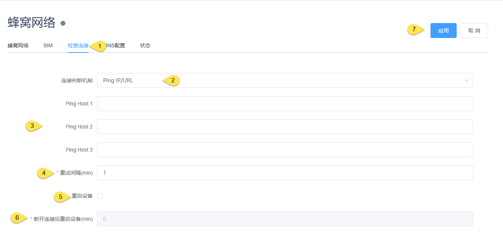
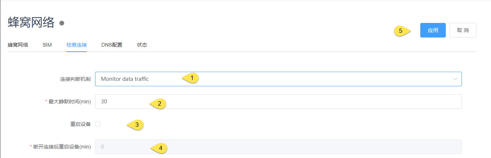
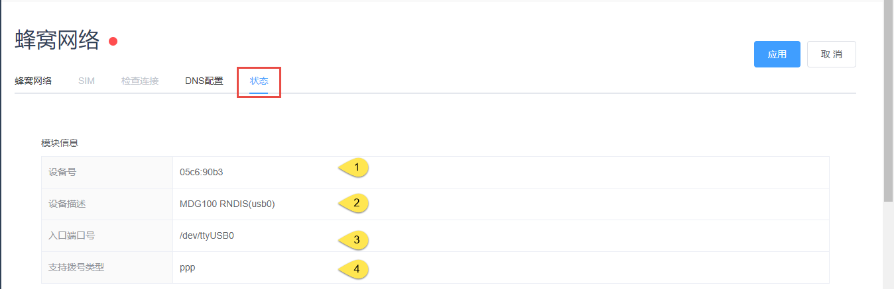
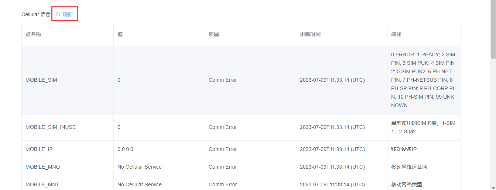

## Celluar配置

### 基础配置

1. 状态灯显示

|  状态   |  说明  |
|  ----  | ----  |
| 灰色 | 模块已拔出 |
|绿色| 检测到模块且已经建立网络连接|
|红色| 检测到模块但是没有建立网络连接 |

2. 选择模块Auto或者None

3. 是否启用蜂窝网络

4. 拨号类型：PPP或者QMI（依模块而定）

5. 应用后生效

### SIM

默认为Auto模式，需要时可以单独配置

应用后生效

### DNS设置

默认为自动获取DNS，也可以手动配置

应用后生效

### 检查连接 

检查连接机制是为了在网络不通的情况下，通过一些尝试使得网络可以恢复，包括重启网卡、重启设备（客户选择）

1. 切换到检查连接页面

2. 选择连接判断机制，目前支持Ping IP/URL和Monitor data traffic两种模式

#### Ping IP/URL模式

    3. Ping host(1\2\3)请用户填写在网络正常的情况下可以访问的IP或者URL

    4. 重试间隔：两次ping命令之间的间隔

    5. 勾选是否重启设备

    6. 在检查网络无法连接，且重启网卡也不能恢复的情况下，多长时间重启设备

    7. 应用后生效

#### Monitor data traffic模式

    1. 选择Monitor data traffic模式

    2. 最大静默时间，是指该网络环境下保持没有流量增加的时间

    3. 选择是否重启设备

    4. 在检查网络无法连接，且重启网卡也不能恢复的情况下，多长时间重启设备

    5. 应用后生效

### 状态

在线查看模块状态，分为两部分，一部分是模块状态，一部分是Celluar信息，包含拨号及网络状态

#### 模块状态

1. 设备识别号

2. 设备型号描述

3. 入口端口号

4. 支持拨号类型

#### Celluar信息

Cellular相关的系统点信息，为避免流量浪费，每次查看请点击刷新按钮更新当前状态

