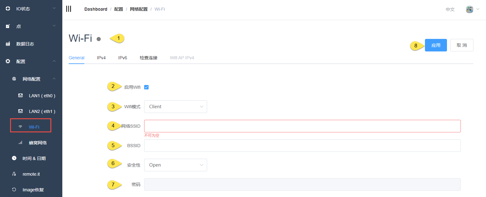
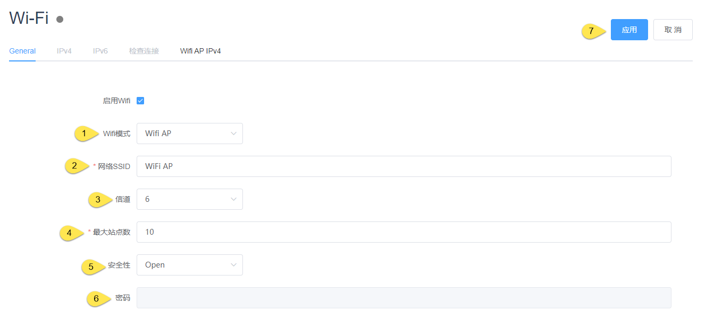
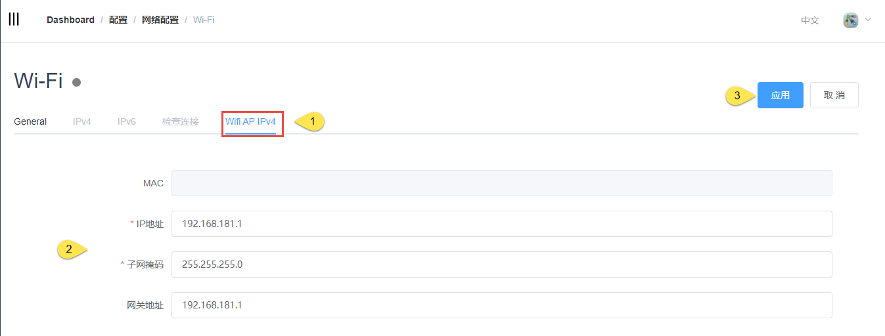

## WF-Fi配置

### 基础配置

1. 状态灯显示

|  状态   |  说明  |
|  ----  | ----  |
| 灰色 | 模块已拔出 |
|绿色| 检测到模块且已经建立网络连接|
|红色| 检测到模块但是没有建立网络连接 |

2. 是否启用Wifi功能

3. Wifi模式：Client模式和AP模式

    #### Client模式

    4. Client模式下网络的SSID，即Wifi模块连接到哪个网络

    5. BSSID:选填，当需要指定连接至指定AP时填写

    6. 安全性：Open、WEP、WPA/WPA2 PSK

    7. 对应安全性相关的密码

    8. 应用后生效

    #### AP模式（需要同时设置General和 Wifi AP IPv4）

    

    1. 选择Wifi AP模式

    2. 网关作为Wifi AP时的名称，用于其他Wifi Client接入使用

    3. 信道：默认为6，依据模块而定

    4. 最大站点数：此AP最大允许接入的Client个数

    5. 安全性：Open、WPA/WPA2 PSK

    6. 密码：设定此AP的密码

    7. 应用后生效
   
    

    1. 选择Wifi AP IPv4

    2. 设置AP模式下分配至Client的IP段

    3. 应用后生效

### 检查连接（Client模式）

检查连接机制是为了在网络不通的情况下，通过一些尝试使得网络可以恢复，包括重启网卡、重启设备（客户选择）

1. 切换到检查连接页面

2. 选择连接判断机制，目前只支持Ping IP/URL

3. Ping host(1\2\3)请用户填写在网络正常的情况下可以访问的IP或者URL

4. 重试间隔：两次ping命令之间的间隔

5. 勾选是否重启设备

6. 在检查网络无法连接，且重启网卡也不能恢复的情况下，多长时间重启设备

7. 应用后生效
