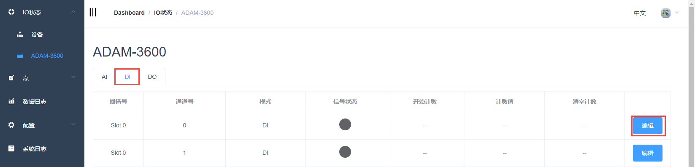
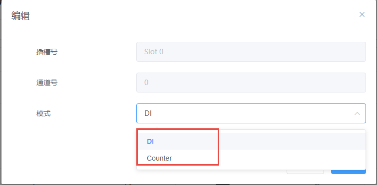
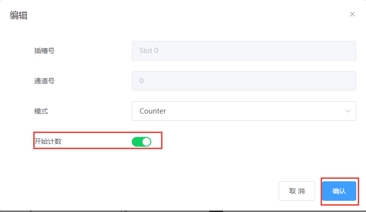

## DI数据获取和参数设置　

DI模块的数据显示如下图。数据表单项如下：

 - 插槽号：DI功能块所在的模块，slot0为板载。

 - 通道号：DI通道号。

 - 模式：Normal（即DI）或者Counter。

 - 信号状态：DI端口电平值。

 - 值：Normal模式时，此处显示采集到的DI值；Counter mode时，此处显示计数值。

	

   需要配置参数时，点击编辑按钮，设置此DI通道工作模式

   

   当DI通道工作模式为Counter时，可以通过开始计数选择是否使能Counter计数：
   
   绿色为使能，使能情况下DI通道有输入则计数
   
   红色为不使能，不使能情况下DI通道有输入也不计数

   

   注意：参数修改后需点击确认按钮方可生效

