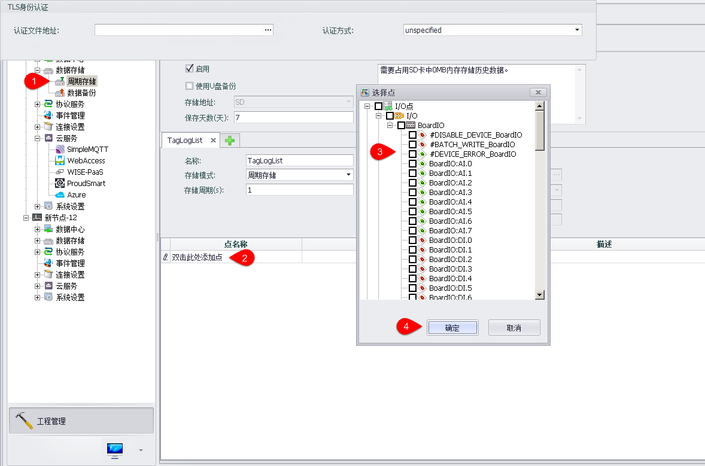
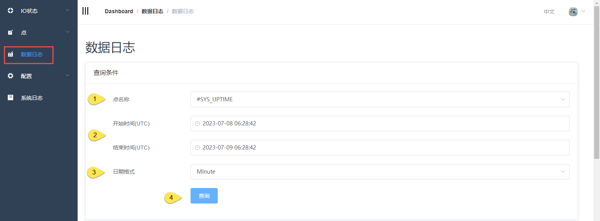
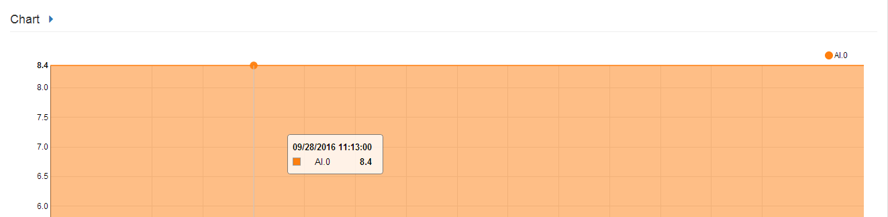
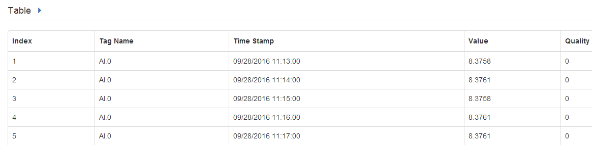
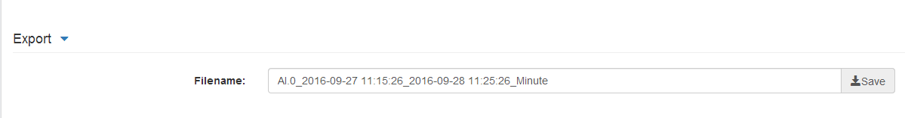
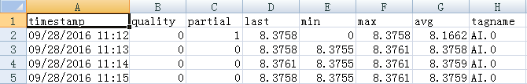

## 数据日志

用户可以在线查看设备上存储的历史数据。首先，用户需要在工程界面中配置周期存储。

　

下载到设备上后可以在在线页面中找到“系统信息”-“数据日志”页面，在此页面中查看已存储的数据。

查询属性如下：

1. 选择点名称
2. 选择数据存储的开始时间、结束时间
3. 选择查询的统计时间，可选择: 分钟/小时/天/完整数据
4. 点击查询

用户可通过以下三种方式查看数据

1. 数据折线图:

	

2. 数据表格:

	

3. 输出到Excel文档并下载，用户可以在浏览器中下载文档，Studio中暂时不支持此功能。

	

	