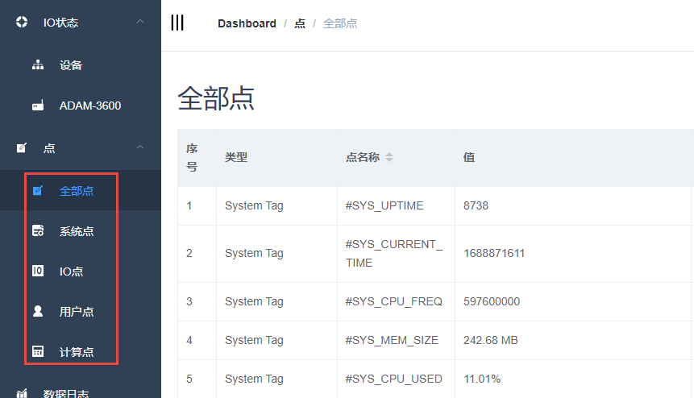

## Tags

EdgeLink在线操作提供了Tag点的获取和设置功能，不同的Tag类型对应不同的页面，分别是系统点， IO点， 用户点和计算点共四种类型，且支持全部点统一查看。　

__tag点搜索相关说明请参考如下连接__：

[tag点搜索](./tag_search/tag_search.html)

 

  

>**注！**
>
>1. 页面的显示行数默认为10行，也可选择每页显示行数:10\20\50\100

>
>2. 超出的部分进行分页显示,可以通过点击右下角的数字或者箭头切换显示其他的tags点

