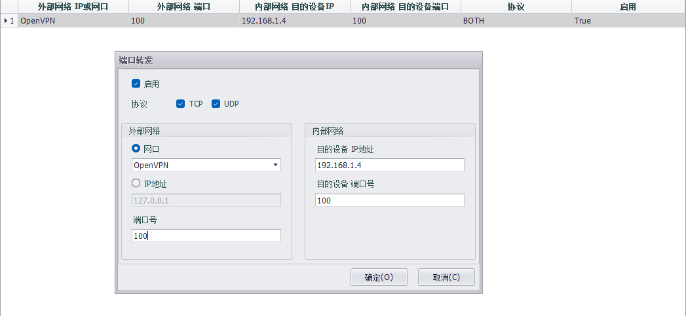

## 网口PLC远程运维

### 场景1

网关的一个网口只连接一台PLC，且PLC配置软件是通过固定端口进行数据发送的情况，可以直接使用端口转发的方式实现远程运维.

举例说明，PC （控制中心）与网关之间通过VPN建立网络连接，网关的LAN1 IP：192.168.1.3，LAN1连接的PLC IP：192.168.1.4 ，PLC通讯软件使用通讯端口为：100。

#### 操作步骤：

1. 通过EdgeLink Studio配置网关的端口转发,并下载工程    

2. 在控制中心打开PLC通讯软件对PLC进行配置(此时通讯软件连接10.0.3.6即可将配置下发到192.168.1.4)

### 场景2

网关的一个网口连接多台PLC（如果现场有多台网关，请注意：每台网关下接的PLC IP地址不可重复），此时可以用网络桥接实现远程运维（因为用到桥接功能，请将VPN设置为tap模式）

举例说明，PC （控制中心）与网关之间通过VPN建立网络连接，将VPN的IP设置为与PLC在同一网段，如图，PC（控制中心）VPN IP：192.168.1.200，网关VPN IP：192.168.1.201，网关的LAN1 IP：192.168.1.3，LAN1连接的PLC IP：192.168.1.10 

#### 操作步骤：

1. 部署VPN时，将IP地址设置为与PLC在同一网段

2. 通过EdgeLink Studio设置将VPN与LAN1桥接在一起，下载至网关，举例：br0 IP设置为：192.168.1.100

3. 在控制中心打开PLC通讯软件对PLC进行配置（通讯软件直接连接192.168.1.10进行配置）

### 场景3

网关的一个网口连接多台PLC,且多台网关下连接的PLC IP地址重复，如图所示。此时需要用到虚拟组网功能实现远程运维。（场景1和场景2同样可以通过虚拟组网实现远程运维，因为端口转发和网络桥接配置更简单，容易上手，所以推荐场景1和场景2的用法）

#### 操作步骤：

1. 通过EdgeLink Studio设置虚拟组网，下载至网关1 （其他网关参考实际进行虚拟组网进行配置）

2. 在控制中心配置对应路由，EdgeLink Studio提供参考脚本，拷贝后直接在控制中心的命令行中执行即可.

3. 在控制中心打开PLC通讯软件对PLC进行配置（通讯软件连接10.3.20.18进行网关1连接的PLC1配置）

**虚拟组网详细配置介绍请参考[2.9.1.6 虚拟组网](../systemsetting/VirtualNetwork.html)章节**

