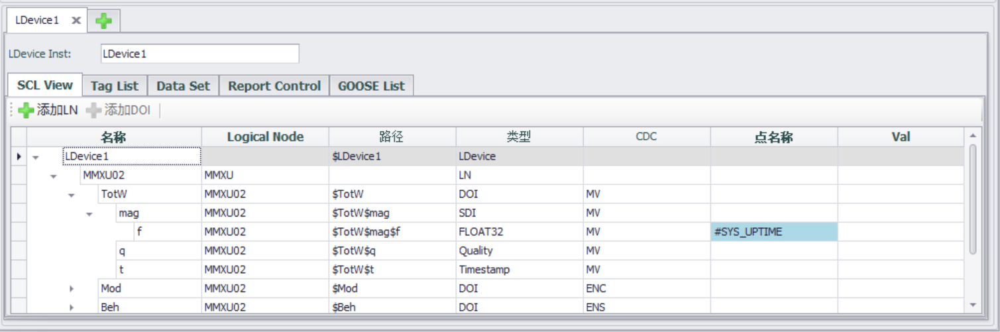
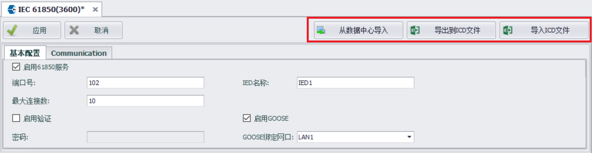

### IEC-61850

EdgeLink可以作为IEC-61850服务器与客户端进行数据交换。

这里将详细阐述如何在EdgeLink Studio中使用IEC-61850服务。

在左边的菜单树双击“服务”下的“IEC-61850”项，弹出配置界面。

#### 配置IEC-61850服务

配置IEC-61850服务前需要先勾选启用，之后配置服务器的基本信息和安全配置。IEC-61850的配置大多会体现在ICD文件中，这里提供ICD文件的导入导出功能，允许用户将已生成的ICD文件导入服务直接使用。这里需要注意，EdgeLink中IEC-61850服务只支持一个ICD文件中的一个IED，这个IED也只包含一个LDevice。

基本配置页面中配置IEC-61850服务器的基本信息，包括：

- 端口号
- 最大连接数
- IED名称
- LDevice Inst

##### 安全配置

支持三种安全模式：

1. 不验证
2. 密码验证
3. 证书验证

密码验证安全模式只验证密码

证书验证安全模式中用户需要配置CA证书文件以及MMS的证书文件。

用户可选择是否启用TLS。

#### 配置SCL

用户将在此页面配置IEC-61850的模型以及数据集和报告，在工程编译时会生成基于SCL语言的ICD文件。

EdgeLink Studio的IEC-61850服务只支持一个ICD文件中的一个IED，这个IED也只包含一个LDevice。在“SCL View”中只对这一个LDevice进行配置。在启用IEC-61850服务时，会自动创建这个LDevice，同时创建LDevice的LN0节点和LPHD节点。

点击“添加”为LDevice添加逻辑节点LN:

可以通过“逻辑节点类型”切换类型，同时勾选要配置的DAI节点。

添加LN后需要为配置的DAI节点关联tag，双击DAI中的点名称单元可以选择工程中已有的tag，同时可以配置IEC-61850中的数据类型。

Tag List页面列出了已添加的所有DAI节点，用户也可以方便的在Tag List页面中为DAI关联tag。

同时提供Tag List导入导出到Excel的功能，用户可以在EXCEL中快速关联DAI与tag。

#### 配置DataSet

DataSet 表示数据集，表示各个逻辑节点包含的数据整理成的一张表，表里面用很多个信号，每个信号用“逻辑设备名称/逻辑节点名称\$功能类型\$树枝\$树叶”这一串路径来精确的表示。 

添加数据集时，界面上会列出已添加数据模型，将用户勾选的DAI添加到数据集中。用户也可以在左侧对已添加的数据集进行筛选。

#### 配置Report

ReportContro控制着如何发送这些数据集，在什么情况下发送哪些内容

#### ICD文件导入导出

用户点击“导出到ICD文件”按钮，可以将配置导出。点击“导入ICD文件”将在其他软件中配置好的ICD文件导入。不过当导入的ICD文件中有多个IED或有多个LDevice节点时，将只导入第一个IED的第一个LDevice配置。