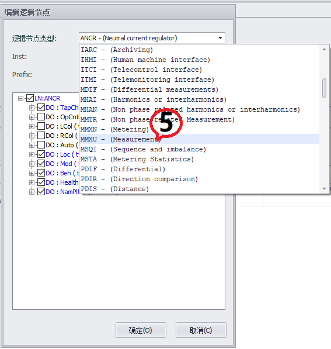

## IEC-61850

EdgeLink可以作为IEC-61850服务器与客户端进行数据交换，IEC-61850功能为收费组件，需单独购买。[购买和激活](./License/License.html)   

这里将阐述如何在EdgeLink Studio中使用IEC-61850服务。

- 在左边的菜单树，展开**“协议服务”**，双击**“IEC-61850”**项。  
   
  

   
   
- 进入**IEC-61850**配置界面。  

  
  
   

- 勾选**“启用61850服务”**项。  

   

### 基本配置

IEC-61850服务目前支持MMS服务和GOOSE服务两种，请按需启用。
此配置页面用于指定通用IEC-61850服务器选项，包括：

- **端口号**  
  用于接受与IEC 61850客户端（MMS）连接的端口号。默认端口号为102。
- **最大连接数**  
  指定支持的最大连接数。默认设置为10。 
- **IED名称**  
  当前IED的名称。您可以更改IED名称。
- **启用验证**  
  设置IED的身份验证模式。默认情况下，身份验证模式设置为“无”。勾选“启用验证”项，要将身份验证模式更改为密码。
- **启用GOOSE**  
  指定是否支持GOOSE服务。默认情况下，不启用GOOSE服务。  
     

### 配置IEC-61850服务

IEC-61850服务目前支持MMS服务和GOOSE服务两种，请按需启用。

   

   

可以配置ICD文件的Communication参数，包括子网名称（SubNetwork-name）、访问点名称（ConnectedAP-apName）以及设备IP地址

### 配置SCL

用户将在此页面配置IEC-61850的模型以及数据集和报告，在工程编译时会生成基于SCL语言的ICD文件。

EdgeLink中IEC-61850服务支持ICD文件中包含多个IED，每个个IED可包含多个LDevice。在“SCL View”中只对这一个LDevice进行配置。在启用IEC-61850服务时，会自动创建这个LDevice，同时创建LDevice的LN0节点和LPHD节点。

   
   

- 访问 **LDEVICE**（Logical Device，逻辑设备）配置界面

  界面显示已配置的 LDEVICE 列表，支持新建、编辑、删除操作。

  **LDevice Inst**：逻辑设备名称，IED 下的逻辑设备的唯一标识符。确保 LDEVICE 名称与同一 IED 下的其他逻辑设备不冲突。
  

   
   

- **关联逻辑节点（Logical Node, LN）**

  - 点击**“添加LN”**按钮
  

   
   

  - 选择**逻辑节点**类型

    从预定义的**“逻辑节点类型”**列表中选择（如：**MMXU**：多相测量逻辑节点）。
  

   
   

  - 配置**逻辑节点**属性
  

   

  **选择数据对象（DO）和数据属性（DA）**
  

   
   

  - **配置数据映射**

  添加LN后可以为配置的数据属性（DA）节点关联Tag。双击数据属性（DA）中的**“点名称”**单元，可以选择工程中已有的Tag。

   
  选择关联**Tag**，然后点**“确定”**按钮。   

   
   

   
   

  - **Tag List**
  
**Tag List**页面列出了已添加的所有数据属性（DA）节点，用户也可以方便的在Tag List页面中为数据属性（DA）关联tag。Tag List页面支持Excel导入/导出，用户可以在EXCEL中快速关联数据属性（DA）与tag。  

   
   
Tag List导出到EXCEL中的内容。   
   

   
   

### 配置数据集（DataSet）

在 IEC 61850 标准中，数据集（DataSet） 是逻辑节点（LN）中数据属性（DA）的有序集合，用于高效组织和传输设备间的关键信息（如测量值、状态信号、控制指令等）。数据集是 MMS（制造报文规范）和 GOOSE（通用面向对象变电站事件）通信的基础。  

  - **进入数据集配置界面**  
  
  界面通常显示已创建的数据集列表，支持新建、编辑、删除操作。  

   

  - **创建新数据集**  
  
  
  
点击**“添加”**按钮  

   

**编辑DataSet**窗体会列出当前LDEVICE包含的所有逻辑节点（LN）中数据属性（DA）。  

   

选择**数据对象（DO）或数据属性（DA）**  

   
   
点击**“确定”**按钮返回**数据集**配置界面，查看已创建的数据集。  

  
  
  
### 配置报告（Report）

IEC 61850 报告用于将数据变化、状态更新等信息从服务器端发送到客户端。  
   
IEC 61850 报告是通过报告控制块（RCB，Report Control Block）实现配置和管理。  
  

  - **进入Report Control（报告控制块）配置界面**  
  
  界面通常显示已创建的数据集列表，支持新建、编辑、删除操作。  

  - **创建新报告**  
  
  
点击**“添加”**按钮  

  - **编辑报告**  
  
**报告控制块**配置  

| **参数**           | **说明**                                                         | 
|---------------|---------------------------------------------------------------|
| 名称           | 报告控制块的名称。该名称与承载RCB的LN相关，在LN内应是唯一的 |
| Report ID | 报告控制块的标识符。客户端可以使用报告标识符字段来区分来自各种BRCB的报告 |
| Data Set | 报告控制块要发送的数据集的名称 |
| Indexed | 如果为true，则报告控制块实例名称将根据提供的名称构建，后面是从01到最大值99的索引号. 最大索引值由“Report Enabled max”来设置 |
| Config Revision | 此报告控制块的配置修订号。此属性应表示DATA-SET配置更改的次数 |
| Buffer | 指定报告是否缓存 |
| Buffer Time | 缓存时间。在第一个事件发生后，必须经过此缓冲时间才能发送报告 |
| Integrity Period | 循环报告的完整性周期（毫秒）。0表示没有完整性报告 |
| Report Enabled max  | 定义此类型的报告控制块的最大数量，这些控制块在配置时在LN中实例化（然后在线使用）。最大值为99 |
| Desc | 描述文本 |

**报告格式**配置  

配置报告中需包含的附加信息段  

| **参数**           | **说明**                                                         | 
|---------------|---------------------------------------------------------------|
| sequence-number   | 如果为TRUE，顺序编号将包含在报告中 |
| report-time-stamp | 如果为TRUE，事件时标将包含在报告中 |
| reason-for-inclusion | 如果为TRUE，触发原因码将包含在报告中 |
| data-set-name | 如果为TRUE，数据集名称将包含在报告中 |
| data-reference  | 如果为TRUE，数据项引用路径将包含在报告中 |
| buffer-overflow | 如果为TRUE，缓冲区溢出标识将包含在报告中 |
| entryID | 如果为TRUE，EntryID将包含在报告中 |
| conf-revision | 如果为TRUE，配置引用（关联数据集版本）将包含在报告中 |

**触发条件**配置  

触发选项决定何时发送报告。   
   
配置需要的报告触发方式（可多选），为True的时候触发  

| **参数**           | **说明**                                                         | 
|---------------|---------------------------------------------------------------|
| data-change   | 数据值变化时触发（dchg） |
| quality-change | 数据品质变化时触发（qchg） |
| data-update | 数据被更新时触发（dupd） |
| integrity | 按固定周期发送（需设置intgPd，如 1000ms） |
| general-interrogation | 总召唤触发（客户端请求时发送全量数据） |
  
  
点击**“确定”**按钮返回**配置报告界面**，查看已创建的报告。  

  
  

### 配置GOOSE  

  
  - **前提条件**  

**启用GOOSE**服务，已完成 LDEVICE（逻辑设备）、LN（逻辑节点）及相关数据集（DataSet）配置。  
  
  

  - **进入GOOSE配置界面**  
  
  界面通常显示已创建的GOOSE列表，支持新建、编辑、删除操作。  

  

**创建 GOOSE 控制块（GCB）**  

点击**“添加”**按钮  

  
  

**配置 GOOSE 报文参数**

  

| 参数           | 说明                                                         | 
|---------------|---------------------------------------------------------------|
| 名称           | 标识本GOOSE控制块的名称 |
| GOOSE ID | GOOSE报文所属应用程序的系统范围唯一标识 |
| Data Set | GOOSE 关联数据集 |
| Config Revision | 此控制块的配置修订号 |
| MAC-Address | 长度为6个八位字节，包含了待发送GOOSE报文的目的MAC地址值。该地址应为多播位设置为TRUE的以太网地址。地址范围分配:起始地址（十六进制）：01-0C-CD-01-00-00 结束地址（十六进制）：01-0C-CD-01-01-FF |
| APPID | APPID用于选择包含GSE管理和GOOSE消息的ISO/IEC 8802-3帧，并用于区分应用程序关联。GOOSE的预留值范围为0x0000到0x3FFF。强烈建议在系统中使用一个独特的、面向源代码的GOOSE APPID |
| VLAN-PRIORITY | 优先级别。出站消息的优先级。数值范围应限制在0到7之间。其中0是最低优先级，7是最高优先级。 |
| VLAN-ID | 虚拟局域网标识符。数值范围应限制在0到4095（FFF）之间 |

### ICD文件导入导出

IEC-61850的配置大多会体现在ICD文件中，这里提供ICD文件的导入导出功能，允许用户将已生成的ICD文件导入服务直接使用。不过当导入的ICD文件中有多个IED时，将只导入第一个IED配置。

ICD文件导入导出功能包括：

- **从数据中心导入**  
  使用ICD模板配置IED。
- **导出到ICD文件**  
  将当前IED配置导出到ICD文件。 
- **导入ICD文件**  
  导入已有的ICD文件。  
     
	 
点击**“导出到ICD文件”**按钮，可以将配置导出。  
点击**“导入ICD文件”**将在其他软件中配置好的ICD文件导入。不过当导入的ICD文件中有多个IED时，将只导入第一个IED配置。

### 配置MMS服务示例
- 进入**IEC-61850**配置界面  
   
  
   
  
  
- **“启用61850服务”**  
   
  
   
  
  
- **添加LN**    
   
  
   
  
  
- 选择**逻辑节点类型** MMXU - (Measurement)  
   
  
   
  
  
- **选择DO**   
注意：选择的DO中，要包含**Float**或者**Double**数据类型的DA   
   
   
   
   
   
- **关联tag到Float或者Double数据类型的DA**  
   
   
   
   
   
- **下载工程**  
   
   
   
   
   
- **用客户端查看**  
   
  
   
   
   
   
### 配置GOOSE服务示例   
   
      
在IEC-61850主站中，配置GOOSE模型，包含启用GOOSE服务、配置绑定的物理网口、配置定义 GOOSE 相关的逻辑节点、数据集、控制块。   
   
    

- 进入**IEC-61850**配置界面  
   
  
   
  
  
- **“启用61850服务”**  
   
   
   
   
   
- **“启用GOOSE”**，然后设置**“GOOSE绑定网口”**   
   
  
   
  
  
- **添加LN**    
   
  
   
  
  
- 选择**逻辑节点**类型 **MMXU - (Measurement)**  
   
  
   
  
  
- **选择DO**   
注意：选择的DO中，要包含**Float**或者**Double**数据类型的DA   
   
   
   
   
   
- **关联tag到Float或者Double数据类型的DA**  
   
   
   
   
   
- **创建或选择数据集**  
   
   
   
   
   
- **根据GOOSE数据集需求，添加数据对象到数据集**  
   
   
   
   
   
- **为数据集关联 GOOSE 控制块（GoCB）**  
   
**新建 GOOSE 控制块（GoCB）**   
    
   
   
   
   
- **设置 GoCB 的通信参数**  
   
明确关联唯一的数据集；设置 GoCB 的通信参数，如组播 MAC 地址、应用 ID（APPID）等。   
   
   
   
   
   
- **下载工程**  
   
   
   
   
   
- **用客户端订阅GOOSE，并查看**  
   
  
   
   

### 从数据中心导入

用户在配置点的“电力属性”参数后，可以将这些点依照模板导入到IEC-61850服务中。

1. 点击“从数据中心导入”按钮

    

2. 选择模板文件，默认模板文件中电力属性与61850类型的对应关系如下：

    | 电力属性 | LNode | DO | DA |
    | ------ | ------ | ------ | ------ |
    |    遥测    |   GGIO     |   Ind     |   mag-f     |
    |    遥信    |   GGIO     |   AnIn     |   stVal     |
    |    遥控    |   GGIO     |   SPCSO     |   stVal     |
    |    电度    |   MMTR     |   SupWh     |   actVal     |
    |    定值    |   GGIO     |   SetVal     |   setMag-f     |

    

    用户也可以通过修改模板文件改变电力属性对应的61850类型。

3. 选择点，选择要导入的点，默认将这些点配置在一个LDevice里面，不勾选“合并为一个LDevice”时会将每个仪表生成一个LDevice，其中只包含这个仪表中的点。
    

4. 逻辑节点tag数量限制，每个LNode中包含的点数量最大值，当一个类型的点数大于这个限制时会新建一个LNode。

    比如要导入1000个遥测类型的点，而遥测限制是300，LDevice在导入后：
    - 创建4个GGIO类型的LNode
    - 前三个LNode有300个Ind类型的DO
    - 第四个LNode有100个Ind类型的DO

    

5. 文档参数
    - rptID取值：默认为None，
        - 选择None: ReportControl的id值为空；
        - 选择Report Index: ReportControl的id值为{LDevice inst}/LLN0$RP${ReportControl name}
    - Report Enabled Max：设置RptEnabled的max值
    - du添加设备名称作为前缀：
        - 不勾选时点的dU值为点名称
        - 勾选后点的dU值为仪表名和点名称的组合
    

6. 导入总览，统计每种类型会导入的点数量，创建的LNode数量
    
    
