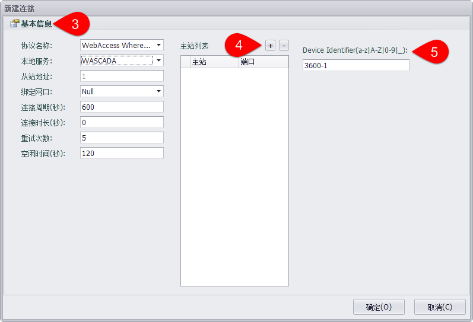
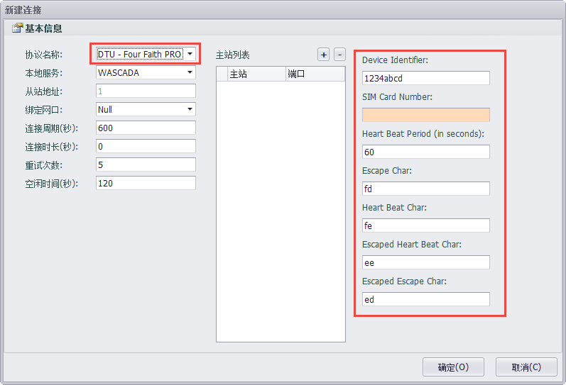

## 主动连接

主动连接的主要应用场景为：RTU可以直接访问SCADA站点，但SCADA站点不能直接访问RTU，例如RTU通过蜂窝无线模块连接或者RTU位于防火墙后的情况。在这种情况下，传统的由SCADA建立TCP连接的行为模式已经不适用，而是需要由RTU主动建立与SCADA的TCP连接，连接建立后SCADA将使用该连接进行后续的数据访问。

主动连接的基本原理如下图所示，主动连接（Active Connection）会建立两个连接，一个是与设备上的某个服务的连接（通过TCP或者虚拟串口，也称为对下连接），另一个是与SCADA站点的连接（也称为对上连接），连接建立之后，主动连接会在两个连接之间进行数据转发。由于使用的是标准的TCP连接，所以对下连接可以支持所有侦听TCP端口的协议，包括Modbus TCP，DNP3等。对上连接目前支持两种协议，一种是WhereIAm协议，用于与WebAccess连接；另一种是FourFaith的DTU协议，用于与支持四信DTU的服务器连接。未来将会加入更多的对上连接的协议。

### 主动连接设置

主动连接需要配置的项目包括对上连接的协议，对下连接的服务，对上连接的站点列表以及一些相关的参数。添加一个主动连接的步骤如下：

1.在工程节点中的“连接设置”下找到“主动连接”，双击它打开设置页面。

2.点击“添加”按钮来新增一个主动连接。

3.设置主动连接的参数，包括：

 - 协议名称：指定对上连接的协议，其中“WebAccess WhereIAm”用于连接WebAccess服务器，“DTU - Four Faith PROT”用于连接支持四信DTU的服务器。选择不同的服务，在设置页面最右边的扩展参数列会有不同的设置参数，请根据各个协议的配置参数来正确配置。WhereIAm的配置参数只有一个：Device Identifier，指定设备标识，该标识必须与WebAccess工程中配置的设备名称一致，以便WebAccess可以正确识别每一台连上的设备。

    

 - 本地服务：指定对下连接的服务。

 - 从站地址：仅在对下连接为Modbus RTU服务时有效，指定Modbus RTU从站地址。

 - 绑定网口：指定主动连接通过那个网口进行数据通信，设置为None表示不绑定。此参数一般用于设备有多个网络连接时，为避免系统默认路由的不确定性，需要明确指定主动连接的数据通道时使用，例如绑定Cellular，就指定了只使用蜂窝无线网络进行数据传输。

 - 连接周期（秒）：指定主动连接每隔多久建立一次对上连接。

 - 连接时长（秒）：指定对上连接建立后持续多久再断开，设置为0表示对上连接建立后不主动断开。

 - 重试次数：指定建立对上连接时失败后的重试次数，超出重试次数后，主动连接将不再尝试连接直到下一个连接周期的到来。

 - 空闲时间（秒）：指定对上连接建立后，如果该连接在指定的空闲时间内没有任何数据传输，程序会断开此对上连接并进行重连。设置为0表示不检查空闲时间。

4.点击“+”按钮添加对上连接的主站地址及端口号。

输入主站地址，可以使用IP，也可以使用域名地址；输入主站端口，如果是WebAccess，一般默认是504；点击确定添加主站信息到主站列表，重复4~7步骤可以添加多个主站，每个主动连接可以设置最多5个主站。

点击“确定”按钮添加该主动连接到列表中。