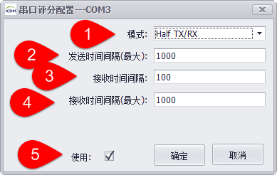

## iCDManager 

通讯监控单元。对于网口的检测，采用对网卡输出的网络状态信息采样，汇总信息，测试网络现在的状况；对于串口监测，采取对串口物理层通信信号采样，获得串口是否有活动，串口多久没有活动，串口数据包的响应时间等信息。

### iCDManager主界面 

如上图所示：在online界面选中要查看的设备，右击设备。

1. 打开Online界面

2. 选中要查看的设备

3. 在设备名称上右击，弹出菜单中选择”iCDManager”。打开iCDManager查看界面

4. 查看串口通讯状态界面。第一次打开时，默认显示此页面

5. 查看网口通讯状态界面。界面参考[2网络监控]

6. 显示串口名称。双击此名称可以打开参数配置界面。[配置参考1.1串口参数配置]

7. 显示通讯状态监控模式。[配置参考1.1串口参数配置]

8. 显示监控状态，结果分别显示poor.good.excellent[配置参考1.2监控状态提示]

### 串口参数配置

串口配置参数中所有时间单位默认为毫秒(ms)

#### Full tx/rx

串口参数配置。参数如下所示

1. 代表监控模式，此页面为Full tx/rx[全功能监测模式]

2. 代表接收线监测电平变化最小时间间隔，电平变化时间小于此时间为满分

3. 代表接收线监测电平变化最大时间间隔，电平变化时间大于此时间为零分

4. 代表发送线监测电平变化最小时间间隔，电平变化时间小于此时间为满分

5. 代表发送线监测电平变化最大时间间隔，电平变化时间大于此时间为零分

6. 是否显示此端口信息。

#### Half tx/rx

1. 代表监控模式，此页面为Half tx/rx[心跳监测模式]

2. 代表发送线监测电平变化最大时间间隔，电平变化时间大小此时间时为零分。小于此时间时代表心跳包发送正常。才会监测响应时间。

3. 代表接收线监测电平变化最小时间间隔，发送电平变化时间与接收电平变化时间差小于此时间为满分

4. 代表接收线监测电平变化最大时间间隔，发送电平变化时间与接收电平变化时间差大于此时间为零分

5. 是否显示此端口信息

#### Tx Only

1. 代表监控模式，此页面为Tx Only[发送监测模式]

2. 代表发送线监测电平变化最小时间间隔，电平变化时间小于此时间为满分

3. 代表发送线监测电平变化最大时间间隔，电平变化时间大于此时间为零分

4. 是否显示此端口信息

#### Rx Only

1. 代表监控模式，此页面为Rx Only[接收监测模式]

2. 代表接收线监测电平变化最小时间间隔，电平变化时间小于此时间为满分

3. 代表接收线监测电平变化最大时间间隔，电平变化时间大于此时间为零分

4. 是否显示此端口信息

### 监控状态提示

1. 故障现象

2. 故障处理建议

### 网络监控

1. 网络名称

2. 网络连接状态

3. 网络通讯状态

