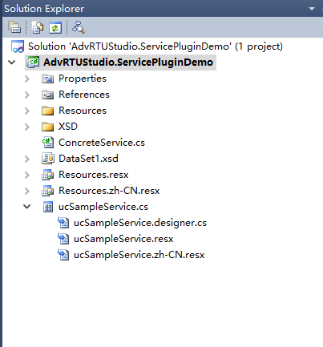
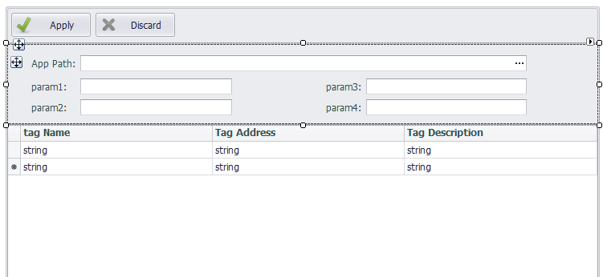
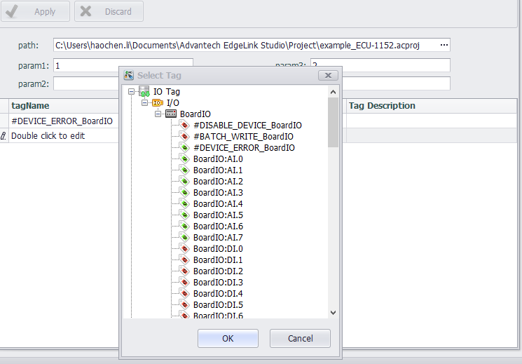
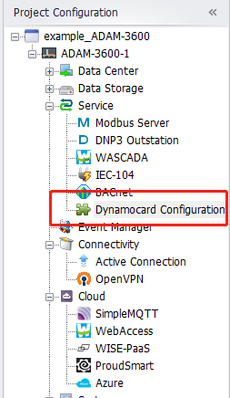
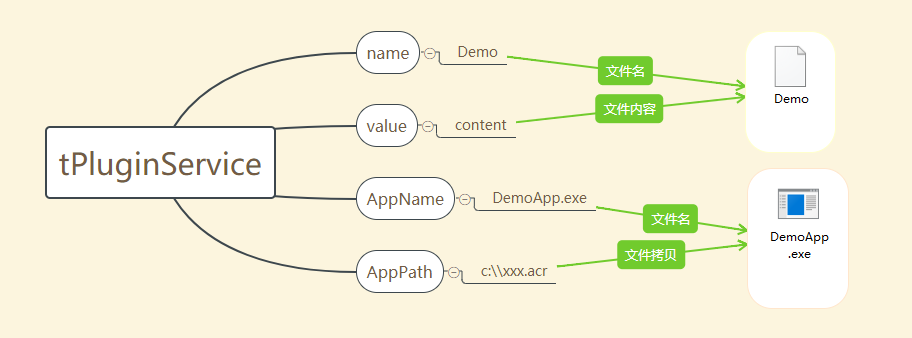

# Plugin界面开发

## 介绍
EdgeLink Studio支持客户进行二次开发，并以plugin的方式插入到EdgeLink Studio中。客户只需要开发一个用户控件，并在用户控件中保存配置信息，在下载时EdgeLink Studio会将此信息加入到下载压缩包中并下载到设备。同时EdgeLink Studio还为plugin插件提供app程序下载和tag点选择功能。

下面以一个Demo程序AdvRTUStudio.ServicePluginDemo为例，介绍EdgeLink Studio plugin插件。

### 功能

Studio会遍历./Plugin目录下的所有dll，载入包含IServicePlugin接口的dll。

首先创建名为AdvRTUStudio.ServicePluginDemo的Class Library。我们将在这个工程中开发plugin插件。

在AdvRTUStudio.ServicePluginDemo中创建继承IServicePlugin接口的类ConcreteService。在ConcreteService中实现了IServicePlugin接口的两个属性和两个方法。

其中GetServiceConfiguration方法会返回一个用户控件，Demo将在这个用户控件中展示配置信息并与用户交互。创建了名为ucSampleService的用户控件：

客户开发时需要通过GetServiceConfiguration方法传入的pluginService参数展示数据，并将用户修改保存到pluginService参数中。

用户控件的基类ucBase提供方法允许用户选择设备中已添加的tag点。

用户控件开发完成后，编译AdvRTUStudio.ServicePluginDemo，并将编译后的dll及资源文件拷贝到./Plugin目录中。

再打开EdgeLink Studio后就可以看到插入的plugin插件。

### 编译

下载配置到设备前，EdgeLink Studio会编译配置文件，并将编译好的文件加入一个加密的压缩包中，再将压缩包下载到设备中。

编译plugin程序时：

1. EdgeLink Studio会将plugin对应的tPluginService类中的Value字符串值为内容，保存到“插件名称.acr”文件中，放置在压缩包中\project文件夹内。

2. AppPath路径如果存在文件，会将此文件重命名为AppName的值，放置在压缩包中\usr文件夹内。

为了在设备启动时启用plugin app，还需要修改AdvProgramMgr.acr文件。

	<program mode="3">
		...
		<!--{ispluginName_start}command privileged="0" >/home/sysuser/bin/xxx -d</command{ispluginName_end}-->
	</program>

在mode=“3”节点下添加启动脚本，其中pluginName为plugin插件的名称，也就是IServicePlugin接口中GetServiceName()方法返回的名称。

如果plugin的Enable属性的值为true，在编译时EdgeLink Studio会删去前后的注释符，否则会删去整行脚本。
	

### 总结

总结一下，客户需要开发一个基类为AdvRTUStudio.UICommon.ucBase的用户控件，并在工程中实现一个实现IServicePlugin接口的类。就可以在EdgeLink Studio中展示客户开发的用户控件，并可通过tPluginService类与Studio交互数据。Studio会将tPluginService类中的数据保存到工程中，并在编译时生成相应的配置文件。

## 实现

代码可参考Demo程序（AdvRTUStudio.ServicePluginDemo），其中有以下三个部分需要说明。

### IServicePlugin

用户需要在工程中创建一个继承IServicePlugin的类，在Demo程序中名为ConcreteService，在其中实现两个方法和两个属性

- System.Drawing.Image image { get; }

	EdgeLink Studio中会以此image作为plugin的图标，显示在功能树与界面tab页上。如此属性为null，Studio会使用默认图标替代。

- int imageIndex { get; set; }

	在plugin中不用为此属性赋值。EdgeLink Studio载入时会获取plugin的图标，并为图标分配一个序号方便Studio调用。

- string GetServiceName()

	返回plugin的名称。Studio中一次名称作为plugin的标识，将此名称显示在功能树中。Studio中将不会载入第二个同名plugin插件。

- ucBase GetServiceConfiguration(tPluginService pluginService)

	返回通过参数pluginService生成的界面，界面基类为ucBase。用户需要将参数pluginService传递到界面中，在保存时将修改保存到pluginService中。

### tPluginService

Studio传递到界面中的数据类，其中有如下属性：

- name：plugin的名称，与IServicePlugin中的GetServiceName()返回的名称相同。在载入plugin时Studio会检查工程中的每个设备，当设备中不包含没有同名数据类时，会创建新数据类并将属性name设置为GetServiceName()。

- description： 目前没有使用此属性

- AppPath：需要下载到设备中的文件路径

- AppName：下载到设备中的文件，将重命名为AppName

- Value：plugin配置文件的内容，在编译时会将此内容保存到“plugin名称.acr”中

- Enable：是否启用plugin，当此值为false时，将不生成配置文件，AdvProgramMgr.acr中plugin的对应启动项也将不启用。

### ucBase

开发plugin界面需要继承基类ucBase。有以下几个方法可以与Studio进行交互。

1. 设置tab页名称

	设置EdgeLink中打开此plugin tab页的名称。

		private void ucSampleService_Load(object sender, EventArgs e)
		{
		    base.SetTabText(ServiceName);
		}

2. 保存工程

	将修改保存到工程文件中

		private void btnApply_Click(object sender, EventArgs e)
		{
		    if (Save())
		    {
		        base.SaveProject();//call iRTU utility to save project file
		    }
		}

3. 保存全部

	EdgeLink可以保存全部打开的tab页，保存时会调用页面的Save方法

		public override bool Save()
		{
		    ...
		}

4. 获取设备中已添加的tag点

	ucBase提供方法可以打开一个弹出页面，在页面中用户可选择一个或多个tag点。

	- 选择一个点

			BaseTag selectTag = base.GetTag(GetCellValue(gridView1.FocusedRowHandle, "tagName"));

	- 选择多个点

			List<BaseTag> selectTags = GetTags(ref tagType, ref dataTypeIndex, false);