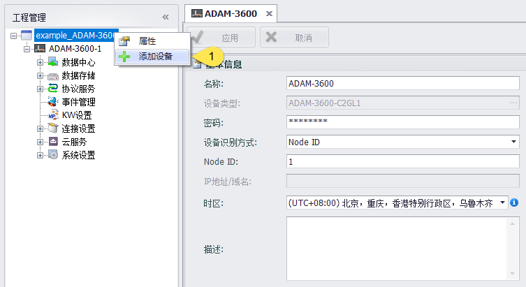
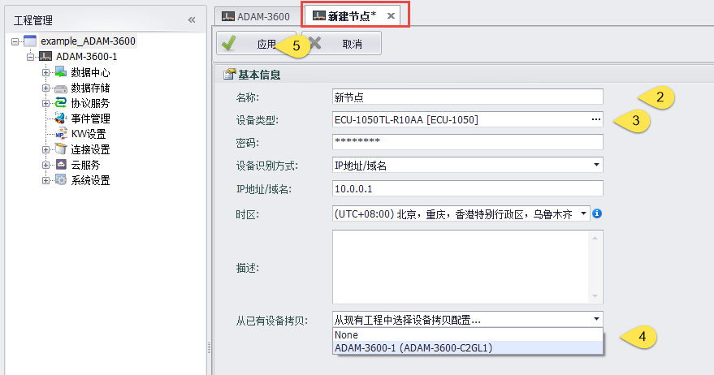
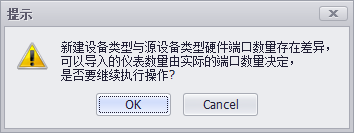
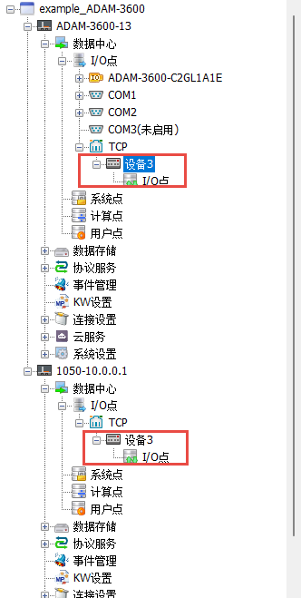

## 从已有设备拷贝添加设备

1. 此时工程文件中已有设备：ADAM-3600-1，在工程名称上右键添加设备。

2. 填写设备名称。

3. 选择想要添加的设备类型。 

4. 从已有设备拷贝

5. 应用

当设备类型不一致时，会有下图的提示，如果确认创建，点击OK即可

此时会在工程中添加一个新的设备，型号为添加时选择的型号，配置信息从ADAM-3600-1拷贝（端口数量由添加时选择的型号决定）

