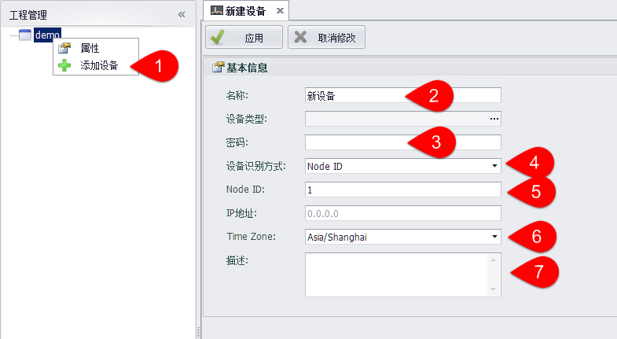

## 添加空白设备并进行配置

1. 右键添加设备。

2. 填写设备名称。

3. 填写密码，默认密码为“00000000”。可以在Online页面修改密码，请参考3.1.4章：密码设定，且修改完密码后，需要在此处填写对应的密码才可以下载工程。 

4. 设备识别方式，分为Node ID、 IP地址、域名以及通过Azure下载。

5. 填写对应的Node ID值或者IP地址。 

6. 选择设备所在时区。

7. 填写设备描述，可以为空。



#### 设备识别方式 ####

- 通过Node ID识别设备：

  

  下载时在网络内搜索Node ID为配置值的设备IP，向此设备下载工程

  

- 通过IP地址/域名识别设备：

  

  下载时向配置好的设备下载工程，可以配置设备IP、域名。使用remote.it或具有端口转发服务的网关内设备下载工程时，可配置端口号，如：

  ```
  adam3600-generic-tcp.at.remote.it:30000
  ```

- 通过Azure下载设备

  

  可以通过Azure云服务下载工程到设备中，需要配置IotHub的主连接字符串以及IotHub中的设备ID。


  IotHub连接字符串：

  

  

  
  IotHub设备名称：

  
