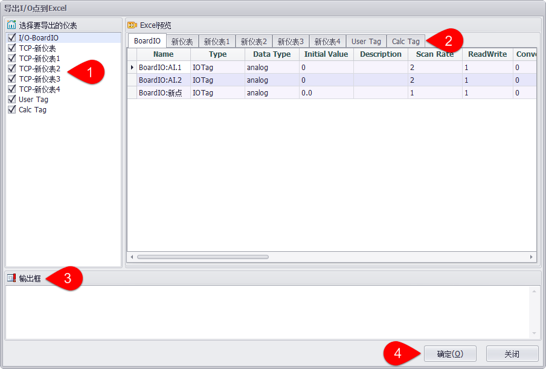

## 设备点导入导出 ##

EdgeLink Studio支持将设备的IO点、计算点和用户点按Excel格式批量导入导出操作。

###从Excel导入###

Excel表格中的设备IO点、计算点和用户点应按工程定义要求的格式保存，包括sheet名称、表头名称、表格数据格式等。用户选中要导入点的设备，点击“从Excel导入”按钮，在弹出的窗口中选择要导入的Excel文件。

1.在左侧多选框中选择需要导入的Excel表格。

2.在“Excel预览”窗格中点击选项卡预览表格内的数据。

3.系统会自动检查选择的Excel表格文件格式是否符合导入的要求，若不符合，则在输出窗口中显示错误内容。

4.若Excel文件格式检查无误，点击“确定”按钮开始导入。

在开始导入后，系统将询问是否更新选中设备的Tag点。点击“OK”按钮确认导入。

导入成功后，系统将弹出成功提示。

在导入设备计算点时，系统将检查Excel表格中的计算点公式及变量定义，若公式错误或公式中的变量未定义为系统中的Tag点，则将在输出窗口中给出提示，以便用户检查公式和变量定义。

此时Calc Tag表中第一行的内容为：

可见Excel表格中公式为“A+B+C”,而变量“C”为空，即公式中未正确定义变量“C”对应的Tag点。

###导出到Excel###

选择工程中要导出点的设备，点击“导出到Excel”按钮，在弹出的窗口中可以设置将Tag点导出到Excel文件中。

1.在左侧多选框中选择需要导出的点。

2.在“Excel预览”窗格中点击选项卡预览设备点数据。

3.在输出窗口中显示输出内容。

4.点击“确定”按钮开始导出操作。

5.导出成功后，系统将弹出成功提示。

