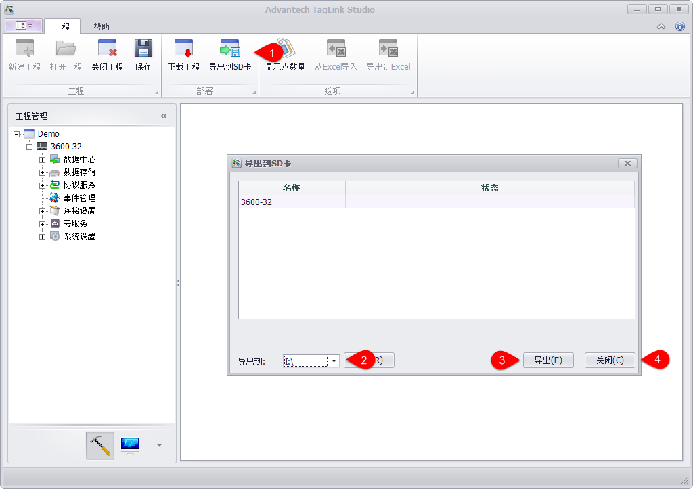

## 导出到SD卡　

此功能将配置好的工程导出到SD卡。在没有网络连接的情况下，可以将SD卡查到设备上以更新EdgeLink。

1. 鼠标选中设备或者不选中设备，直接点击导出到SD卡，此时列出所有工程中的设备

2. 选择要导出的SD卡的目标路径

3. 点击导出，在进度条显示完成，即完成导出动作

4. 完成后，关闭对话框

以上动作完成后，将SD卡插入到EdgeLink设备上，给EdgeLink设备上电，即可完成工程更新。

**注意**：设备识别方式为Node ID的设备才能使用此功能更新EdgeLink。

