## DNP3 服务器　

ADAM-3600可作为DNP3 Outstation(下面章节按照中文习惯简称DNP3服务器）和HMI/SCADA的DNP3 Master（下面章节按照中文习惯简称DNP3客户端）进行数据交换，目前版本的DNP3服务器符合DNP3 依顺性测试Level2的级别。　

接下来的章节会逐次详细讲解DNP3 Outstaion的应用。

1. DNP3服务器在【工程管理】的【协议服务】的子节点，双击打开DNP3服务器的主配置界面。

	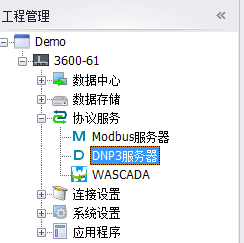

2. 如下为DNP3服务器的主界面，在此为您解释如下的几个概念，

	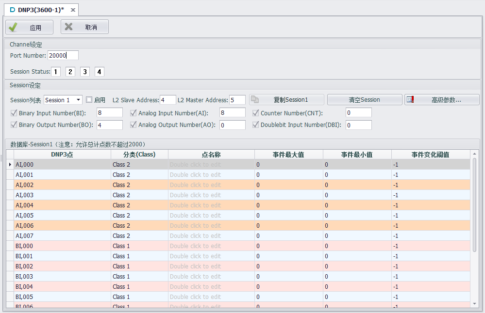

 - Channel：中文为通道的意思，表示DNP3服务器通过何种介质对外通讯，本版本DNP3服务器只支持通过Ethernet网络通讯，默认为TCP/IP网络通讯协议；

	Port Number：DNP3服务器TCP/IP通讯的端口号，默认为20000；
	
 - Session：中文为会话的意思，表示DNP3服务器可以和多个DNP3客户端进行通讯，支持的会话个数最多为同时和4路DNP3客户端进行通讯；请客户依据工程实际配置会话，不要配置过多闲置的会话，造成CPU Loading过重，影响EdgeLink的运行效率；

	启用：使能相应的会话，用户只有勾选【启用】，DNP3客户端才可以访问该会话；

	L2 Slave Address：DNP3服务器端的地址，DNP3协议规定了数据链路层，需要设定源地址和目标地址，如果不是很熟悉该部分，请保持默认设定；

	L2 Master Address：DNP3客户端的地址，DNP3协议规定了数据链路层，需要设定源地址和目标地址，如果不是很熟悉该部分，请保持默认设定；

 - 数据库：每一个会话会配置一个独立的数据库，用户依据前面配置好的Tag点，通过Tag点名称映射到DNP3服务器的DNP3点，并进行DNP3分类，配置每一个DNP3点的属性；

	**Note：为了EdgeLink的运行效率，请保证所有会话的DNP3点总数不超过2000点。**

3. 接下来，详细介绍各个部分的重点配置内容；

 - Channel设定部分

	Session Status：在通道下会显示每一个会话的状态，当1-4个会话中的任何一个会话启用时，就会以【绿色】状态来显示该会话的状态，该状态为只读；

	如下所示，

	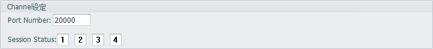

 - Session设定部分

	在会话编辑之前，用户要首先选择要编辑的1-4个会话，默认当前会话为Session 1，首先要保证勾选【启用】选择框，

	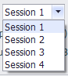

	然后选择是否查看及使用6类DNP3点类型，其中每一个DNP3点类型前面的选择框表示是否在编辑界面中呈现，后面的编辑框用来输入默认的DNP3点的个数，默认已经为客户配置了8组BI，8组AI，和4组BO的DNP3点类型，默认在下面的编辑列表中显示BI点的编辑；其中【显示/隐藏所有】和每一个DNP3点类型前面的选择框一样，用来操作是否在编辑列表中展现用户的DNP3点的配置，目的是能够让用户过滤当前的编辑点，避免编辑列表过于冗长，影响用户的操作便利性。如下图，

	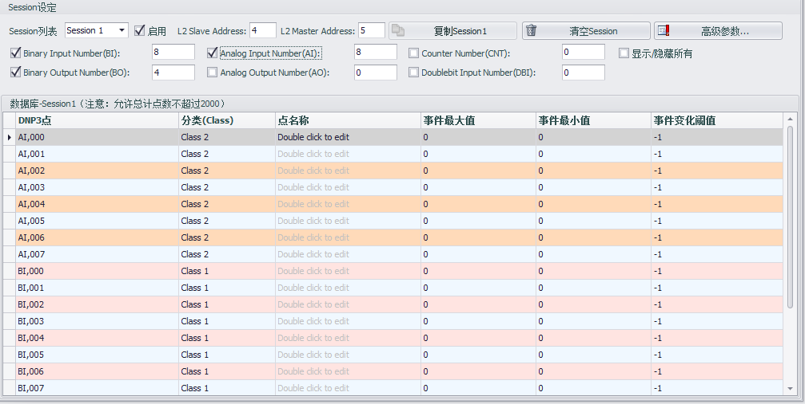

	【复制Session1】：当用户要配置多个会话，并且多个会话基本相似，用户可以利用该按钮进行会话1的克隆，来复制出其他会话；

	【清空Session】：当用户配置会话出现较多的失误，可以通过清空会话重新编辑，但是该操作不可以恢复，请用户慎重操作；

	【高级参数】：高级用户需要定制DNP3服务，可以通过该按钮进入高级参数设置，包含如下4部分；

	1. 【Default Variation】

		中文为默认变体的意思，指明在默认状态下的各个DNP3群组的默认数据类型，其中在信息文本框里面进行了比较详细的描述，更详细的信息请参见DNP3协议(**本文档援引的DNP3协议版本为2012版本，不同协议版本可能存在章节方面的差异**)章节附录A （Annex A DNP3 data object library -- object descriptions）。

		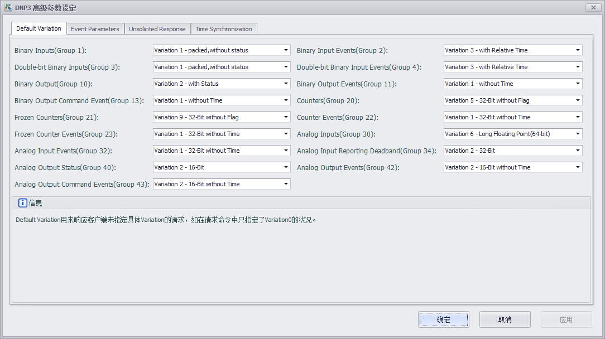

	2. 【Event Parameters】

		中文为事件参数设定的意思，用来配置不同的DNP3点群组产生Event的行为模式的参数，其中在信息文本框里面进行了比较详细的描述，更详细的信息请参见DNP3协议章节4.1.5.2 Events部分；

		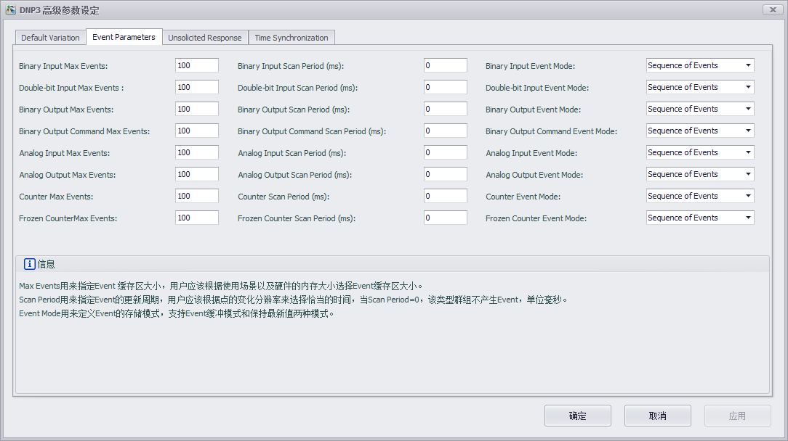

	3. 【Unsolicited Response】

		中文为主动上传的意思，用户可以启用DNP3服务器端的主动上传功能，但是需要DNP3客户端主动使能DNP3服务器端的主动上传，主动上传功能才起效，用户可以进行Class1到Class3的主动上传的使能设定；其中在信息文本框里面进行了比较详细的描述，更详细的信息请参见DNP3协议章节4.6 Unsolicited Responses部分；

		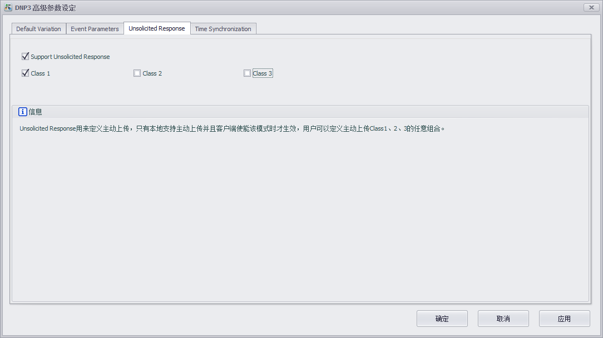

	4. 【Time Synchronization】

		中文为时间同步的意思，DNP3协议默认支持时间同步功能，用户可以选择是否和DNP3客户端进行时间同步，默认为30分钟进行一次时间同步，同步时间的长短决定于用户应用场合对时间精度的要求，其中在信息文本框里面进行了比较详细的描述，更详细的信息请参见DNP3协议章节10.3 Time Synchronization部分；

		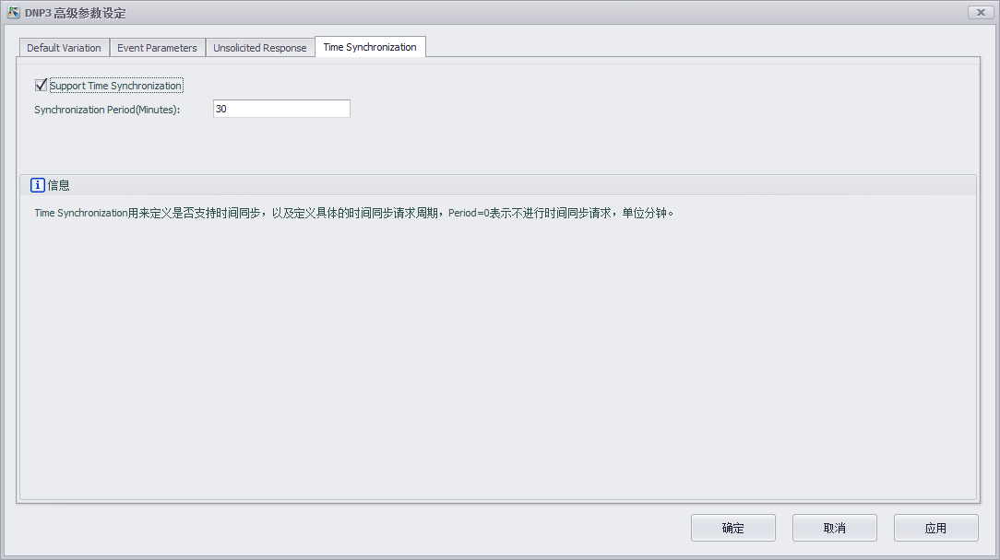

 - 会话的【数据库】编辑

	每一个会话的DNP3点都需要关联一个Tag点，通过在【点名称】所在列，双击来添加Tag，

	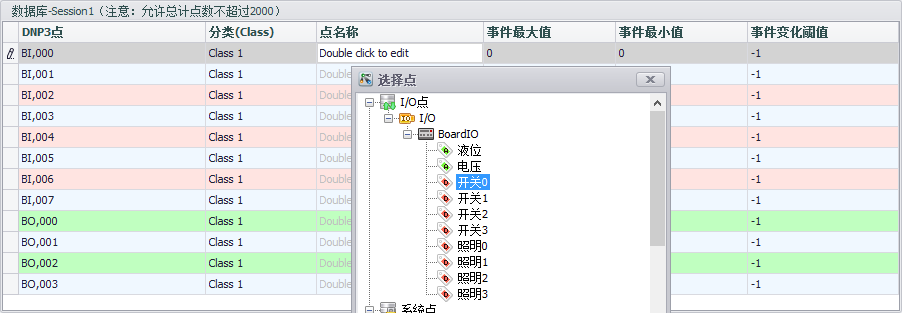

	完成Tag点关联，则Tag点【开关0】的变化会反馈到DNP3的点【BI0】，其中事件最大值、最小值、变化阈值只针对Analog Input，其他DNP3点类型请保持事件参数为默认即可；

	

	针对DNP3点如AI，模拟量的Event，本DNP3服务器支持如下三种限定，最大值、最小值、以及变化阈值，需要设定AI Event的用户可以调整AI的事件参数，来触发AI Event。

	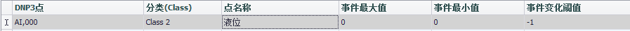

	如上是DNP3服务器的基本参数设定，当高级用户有更多参数需要设定，请联系Advantech技术支持人员得到更详细的解答。
