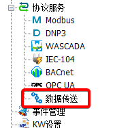
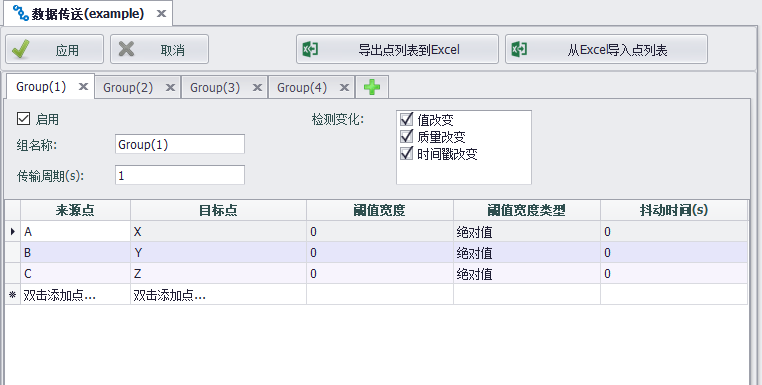

## 数据传送

数据传送用于将指定tag点的值写到另一个tag点上，根据预设的周期及变化检测来触发数据传送。

### 界面配置

1. 用户可点击协议服务下的`数据传送`节点进入配置界面。

2. `数据传送`配置界面如下图所示，最多可以配置4个组，每一组可以有不同的周期和变化检测配置。如果点数较多，可以用导出/导入Excel表格的方式来协助编辑。

依上图配置，`数据传送`程序将以每秒为周期，或是来源点的点值、质量、时间戳的任一改变作为触发条件，来检测来源点与目标点的点值是否相同，如果有差异，则会将来源点的点值写入目标点，即 A=> X，B=> Y，C=>Z。
