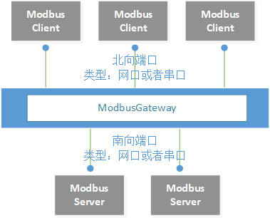
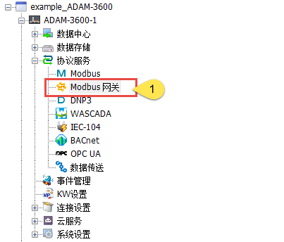
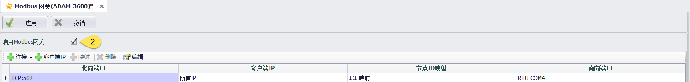
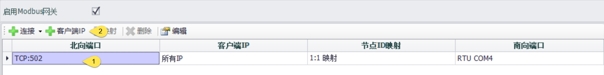
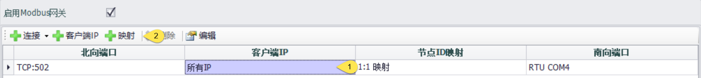
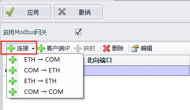
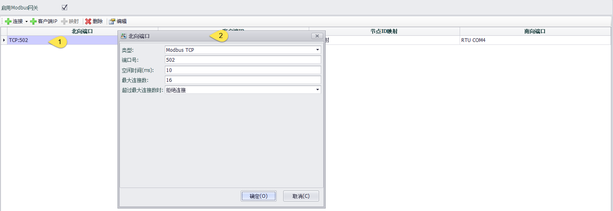
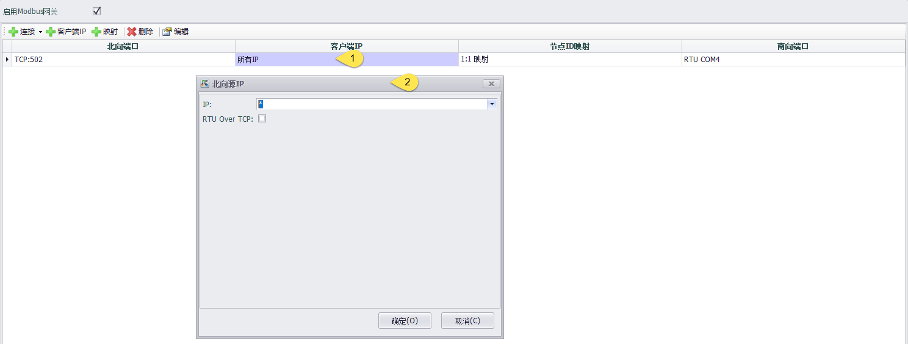
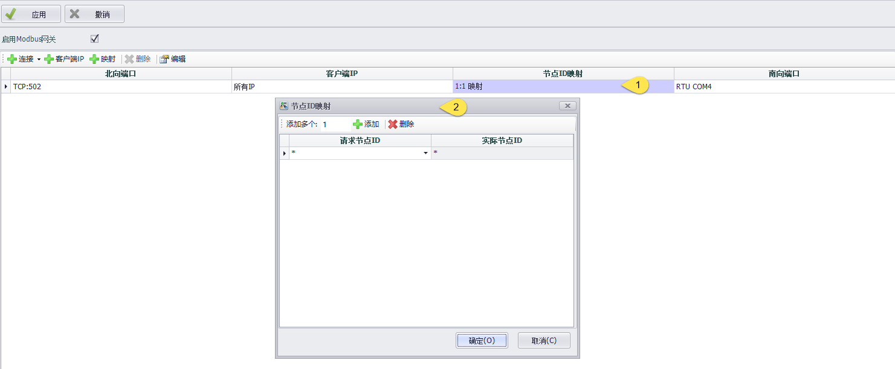
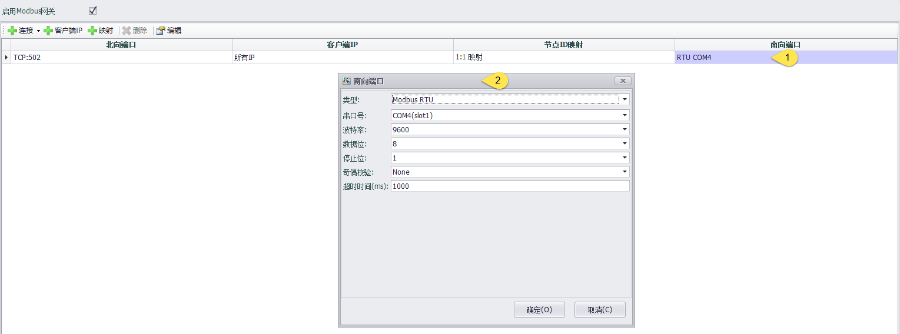

## Modbus网关

### 架构图

#### ModbusGateway程序主要进行Modbus TCP 和 Modbus RTU协议之间的相互转换，北向的Modbus Client通过网关设备的ModbusGateway程序直接访问到网关设备南向连接的仪表

### 使能

使能Modbus网关功能，此时会默认增加一个ETH转COM的连接

### 默认连接参数说明

|  参数   | 说明                                                                         |
|  ----  | ----------------------------------------------------------------------------  |
| 北向端口  | 请求端发送请求使用的端口类型, TCP:502意思是请求通过TCP端口发出，以端口号502来访问ModbusGateway |
| 客户端IP  | 请求端IP，如无特殊限定则允许所有IP访问 |
| 节点ID映射  | 请求端ID与南向仪表ID的映射关系，1:1 映射意思是请求端ID为a，则转发给南向连接中ID为a的仪表 |
| 南向端口  | 实际连接仪表的端口类型 |

### 配置说明

1. 添加

光标选中北向端口时，可以添加一条新的连接，可以选择在同一北向端口下添加不同的客户端IP

光标选中客户端IP、节点ID映射或者南向端口任意一项，可以选择添加一条新的连接、添加一个新的客户端IP或者一个新的节点ID映射和南向端口

2. 连接

连接方式有4种

|  连接类型   |  描述  |
|  ----  | ----  |
| ETH-->COM  | 将北向的网口请求转换为南向的串口请求 |
| COM-->ETH  | 将北向的串口请求转换为南向的网口请求 |
| ETH-->ETH  | 将北向的网口请求转换为南向的网口请求 |
| COM-->COM  | 将北向的串口请求转换为南向的串口请求 |

3. 北向端口

双击某个具体连接的北向端口,进入北向端口设置

|  参数   |  描述  |
|  ----  | ----  |
| 类型  | Modbus请求的类型：Modbus TCP/ Modbus UDP / Modbus RTU / Modbus ASCII |
| 端口号  | 只有在Modbus TCP或者Modbus UDP的情况下才需要设置访问的端口号 |
| 空闲时间  | 某个连接的最大空闲时间 |
| 最大连接数  | ModbusGateway允许的最大连接数 |
| 超过最大连接时  | 当连接超过最大连接数时的策略：拒绝连接/抛弃最早的连接 |

4. 客户端IP

双击某个具体连接的客户端IP，进入客户端IP的设置

|  参数   |  描述  |
|  ----  | ----  |
| IP  | 允许北向请求的IP地址，*代表所有IP都允许，可以按照单一IP或者IP段进行设置 |
| RTU Over TCP | 勾选后北向请求的协议类型为Modbus RTU Over TCP |

5. 节点ID映射

双击某个具体连接的节点ID映射，进入节点ID映射设置。其中*代表不进行ID转换，即1：1映射

|  参数   |  描述  |
|  ----  | ----  |
| 添加多个  | 默认每次点击添加会增加一个ID映射，在空白处填写个数，再点击添加可以一次添加多个ID映射 |
| 请求节点ID | 北向客户端发送请求时的节点ID |
| 实际节点ID | 南向仪表的实际ID |

6. 南向端口

双击某个具体连接的南向，进入南向设置

|  参数   |  描述  |
|  ----  | ----  |
| 类型  | 南向仪表Modbus协议类型：Modbus TCP/ Modbus UDP / Modbus RTU / Modbus ASCII |
| 串口号  | 南向仪表与网关连接的串口号|
| 超时时间  | 南向请求的超时时间|

