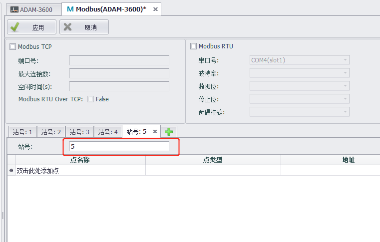
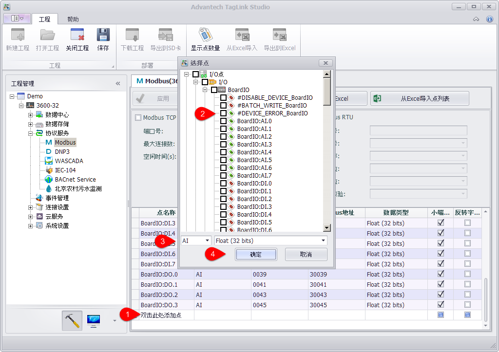
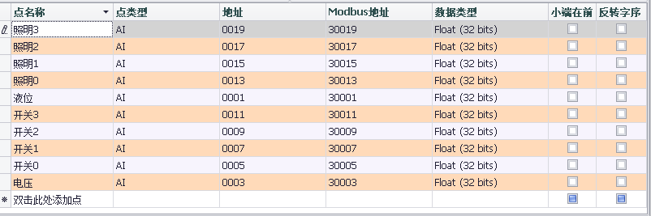
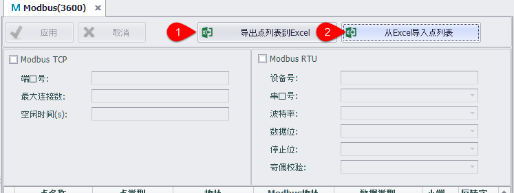
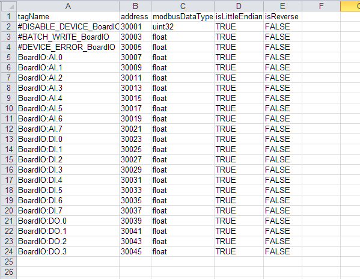

## Modbus服务器　

Modbus服务器实现了Tag点到Modbus地址的映射，允许上位机Modbus Client通过Modbus TCP或者Modbus RTU的协议读写Tag点。

### Devid ID 设置

支持DeviceID修改，用于Client访问

### Modbus TCP配置

通过使能Modbus TCP服务，即可允许上位机通过基于TCP/IP的Modbus TCP协议来访问设备。

Modbus TCP的配置如下：

 - 端口号：设置Modbus TCP侦听端口号，默认值是502。

 - 最大连接数：限定同时连接的客户端个数，默认值是4，表示允许最多4个客户端同时通过Modbus TCP协议访问设备。

 - 空闲时间：指定当TCP连接建立之后，允许客户端无任何读写操作的最长时间，默认值是120秒，超出此时间后服务器会自动断开与客户端的连接。将空闲时间设置为0表示不做此项检查，服务器不会主动断开连接。

### Modbus RTU配置

通过使能Modbus RTU服务，即可允许上位机通过Modbus RTU协议经由串口连接（RS-232/485) 或者虚拟串口连接来访问设备。

Modbus RTU的配置如下：

 - 设备号：有时也称为站号，为Modbus RTU设备在串行总线上的节点标识。

 - 串口号：指定Modbus RTU服务要连接的串行端口，下拉列表中显示的是当前设备的所有可用端口，如果某个端口没有在列表中，说明该端口已经被其它服务占用，需要在数据中心手动删除被占用的COM口，才可以配置此端口。

 - 波特率：指定串行传输的波特率，默认值为9600。

 - 数据位：指定串行传输的数据位，默认值为8。

 - 停止位：指定串行传输的停止位，默认值为1。

 - 奇偶校验：指定串行传输的奇偶校验规则，默认值是None，表示不进行奇偶校验。

### Modbus地址映射

为了Modbus客户端可以访问到设备上的Tag点，需要将Tag点映射到对应的Modbus地址上，配置步骤如下：

1. 将Tag点添加到Modbus地址列表中，操作如下
	1. 双击Modbus地址列表中有”双击此处添加点“的单元格

	2. 选择要加入Modbus地址列表的Tag点，可以一次选择多个点。

	3. 选择映射的数据类型和数据转换方式，此项操作会应用到所有已选择的点。

	4. 点击确认添加已选择的点到地址列表中

	5. 重复上述操作可添加更多的点到地址列表
	
	

2. 修改Tag点映射到Modbus地址的详细设定，可配置项有：

 - 点类型：有四种类型：AI、AO、DI、DO，分别对应Modbus协议的四种点类型3、4、1、0。

 - 地址：指定该Tag点在Modbus地址空间的起始地址，最小的地址为1。地址列表中有个Modbus地址列，是不可编辑的，里面的内容由点类型和地址组合而成，表示Modicon规则的Modbus地址。

 - 数据类型：有整数和浮点数两大类，整数类型按有无符号以及比特数（16,32,64）的排列组合一共可分为6种，浮点数类型按单精度和双精度分为两种（Float和Double）。

 - 小端在前：默认的字节对齐方式是大端在前（网络序），如果客户端只能接受小端在前的数据，则需要将该Tag点的小端在前的设置项打钩。

 - 反转字序：小端在前反转的是字节序，反转字序则是以字（WORD，2字节）为单位进行反转。需要注意的是，反转字序的操作是在大小端操作完成后进行的，也就是说，如果同时设置了小端在前和反转字序，则被映射的Tag点值在被读取时会先执行小端在前的字节序反转操作，然后才会执行反转字序的操作。

	

### Modbus数据类型转换对照表

为了便于理解数据类型转换，请参考下表的示例，其中数值表示以16进制方式表示，每个字节以空格隔开：

| 名称 | 原始值 | 小端在前 | 反转字序 | 小端在前+反转字序  | 
| :--------   | :-----  | :----  | :----  | :----  |
 | Signed/Unsigned Integer (16 bits) | 12 34 | 34 12 | 12 34 | 34 12  | 
 | Signed/Unsigned Integer / Float (32 bits) | 12 34 56 78 | 78 56 34 12 | 56 78 12 34 | 34 12 78 56  | 
 | Signed/Unsigned Integer / Double (64 bits) | 12 34 56 78 90 AB CD EF | EF CD AB 90 78 56 34 12 | CD EF 90 AB 56 78 12 34 | 34 12 78 56 AB 90 EF CD | 

### 点列表导入导出

用户可将tag点列表导出到EXCEL中，编辑后再导入到EdgeLink Studio中。

用户可以编辑导出到EXCEL中的tag点列表，但要注意列的顺序不能调整。

　

　

　
