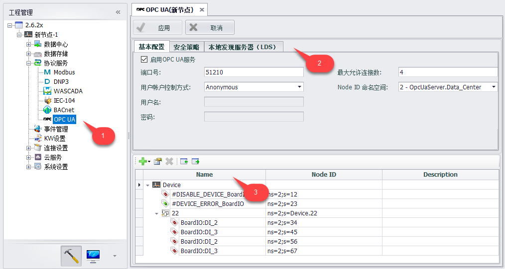
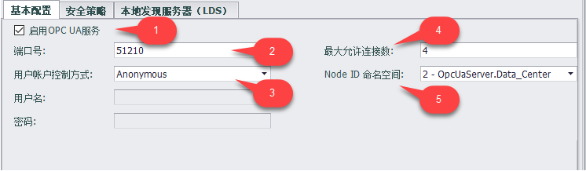
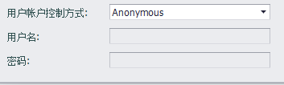
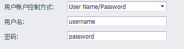
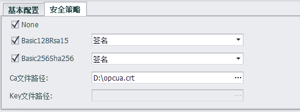
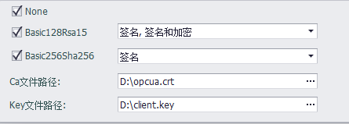
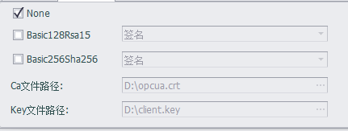
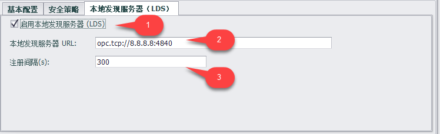

## OPC UA服务器

OPC Unified Architecture (OPC统一架构)是 OPC Foundation 定义的一个标准，是一种现代工业自动化通信协议。它是一个开放标准，传统本地应用程序、工业物联网以及工业 4.0 应用程序和平台正越来越多地将其用于数据收集和控制。EdgeLink 网关设备作为 OPC UA 服务器可以无缝连接到在任何操作系统上运行的 OPC UA Client 应用程序。

### 界面配置

1. 用户可点击协议服务下的 OPC UA 节点进入配置界面。
2. 在OPC UA配置界面中可以配置设备上 OPC UA 服务器的基本配置和安全策略。
3. 可以为OPC UA服务器添加设备中已配置的 tag 点。

#### 基本配置

1. 用户可以选择启用或不启用OPC UA服务，不启用服务时不会生成 OPC UA 配置文档。
2. 端口号：设备上 OPC UA 服务器的端口号，默认为4840.
3. 用户账户控制方式：服务器允许客户端以匿名方式访问服务器或者访问时验证用户名和密码

    匿名方式：默认连接方式，服务器允许客户端匿名创建连接，不需要配置用户名和密码。

    

    验证用户名和密码：客户端在创建连接时需要配置用户名和密码，必须输入用户名而密码可以为空。

    

4. 最大允许连接数：最多允许几个客户端同时连接到服务器。
5. Node ID命名空间：节点的命名空间

    0. OPC UA Namespace
    1. Local Server
    2. OpcUaServer.Data_Center

#### 安全策略

EdgeLink的OPC UA服务器支持 None/Basic128RSA15/Basic256Sha256 三种安全策略，可以灵活应用于不同场合。

勾选 Basic128RSA15 和 Basic256Sha256 后需要为这两种安全策略分别选择消息安全模式。消息安全模式有“签名”、“签名和加密”两种。

1. 只选择消息安全模式为“签名”时，需要选择CA文件下载到设备中。
2. 当至少有一种安全策略选择的消息安全模式为“签名和加密”时，需要选择 CA 文件和 Key 文件下载到设备中。

如果 Basic128RSA15 和 Basic256Sha256 都不勾选，安全策略预设为“None”。

#### 本地发现服务器（LDS）

本地发现服务器（Local Discovery Server）能够在指定的计算机上发现可用的OPC UA服务器。

1. 启用本地发现服务器
2. 本地发现服务器URL：服务器地址
3. 注册间隔：向LDS注册OPC UA服务器的时间间隔，单位是秒

### HDA

首先将需要使用历史数据方式读取的数据保存到本地数据记录中，参考[数据记录](../DataLogger/DataLogger.html)进行配置

然后将对应数据（点）添加到OPCUA Server的点表中

