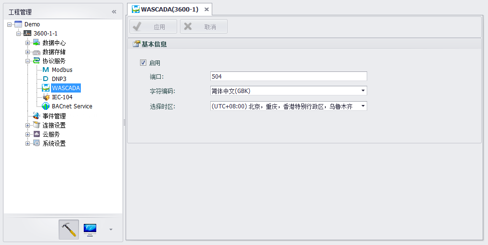
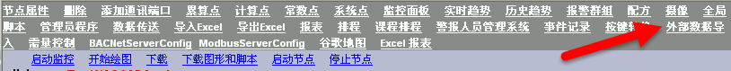
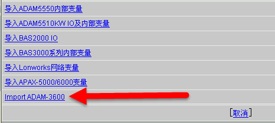
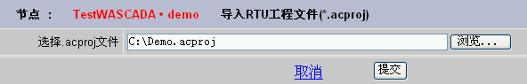
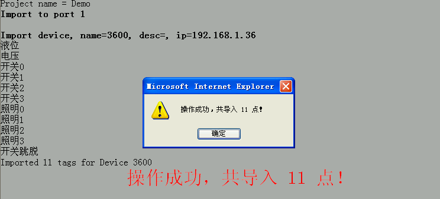
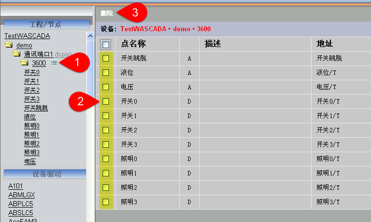
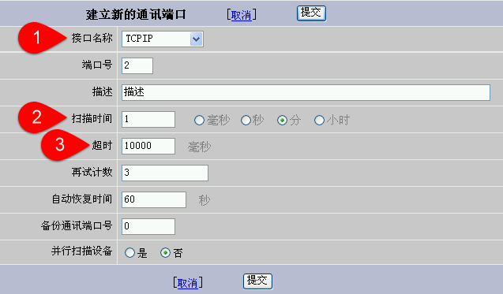
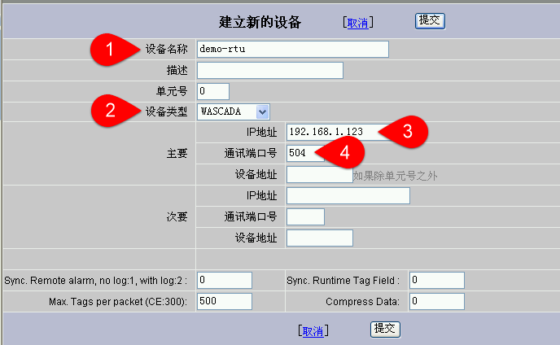
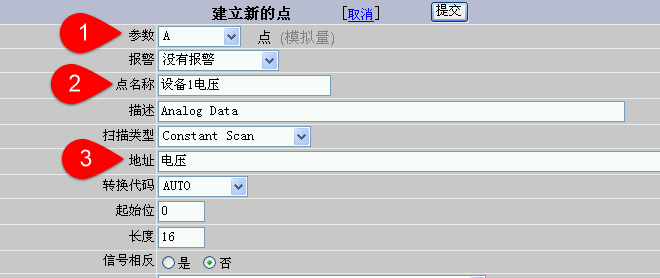

## WASCADA服务

WASCADA协议是WebAccess的私有通信协议，通过RTU实现的WASCADA服务，WebAccess可以通过TCP连接直接访问RTU上的所有Tag，无需做任何的地址映射（如Modbus服务）。除此之外，对于那些有配置数据周期性存储的Tag点，通过WASCADA服务还可以获得断线续传的功能。

### WASCADA基本配置

WASCADA服务是默认启用的，在无特殊要求的情况下建议不要关闭它。

WASCADA的配置项有三个：

 - 端口：设置WASCADA的侦听端口，默认是504。

 - 字符编码：设置WebAccess的字符编码，请根据WebAccess的实际字符编码来设定，否则对于非中文的Tag点名称可能会造成名字解析错误。如果是简体中文的WebAccess，一般来说选择默认的“简体中文（GBK）”即可。

 - 选择时区：设置WebAccess服务器的时区，有些时候WebAccess服务器所处的时区可能会与RTU设备所处的时区不同，为了确保数据时间戳的一致性，请在此处选择正确的WebAccess服务器时区。

### 在WebAccess上添加RTU的Tag点

有两种方式可以添加Tag点到WebAccess中，一是从RTU工程文件导入，二是手动添加，分别介绍如下：

1. 导入RTU工程文件到WebAccess

	在WebAccess中导入RTU工程文件的功能需要新版本WebAccess的支持，如果您手头的WebAccess中不包括此功能，可更新到支持此功能的WebAccess或者通过安装功能扩展包来获得对此功能的支持。

	1.1 打开WebAccess工程管理，进入监控节点属性页面，点击“外部数据导入”，如下图所示。

	

	1.2 如果您的WebAccess版本支持RTU的工程文件导入，则应该会出现“Import EdgeLink”的列表项，点击此项进入导入页面。

	

	1.3 在导入页面中点击“浏览”按钮，选择RTU工程文件（扩展名为.acproj），然后点“提交”按钮，如下图所示。

	

	1.4 页面显示“文件上传中，请稍候…”，此时所选的 .acproj 文件已经开始上传。

	1.5 上传完毕后，自动开始显示导入过程，导入完毕后，会弹出一个消息框，提示导入成功和已导入的点数，页面最下方也会显示导入的点数。

	

	1.6 删除不用的点。由于导入的过程会把工程中所有的点导入，这常常不是必须的（多余的点可能会造成不必要的数据流量浪费），所以我们要把那些对于WebAccess来说没有用的点删除。删除的方法：如下图所示，从工程节点中找到导入的设备节点，其右边有个点列表的图标，【1】点击它即可打开该设备的点列表，【2】勾选要删除的点，【3】点击页面左上方的删除按钮，这样就可以完成删除的动作。

	

2. 手动添加Tag点到WebAccess

	手动加点的方式适用于所安装的WebAccess尚未支持导入RTU工程文件的方式，也可以用于在导入工程文件后对某些参数做适当的调整。

	2.1 建立新的监控节点（如果在已有监控节点上添加新设备可以略过此步）

	2.2 在新建的监控节点上建立新的通讯端口，需要注意以下几点（如下图所示）：【1】接口名称为TCPIP；【2】扫描时间应根据实际项目需要设置，但不宜过短，默认的1秒在大多数情况下是不必要的，请更改之；【3】超时默认是1000毫秒，这在本地局域网的情况下是适用的，但是如果是通过Internet或者无线蜂窝网络来传输数据，由于链路的数据传输延迟本身较大，所以1000毫秒的设定是不适合的，请将其改为最少10000毫秒（10秒），否则在网络通信状况不佳的情况下会出现连接失败的现象。

	

	2.3 在新建的通讯端口下建立新的设备。需要填写【1】设备名称，填写在WebAccess端此RTU的识别名，如果RTU是通过主动连接的方式与WebAccess连接（请参考主动连接设置的帮助文档），则此设备名称必须与主动连接设置中WhereIAm的设备标识名称一致；【2】设备类型选择“WASCADA”；【3】IP地址填写RTU的实际IP地址，如果RTU是通过主动连接的方式与WebAccess连接，此处留空；【4】通讯端口号，默认是504，此处必须与RTU工程配置的WASCADA端口号一致。设备的扩展选项部分请保留默认值，不要改动。

	

	2.4 在新建的设备下建立新的点。如下图所示，【1】参数“A”对应RTU上的Analog点，参数“D”对应RTU上的Discrete点，参数“Text”类型的点目前不支持；【2】点名称输入RTU上的Tag点在SCADA中使用的点名称，这个名称在SCADA节点中是全局唯一的；【3】地址栏中输入RTU上的点名称，如果该点在RTU上被设置为周期性存储，还可以在点名称后加上“/T”，例如“电压/T”，以便断线续传。

 	断线续传的说明：对于加了“/T”后缀的Tag点，如果“记录数据”的配置项为“是”的话，则WebAccess会在断线重连后从RTU读取该点断线期间的存储数据以补全SCADA本地历史趋势数据记录。需要注意的是，断线补传的数据只能包括分、时、天这三个时间精度的存储数据，换句话说，如果在历史趋势图中查看补全的断线期间的数据，将时间精度放大到分以下的等级是显示不出数据曲线的。

	其它参数的配置请参考WebAccess的用户手册。

	

 

　
