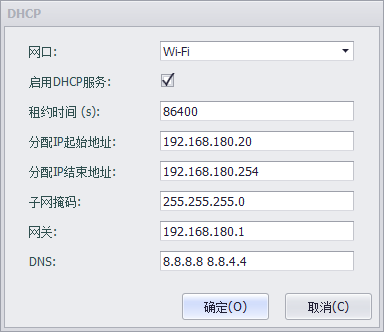

### DHCP Server设置

DHCP(Dynamic Host Configuration Protocol)动态主机配置协议是一个局域网的网络协议。指的是由服务器控制一段IP地址范围，客户机登录服务器时就可以自动获得服务器分配的IP地址和子网掩码。当本设备WIFI设置为AP模式时，如果想让连接到AP上的station可以自动获取IP地址等相关信息，需要配置本服务。

注：如果在固定网卡上使用本功能时，请确保全局域网中仅有此一个DHCP服务，否则会分配IP异常，使整个局域网无法正常工作。

用户可配置的属性如下：

- 网口：选择在某个网口启用DHCP Server功能。
- 启用：选择是否启用此配置。
- 租约时间：DHCP Server的租约时间。
- 分配IP起始地址：配置DHCP Server分配给客户机的IP地址范围的起始地址。
- 分配IP结束地址：配置DHCP Server分配给客户机的IP地址范围的结束地址。
- 子网掩码：配置DHCP Server分配给客户机的子网掩码。
- 网关：配置DHCP Server分配给客户机的网关，一般为DHCP Server本机IP。
- DNS：配置DHCP Server分配给客户机的DNS地址，多个DNS地址以空格分隔。