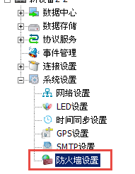
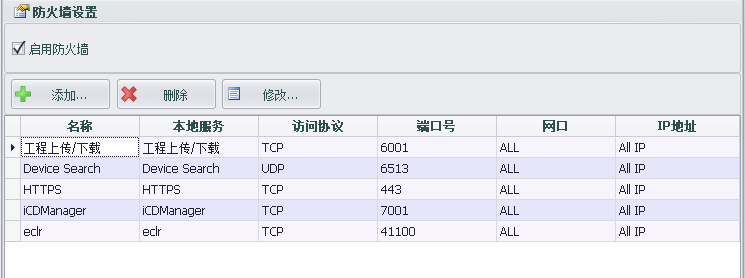
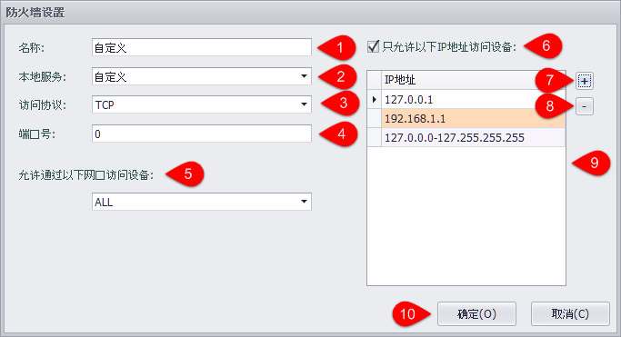
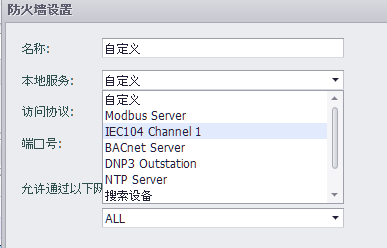
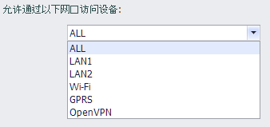
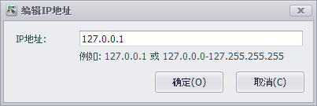
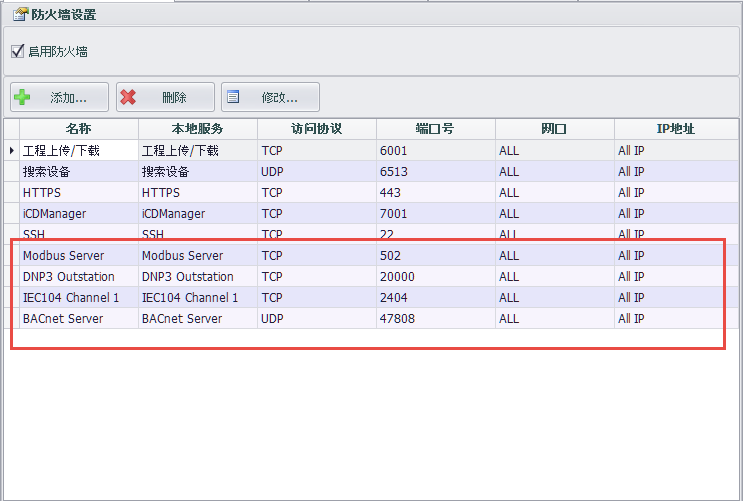

## 防火墙设置

"防火墙设置"中可以对设备的网口进行限制，只允许设置的IP地址访问指定端口。

当防火墙启动时只允许符合防火墙列表中的连接访问到设备中。

----

### 防火墙列表

新建设备后，防火墙会默认启动并包含“工程上传/下载”、“搜索设备”、“HTTPS”、“eclr”四个本地服务，设备支持iCDManager时，iCDManager也会默认启动。且“工程上传/下载”、“搜索设备”为必需的的本地服务，至少需要保留一个此服务。

----

### 添加防火墙设置

在防火墙列表界面中点击添加按钮可以添加防火墙设置。

1. 此配置的名称，默认与“本地服务”名称相同，用户可修改。
2. 本地服务中包括“工程上传/下载”、“搜索设备”、“HTTPS”以及被启用的“Modbus”、“IEC104”等服务。用户也可以选择“自定义”来设置。

	

3. 用户可以设置“TCP”或“UDP”访问限制。

	

4. 设置允许通过防火墙的端口号，范围是0-65535
5. 设置允许特定网口访问设备。

	

6. 用户可以选择允许所有IP，通过前面的配置访问此设备。也可以限制只允许特定IP访问。
7. 用户可以点击“+”以添加允许访问的IP地址。添加时可以输入IP地址或IP范围。
	
	

8. 用户可点击"-"按钮删除选择的IP地址。
9. 添加后的IP地址或IP范围可在IP列表中显示，用户可以双击IP列表来编辑选择项。
10. 设置完成后点击“确定”按钮保存设置。

----

### 本地服务默认设置

防火墙包含的的本地服务包括“Modbus”、“DNP3”、“IEC104”、“BACnet”、“NTP”。这些服务在启用时会添加本服务的默认设置到防火墙限制中。服务禁用时会删除防火墙中的所有相关设置。

