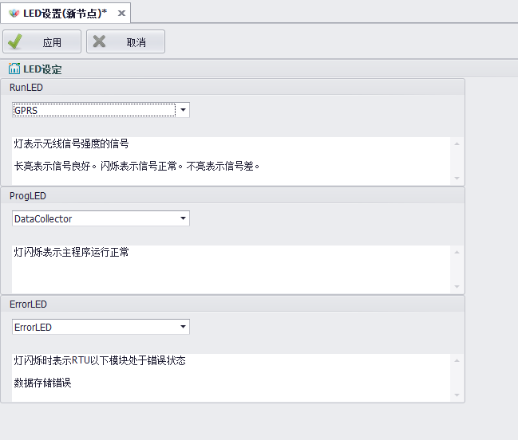
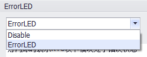

## LED设置 

"LED设置"中可以设置RTU上指示灯的工作模式，包括RUN灯、PROG灯、ERROR灯。

1. 在导航栏中双击"系统设置"中的"LED设置"，打开编辑页面。

2. 在RunLED选择框中可以选择RUN灯是否启用。

RUN灯监控数据采集和KW功能，当RUN灯闪烁时，表示主程序运行正常。

3. 在ProgLED选择框中可以选择PROG灯是否启用。

PROG灯监控移动信号或WIFI信号的强度，长亮标识信号良好，闪烁表示信号正常，不亮表示信号差。

4. 在ErrorLED选择框中可以选择ERROR灯是否启用。

启用时会监控关键模块是否连接正常，某一个模块不正常时ERROR灯会闪烁。可以监控的模块包括：数据存储模块、移动模块、WIFI模块。

不启用时，ERROR灯不会点亮，用户可以自行编写程序使用此灯。
