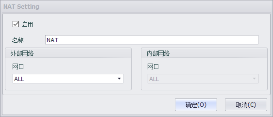
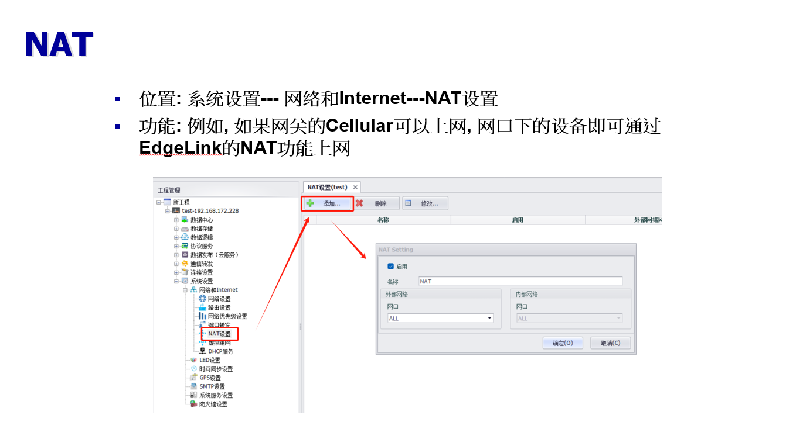
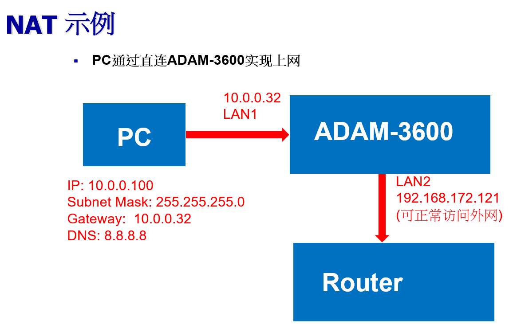
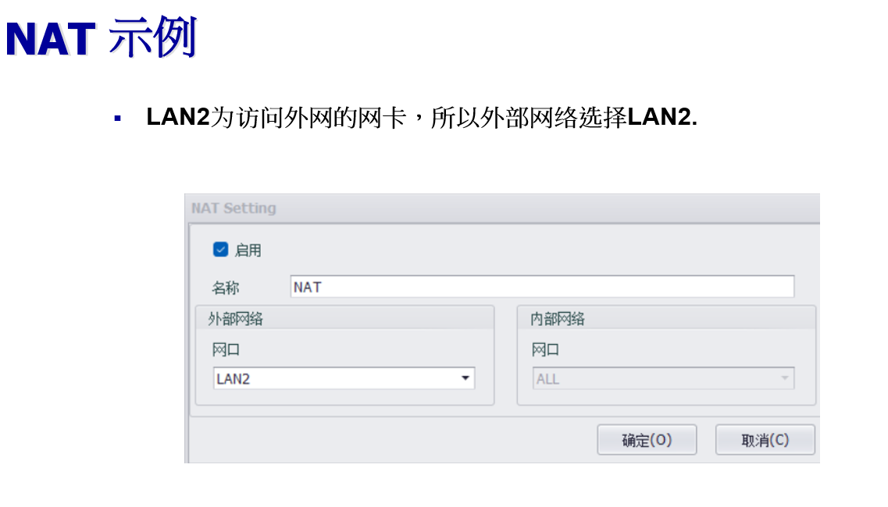
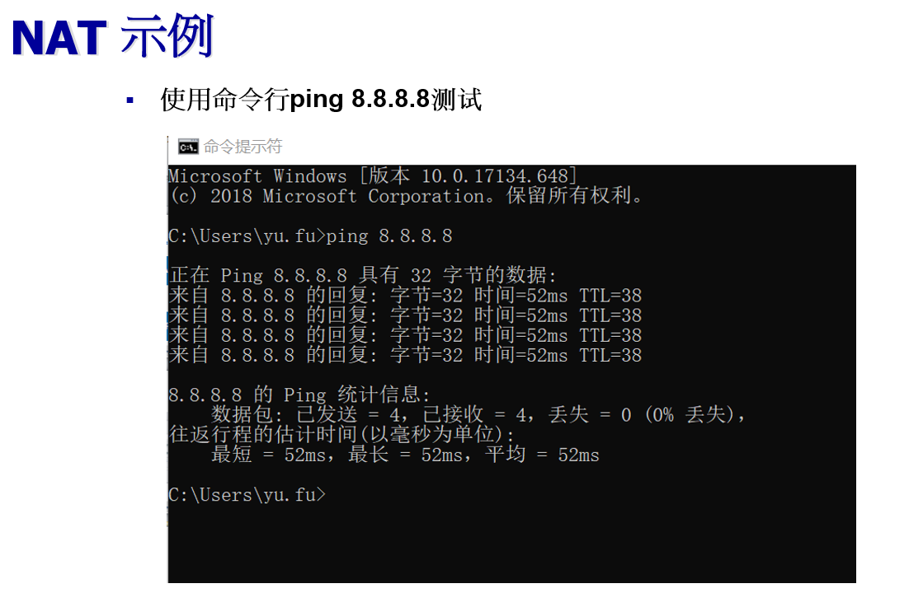

### NAT设置

使用设备作为网关时，启用NAT功能后允许内网连接到网卡的设备通过网关访问外网。

转换为iptables脚本为

	iptables -t nat -A POSTROUTING -j MASQUERADE -o eth0

用户可配置的属性如下：

- 启用：选择启用时，将添加此条配置到nat.sh中。
- 名称：可以选择只支持TCP、UDP或两种协议都支持。
- 外部网络-网口：选择允许内网设备通过网关的特定网口访问外网，或者可以通过全部网口访问。

#### 使用示例

