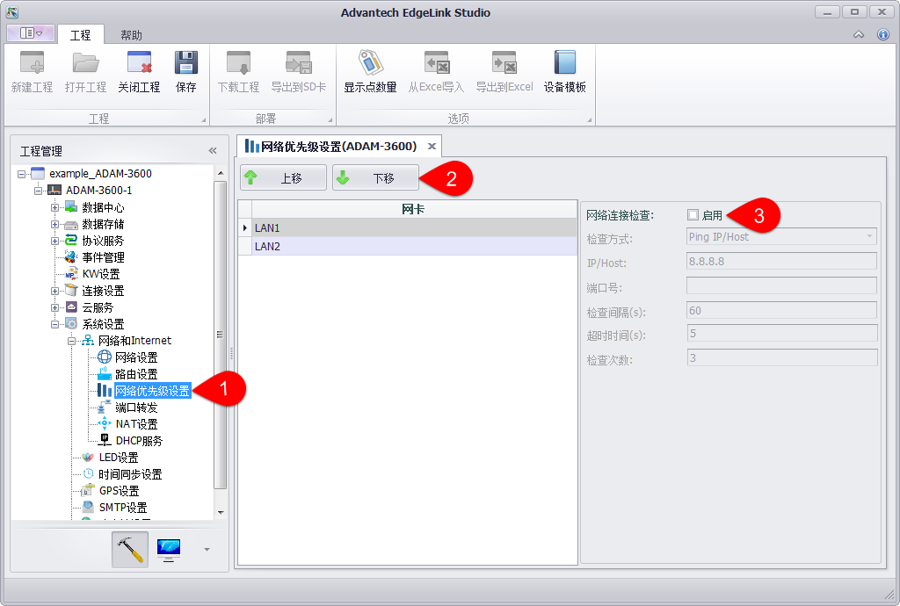
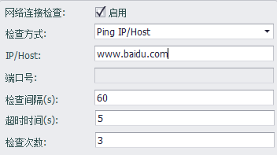
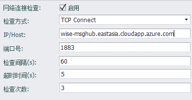

### 网络优先级设定

用户可以配置网络优先级，即默认路由的优先级。在网络优先级设定面板中列出了现有设备上的网卡，可点击排序按钮进行排序。

1. 打开“系统设置”-“网络和Internet”-“网络优先级设置”页面。

2. 选中网卡，点击“上移”或“下移”按钮修改网络优先级顺序。

3. 对网络启用连接检查。

按照网络优先级，如果优先级最高的网络与设置的需要检查的IP/Host之间网络出问题，则切换至次优先级的网络，路由表会进行更新；当优先级高的网络与IP/Host之间网络恢复则会切换回优先级高的网络，路由表更新。

- 检查方式：Ping IP/Host方式指的是通过ping检查网络连通状况，TCP Connect方式指的是通过TCP协议连接指定TCP端口
- IP/HOST：可以写IP或者Domain，建议填写公网IP/HOST，设置Domain时如果网卡为固定IP必须设置DNS服务器
- 端口号：只有TCP Connect方式需要填写，请填写对应端口号
- 检查间隔：检查周期，单位是秒
- 超时时间：检查失败时的超时时间，单位是秒
- 检查次数：检查失败超过此数值后切换网卡

有的服务器是不允许ping的，这时检查方式可以选择TCP Connect的方式，以wise-paas为例，可按如下方式设置.

